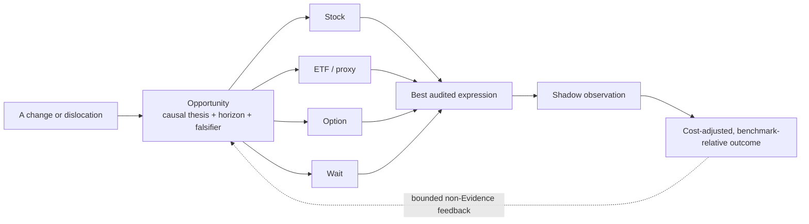
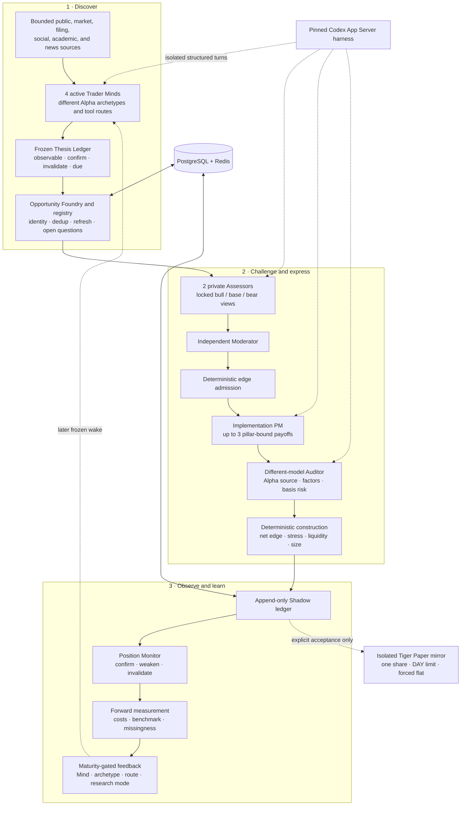

# ALTA

## Autonomous LLM Trading Asterism

_A virtual trading platform operated by specialized LLM agents._

[](https://github.com/kyky2347/ALTA/actions/workflows/ci.yml)
[](CHANGELOG.md)
[](LICENSE)
[](docs/research-scope.md)

ALTA is an evidence-first, opportunity-centric research system for public
markets. Specialized LLM agents independently search for changes and
dislocations, turn them into falsifiable opportunities, challenge one another's
underwriting, compare possible expressions, and measure the result in a durable
Shadow ledger.

> [!IMPORTANT]
> ALTA is experimental, research-only software. It is not investment advice, a
> trade recommendation, an order-management system, or evidence of profitable
> Alpha. It has no live-trading mode and must not be connected to live brokerage
> credentials or real capital.

**Current release:** `0.25.0` (`INCENTIVE_LOOP_VERIFIED`) · **Normal mode:**
Replay / Shadow · **Broker boundary:** explicit Tiger Paper acceptance only ·
**Real-world Alpha:** unproven

[Quick start](#quick-start) · [Architecture](docs/architecture/overview.md) ·
[Operations](docs/operations/autonomous-shadow.md) ·
[Research scope](docs/research-scope.md) · [Security](SECURITY.md) ·
[Attribution](ATTRIBUTION.md) · [中文说明](README.zh-CN.md)

## The idea

**ALTA trades opportunities. Stocks, ETFs, and options are only possible
expression vehicles.**

Most agent-trading demos start after a human has selected a ticker. ALTA starts
earlier: four orthogonal Trader Minds ask what changed, why the market may not
have absorbed it, what causal path connects the evidence to a security, and what
would prove the thesis wrong. A valid cycle may end with `Wait` or no position.

The design separates two kinds of intelligence:

- LLM agents own open-ended discovery, interpretation, disagreement, and
  implementation hypotheses.
- Deterministic software owns time, provenance, identity, budgets, replay,
  risk, execution constraints, and the capital boundary.
- Forward Shadow outcomes—not Agent confidence or activity—are the only basis
  for performance evaluation and bounded research incentives.



This makes a ticker an implementation choice, not the unit of research. An
attractive company with a fully priced security may still be `Wait`; the same
opportunity may be better expressed through a proxy or option; and an elegant
trade structure cannot rescue weak evidence.

## How ALTA works



Only structured artifacts cross Agent hand-offs. Private Assessors do not see
one another's first view; the expression proposer and implementation Auditor use
different model routes; rank scores stay hidden from the expression role; and
no Agent receives an order tool.

### The specialized team

| Role                    | Mandate                                                                                   | Authority boundary                                               |
| ----------------------- | ----------------------------------------------------------------------------------------- | ---------------------------------------------------------------- |
| Change / event Mind     | Find revisions, operating artifacts, and event propagation                                | Read-only research; cannot rank or trade                         |
| Market-dislocation Mind | Find price, volatility, flow, breadth, and relative-value anomalies                       | Must identify a falsifiable non-technical mechanism              |
| Causal-policy Mind      | Trace official policy, macro, input-cost, and supply-chain transmission                   | Must map issuer-level exposure and timing                        |
| Expectation-gap Mind    | Find measurable gaps between priced expectations and emerging fundamentals                | Must seek counterevidence and an observable resolution path      |
| Two private Assessors   | Underwrite independent scenario distributions, base rates, variants, and first rejections | Locked views; no instrument selection                            |
| Moderator and ranker    | Reconcile disagreements, preserve uncertainty, and admit only decision-grade edge         | Moderator is an Agent; rank mechanics are deterministic          |
| Implementation PM       | Compare direct stock, ETF/proxy, option, and `Wait`                                       | Proposes a bounded slate; cannot submit orders                   |
| Independent Auditor     | Reclassify intended Alpha, systematic exposures, basis risk, and hedge posture            | Different model from the proposer; may select only one or `Wait` |
| Position Monitor        | Review frozen thesis pillars against newer point-in-time evidence                         | Appends reviews; cannot rewrite original underwriting            |

The default model team is heterogeneous: DeepSeek V4 Flash handles active
discovery, DeepSeek V4 Pro handles thesis underwriting and expression, Grok 4.6
provides disconfirming assessment and independent audit, and Kimi K3 moderates.
Every run records the actual provider and model. Availability and behavior
remain external-provider dependencies, not repository guarantees.

## What is implemented

| Area          | Current capability                                                                                                                                        |
| ------------- | --------------------------------------------------------------------------------------------------------------------------------------------------------- |
| Discovery     | Four concurrent Trader Minds, autonomous tool calls, explore/follow-up allocation, route rotation, no-op support, and bounded process memory              |
| Evidence      | Raw-first point-in-time records, stable identity, content deduplication, immutable thesis pillars, provenance, and replay                                 |
| Deliberation  | Private heterogeneous assessment, scenario odds, reference-class base rates, priced-in/variant separation, bounded moderation, and conservative admission |
| Expression    | Up to three Stock / ETF / Option / Wait hypotheses, real quote or option-chain gates, implementation comparison, and independent audit                    |
| Portfolio     | Cost deduction, Alpha decay, stress and gross limits, liquidity, shared factor buckets, incumbent replacement hurdle, and pre-intent revalidation         |
| Learning      | Cost-adjusted SPY-relative Shadow measurement, frozen cohorts, configuration drift, missingness, and maturity-gated performance attribution               |
| Incentives    | Symmetric, revocable research-budget bonus based only on a conservative forward Alpha bound; no rank, risk, capital, or broker influence                  |
| Reliability   | Single-owner scheduler, two watchdogs, bounded retries, same-frozen-wake recovery, idempotent transitions, and clean shutdown                             |
| Observability | Loopback JSON/SSE for runtime, Agent runs, opportunities, debates, expressions, positions, cohorts, and Alpha summaries                                   |
| Capital       | Disabled by default; isolated CLI-only Tiger Paper acceptance with exact-account binding, one-share limits, and final-flat verification                   |

### Where the research edge is intended to come from

ALTA is not a news summarizer. News is one locator among many. Trader Minds can
begin from market and options dislocations, filings, public pricing and product
changes, operational artifacts, supply-chain evidence, policy transmission,
estimate primitives, public software ecosystems, academic work, or public
social positioning. The system is designed to look for:

- information that is public but fragmented across source families;
- second-order beneficiaries and losers whose causal exposure is overlooked;
- expectation gaps with an observable path to resolution;
- temporary flow, volatility, or implementation dislocations with a fundamental
  mechanism; and
- a cleaner payoff vehicle than the obvious underlying security.

These are research hypotheses. ALTA does not claim that the architecture has
produced persistent out-of-sample Alpha.

## Quick start

The credential-free path verifies the deterministic lifecycle without calling
an LLM, market-data provider, news service, or broker.

### Prerequisites

- macOS or Linux;
- Node.js 22+ and Corepack;
- `uv`;
- Docker Desktop, OrbStack, or another Docker Compose-compatible runtime; and
- Rust only when rebuilding the project-local Codex harness.

```shell
git clone https://github.com/kyky2347/ALTA.git
cd ALTA
corepack pnpm install --frozen-lockfile
./alta env setup --dev

./alta test
./alta env python -m pytest -q alta-runtime/python/tests
uv run --frozen --project alta-runtime/capital-python \
  pytest -q alta-runtime/capital-python/tests
```

Run the deterministic lifecycle and exact replay:

```shell
./alta env up
./alta env python -m alta_asterism migrate upgrade
./alta env python -m alta_asterism demo
./alta env python -m alta_asterism replay
./alta env python -m alta_asterism soak
./alta env down
```

`Wait` and `MVP_IDLE` are valid outcomes. They mean an opportunity did not clear
the evidence or implementation gates, not that the scheduler failed.

## Agent-backed Shadow operation

Build the pinned project-local Codex App Server substrate when using real Agent
turns. The V8 sandbox may be compiled from source:

```shell
V8_FROM_SOURCE=1 ./alta setup
./alta doctor
```

Maintainers may instead supply checksum-verified local V8 artifacts through
`ALTA_RUSTY_V8_CACHE_DIR`, or set both `RUSTY_V8_ARCHIVE` and
`RUSTY_V8_SRC_BINDING_PATH`. Build products, runtime state, databases, and
generated secrets remain under ignored `.alta/` state.

Provider entry points are:

```shell
./alta openai
./alta deepseek
./alta grok
./alta kimi
./alta models
```

Real credentials must remain outside the repository—in an operating-system
secret manager, the process environment, or owner-only
`~/.config/alta/credentials/` files. `.env.example` contains empty placeholders
and non-sensitive defaults only. Research child environments do not inherit
repository, market-data, database, Redis, or broker credentials.

Before enabling external adapters or unattended operation, read the
[getting-started guide](docs/operations/getting-started.md) and
[Autonomous Shadow operations](docs/operations/autonomous-shadow.md). Start with
one controlled Shadow cycle. The host service is then managed with:

```shell
./alta service install
./alta service status
./alta service stop
./alta service uninstall
./alta env down
```

The normal unattended service remains Shadow-only. The optional Tiger path is a
separate, explicitly invoked engineering acceptance and is never enabled by the
24×7 scheduler.

## Observability contract

ALTA exposes a loopback, read-only JSON/SSE surface for a future dashboard. It
does not expose an order API.

| Endpoint                        | Purpose                                                         |
| ------------------------------- | --------------------------------------------------------------- |
| `/health/live`, `/health/ready` | Process and dependency health                                   |
| `/api/v1/system/summary`        | Durable object counts                                           |
| `/api/v1/system/runtime`        | Agent, source, heartbeat, credential-revision, and safety state |
| `/api/v1/mvp/status`            | Current cycle and recent events                                 |
| `/api/v1/runs/{id}`             | Role runs and stage outcomes                                    |
| `/api/v1/opportunities/{id}`    | Evidence, thesis, debate, ranking, and audit trail              |
| `/api/v1/expressions/{id}`      | Expression, construction, and Shadow state                      |
| `/api/v1/alpha/summary`         | Forward Shadow measurement and underwriting calibration         |
| `/api/v1/evaluation/summary`    | Frozen cohort, drift, coverage, missingness, and readiness      |
| `/api/v1/stream`                | Cursor-based server-sent events                                 |

## Verification status

The publication baseline passes:

| Gate                     |                                                                     Result |
| ------------------------ | -------------------------------------------------------------------------: |
| Node gateway / harness   |                                                                  141 tests |
| Opportunity OS           |                                                                  224 tests |
| Isolated capital package |                                                                   25 tests |
| Deterministic lifecycle  | 3 Candidates → 3 Opportunities → 1 audited Shadow position → observed exit |
| Replay                   |         `16be618841b4ced276fea1c3297bd0a934093b995bce50bfadad0b74e9f9816c` |
| Accelerated soak         |                              14 cycles, zero failures, zero manual repairs |
| Foreground service       |                           `live` and `ready`, capital disabled, clean stop |
| Secret scan              |                      Tracked source and publication history required clean |

The soak advances simulated event time; it is not 24 hours of live wall-clock
model operation. Engineering verification proves paths and refusal behavior,
not strategy profitability.

## Safety model

- Supported environments are `replay`, `shadow`, and `paper`; no `live` mode
  exists.
- Missing, stale, illiquid, inconsistent, or unauditable evidence becomes
  `Wait`.
- A Shadow fill requires a forward quote observed after intent; historical
  prices are not backfilled as invented fills.
- Research Agents receive neither broker credentials nor an order tool.
- Tiger mutation is disabled by default and confined to an isolated Paper-only
  package with exact-account binding, one-share DAY limits, and final-flat
  reconciliation.
- Positive small samples never create leverage. Negative evidence can reduce
  later synthetic Shadow capital.
- Interrupted cycles rebuild from the original frozen wake rather than silently
  replacing evidence with later information.

Read [SECURITY.md](SECURITY.md) and the
[research scope](docs/research-scope.md) before using external services.

## Repository layout

```text
.
├── alta                         project-local command
├── alta-src/                    Node gateway, launch control, bounded tools
├── alta-runtime/
│   ├── python/                 Opportunity OS, orchestration, API and SSE
│   ├── capital-python/         isolated Tiger Paper-only executor
│   └── compose.yaml            loopback PostgreSQL and Redis
├── vendor/openai-codex/        pinned, attributed Codex Rust substrate
└── docs/                       architecture, operations, audits and roadmap
```

PostgreSQL is the system of record; Redis is disposable support state. ALTA-owned
application behavior lives outside `vendor/openai-codex/` whenever practical.

## Reproducibility and provenance

Lockfiles cover Node, both Python packages, the Rust workspace, and container
image digests. Deterministic fixtures use synthetic, license-safe data. A clean
clone can reproduce software contracts, migrations, replay, recovery, API/SSE,
Shadow accounting, and first-party tests; it cannot reproduce future model
prose, provider responses, market conditions, or returns.

ALTA contains a modified Apache-2.0 source snapshot of
[OpenAI Codex](https://github.com/openai/codex) at a pinned commit as its App
Server and agent-harness substrate. The vendored boundary, 13 modified Rust
files, retained notices, package dependencies, API-only integrations, and
conceptual architecture references are documented in
[ATTRIBUTION.md](ATTRIBUTION.md) and
[`vendor/openai-codex/CHANGES.md`](vendor/openai-codex/CHANGES.md). Referenced
projects are not presented as ALTA-authored code, and projects listed as
conceptual comparisons are not copied or vendored.

## Documentation

- [Architecture overview](docs/architecture/overview.md)
- [Detailed Opportunity OS design](docs/architecture/opportunity-os.md)
- [Getting started](docs/operations/getting-started.md)
- [Autonomous Shadow operations](docs/operations/autonomous-shadow.md)
- [Research scope and non-goals](docs/research-scope.md)
- [Reproducibility contract](REPRODUCIBILITY.md)
- [Security policy](SECURITY.md)
- [Attribution and third-party boundaries](ATTRIBUTION.md)
- [Changelog](CHANGELOG.md)
- [Contributing](CONTRIBUTING.md)

## License

ALTA-authored source is licensed under the [Apache License 2.0](LICENSE).
Vendored and package-managed dependencies remain subject to their own licenses,
copyright notices, and terms. Service names and trademarks belong to their
respective owners. Compatibility statements do not imply endorsement,
partnership, or official status.

ALTA is independently maintained and is not an OpenAI product or an endorsed
investment system.
