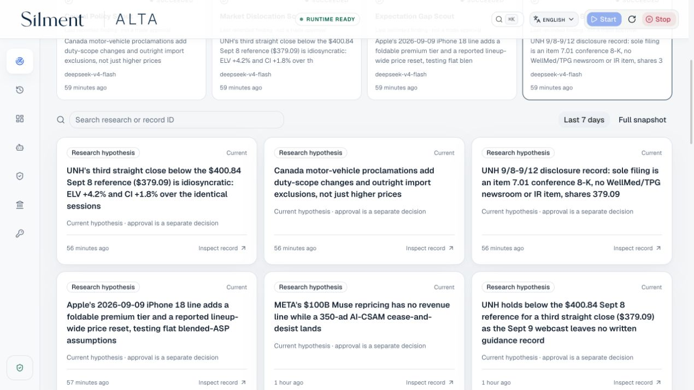
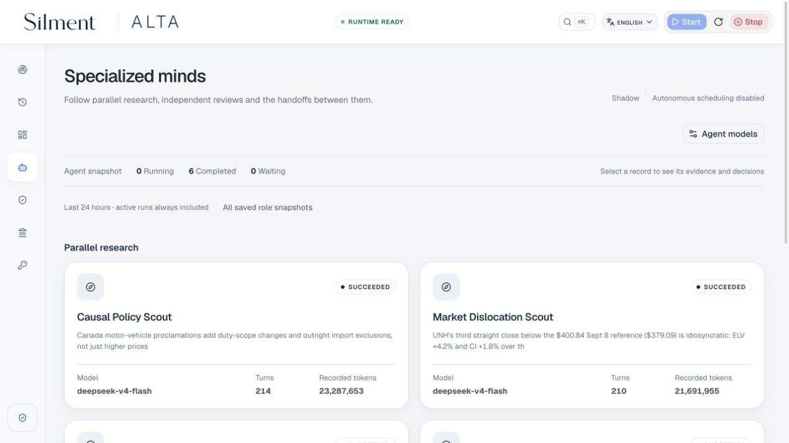
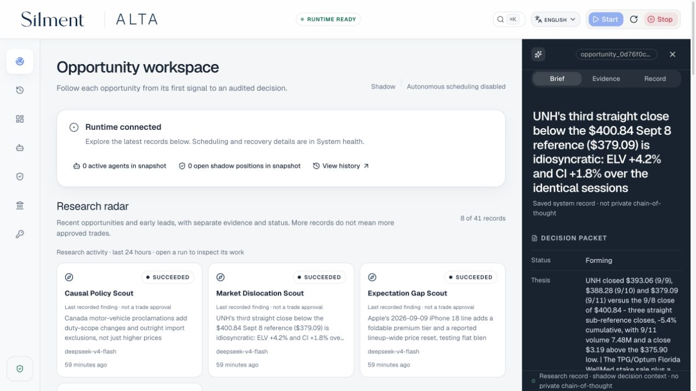
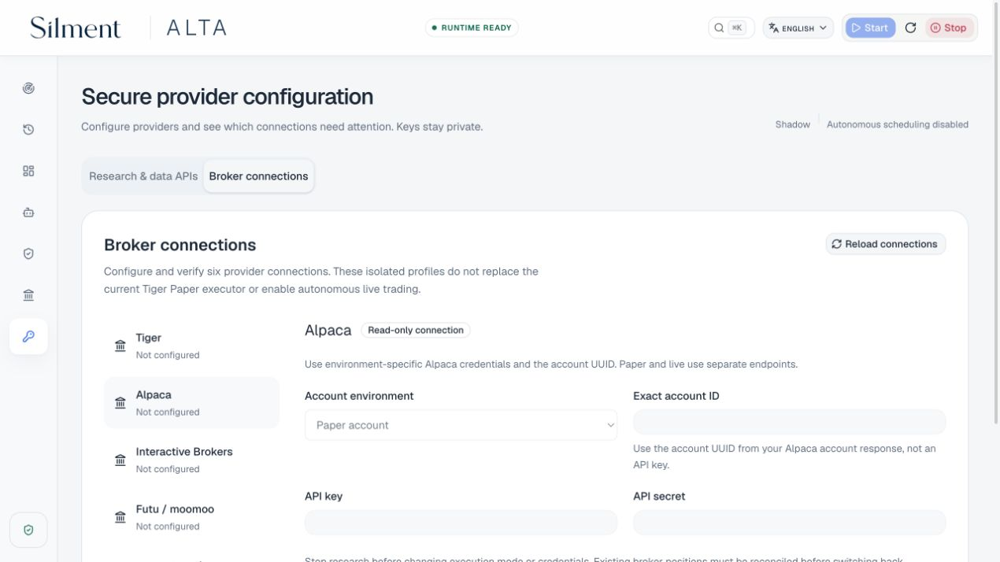
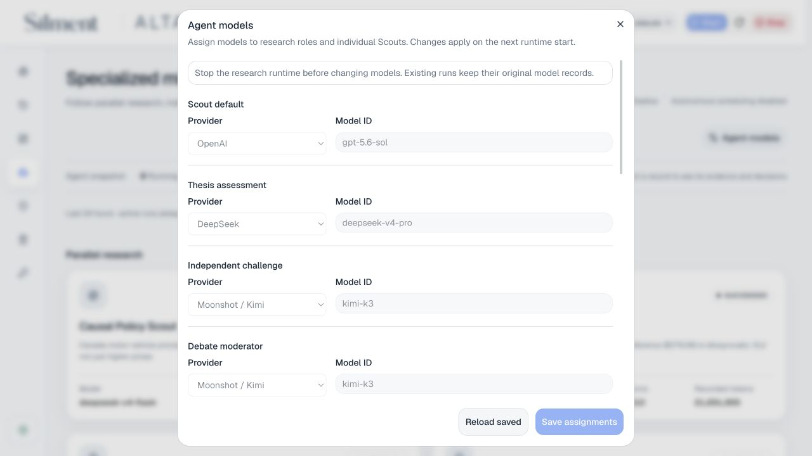
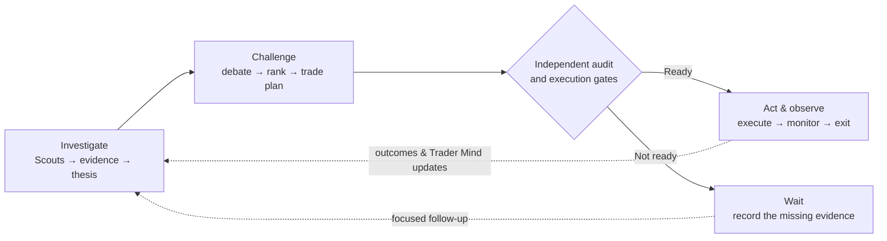
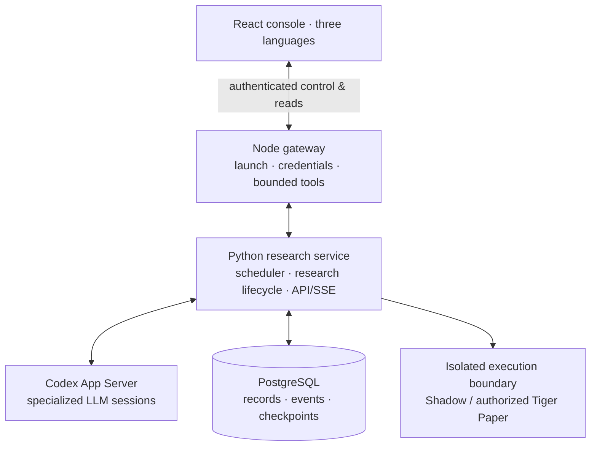

# ALTA

## Autonomous LLM Trading Asterism

_A virtual trading platform operated by specialized LLM agents._

[](https://github.com/kyky2347/ALTA/actions/workflows/ci.yml)
[](LICENSE)
[](docs/research-scope.md)

[简体中文](README.zh-CN.md) · [繁體中文](README.zh-HK.md) ·
[Quick start](#run-locally) · [Architecture](docs/architecture/overview.md) ·
[Verification](docs/audits/console-readability-2026-09-12.md) · [Website](https://alta.silment.com)

**Trade the opportunity. The stock, ETF, or option is only its carrier.**

ALTA is a local, multi-agent market-research system with an operator console and
separate simulation and brokerage boundaries. Four specialist Scouts investigate
the world; independent reviewers challenge their findings; a strategy desk
compares possible trades. Every handoff leaves a record you can inspect.

The ambition is a virtual research firm—not another chatbot that recommends a
ticker. The test is whether an idea survives evidence, disagreement, costs and time.

> [!IMPORTANT]
> Experimental, research-only software. Not investment advice, an order-management
> system or evidence of profitable Alpha. Autonomous execution supports internal
> **Shadow Paper** and explicitly authorized **Tiger Paper**. Additional broker
> connectors are a separate, incomplete integration—not enabled autonomous live trading.

## See the work

Current console captures, focused on recent saved research and the specialist team.
Open an image for the full view. Research hypotheses are not approved trades.

[](docs/assets/alta-operator-console-en.jpg)

| The research team                                                                       | Inside an opportunity                                                                                             |
| --------------------------------------------------------------------------------------- | ----------------------------------------------------------------------------------------------------------------- |
| [](docs/assets/alta-agent-desk-en.jpg) | [](docs/assets/alta-opportunity-detail-en.jpg) |
| Independent reviewers, model routes and recorded work.                                  | Original decision brief; complete lineage remains inspectable.                                                    |

| Broker connections                                                                                                | Model routing                                                                                             |
| ----------------------------------------------------------------------------------------------------------------- | --------------------------------------------------------------------------------------------------------- |
| [](docs/assets/alta-broker-connections-en.jpg) | [](docs/assets/alta-model-settings-en.jpg) |
| Six provider-specific forms; credentials and execution authority stay separate.                                   | Assign models by role while preserving independent review.                                                |

September 12, 2026 · English interface · original Agent artifacts retain their
authored language. Capture scope, record IDs and image hashes are in the
[release review](docs/audits/console-readability-2026-09-12.md).
No credentials or account details are included.

## How the firm works



**LLMs decide what deserves investigation. Code decides what may change durable
state or capital.** No Agent can supply its own evidence, approve its own risk
and move broker capital. Missing evidence is a reason to wait, not improvise.

| Layer      | What is implemented                                                                                                   |
| ---------- | --------------------------------------------------------------------------------------------------------------------- |
| Discovery  | 4 Scouts, 13 bounded read-only tools, date-aware search, issuer crawling, feeds, academic and archive lookups         |
| Judgment   | Independent model routes, falsifiable thesis pillars, counterevidence, portfolio-aware ranking and carrier comparison |
| Continuity | Persistent follow-up questions, catalyst deadlines, checkpoint recovery and evolving Trader Minds                     |
| Evaluation | Point-in-time forecasts, forward outcomes, benchmark-relative measures and downside-only risk calibration             |
| Operations | Three-language console, API/SSE, run history, write-only credentials, model settings and lifecycle controls           |

Scouts default to **11 tool calls, 196k chargeable tokens and 420 seconds per
attempt**, within hard caps. More budget buys verification, not an idea quota.
Sources have pacing, cancellation and nested deadlines; incomplete retrievals
stay visible. [Retrieval design and measured limits →](docs/audits/research-retrieval-review.md)

Structured drafts get one budget-bound correction in the same research context,
with exact retrieved citations and an audit trail. Insufficient or stale evidence
still leads to `Wait`—more retries are not a substitute for a current signal.

### Four minds, different questions

The Scouts share tools, not a single research agenda. Each starts with a Trader
Mind: a research style, areas to explore and lessons from earlier work. They can
initiate searches and follow leads rather than only summarize an incoming feed.

| Scout              | The question it pursues                                                             |
| ------------------ | ----------------------------------------------------------------------------------- |
| Change / event     | What actually changed in a filing, business or catalyst—and when?                   |
| Market dislocation | Where have prices or related securities diverged, and is the gap explainable?       |
| Causal / policy    | Which second-order effects connect a policy or industry change to another business? |
| Expectation gap    | What does the market appear to expect, and what evidence could overturn that view?  |

News is a starting point, not the whole research process. Agents can consult
issuer pages, filings, public datasets, market observations and web sources. A
newly fetched page is not automatically a new event: source time and retrieval
time remain distinct. Social or secondary claims need corroboration, not just
a persuasive summary.

### An idea is not a ticker

ALTA keeps the **thesis** separate from the **trade that might express it**.
An opportunity describes what changed, why expectations might be wrong, what
would invalidate the thesis and when the effect could matter. Only then does
the expression stage compare eligible instruments, direction, costs and sizing.
The preferred result can be a stock, ETF, supported option expression—or no trade.

```text
Candidate       Opportunity          Decision             Outcome
source + time → thesis + falsifier → reviews + trade plan → monitor + exit
     └────────── linked IDs, citations and recorded events ──────────┘
```

This separation matters when the obvious instrument is too illiquid, the price
has already moved or several ideas depend on the same risk. A convincing story
does not bypass a fresh quote, a portfolio check or an independent audit. When
the evidence falls short, the system retains a reason and a follow-up question
instead of treating an empty order book as a failure.

### A console for questions, not just counters

| What you need to know               | Where to look                                            |
| ----------------------------------- | -------------------------------------------------------- |
| Why is this idea here?              | Opportunity detail: brief, evidence and the saved record |
| Who investigated or disagreed?      | Agent desk, model routes and linked reviews              |
| What happened before this snapshot? | Activity history and the durable event timeline          |
| Is it ready to act?                 | Decision status, execution mode and authorization checks |
| What needs operator attention?      | System health, connection status and API verification    |

English, Simplified Chinese and Traditional Chinese share the same controls and
record IDs. Agent-written artifacts stay in their authored language. Snapshot
counts, completed work and currently running Agents are distinct; more cards on
screen do not establish more independent ideas or better returns.

## Under the hood



The console does not orchestrate research in a browser tab. A managed backend
owns scheduling and recovery; PostgreSQL preserves the work after a tab closes
or a process restarts. The modified Codex harness supplies Agent sessions and
tool calls, while ALTA owns the research lifecycle and execution policy. Redis
supports coordination; it is not a substitute for the durable ledger.

This is useful for researchers studying multi-agent judgment, developers building
auditable financial workflows and operators evaluating a thesis over time. It
is not a low-latency trading engine or a turnkey institutional trading stack.
The strongest claim today is an inspectable research-to-simulation workflow;
whether it produces an investment edge requires forward evidence.

## Run locally

**Requirements:** macOS or Linux, Node.js 22+ with npm, Python 3.12, `uv`,
Docker/OrbStack and sufficient disk space. Initial installation needs internet.
Building the pinned custom harness additionally needs its Rust toolchain.

```shell
git clone https://github.com/kyky2347/ALTA.git
cd ALTA
npm run dashboard
```

The command installs locked frontend dependencies when needed, builds the current
console and opens an authenticated loopback page. In the console:

1. **API connections** — separate research/data APIs and broker connections; saved secrets are never returned.
2. **Agents → Agent models** — select available models; independent opposing roles must differ.
3. **Start** — prepare the locked backend environment and start its managed dependencies.
4. **Stop** — drain the research service and stop its managed database/cache.

Brokerage authorization is separate and off by default. A saved key does not
grant trading permission. Follow the [setup guide](docs/operations/getting-started.md)
for the Agent harness, provider requirements and troubleshooting.

**What should the first session look like?** A healthy service can be idle while
waiting for its next cycle. Once research runs, inspect the Scout records, follow
their citations and compare reviewer verdicts. A candidate is not yet an approved
opportunity, and an approved thesis is not yet an executable order. Begin in
Shadow Paper; use the record trail to understand a decision before granting any
broker authority. Model access, data entitlements and available cash are separate
requirements, not things the launcher can infer from an API key.

Prefer explicit installation? Run `corepack pnpm install --frozen-lockfile`
before `./alta dashboard`.

### Verify without paid APIs

```shell
./alta env setup --dev
./alta test
./alta env python -m pytest -q alta-runtime/python/tests
uv run --frozen --project alta-runtime/capital-python pytest -q alta-runtime/capital-python/tests
uv run --frozen --all-extras --project alta-runtime/broker-python pytest -q alta-runtime/broker-python/tests
node --test alta-dashboard/tests/*.test.mjs
corepack pnpm check
./alta env down
```

Integration tests require the managed PostgreSQL environment; a plain `pytest`
invocation without `DATABASE_URL` is not the full acceptance command.
See [Reproducibility](REPRODUCIBILITY.md) for deterministic demo/replay and clean-source verification.

## Execution: capability is not permission

| Mode / boundary             | Actual support                                                                                                                                                  |
| --------------------------- | --------------------------------------------------------------------------------------------------------------------------------------------------------------- |
| Shadow Paper                | ALTA-managed fills, costs, positions, monitoring and exits; no broker mutation                                                                                  |
| Tiger Paper                 | Existing adapted executor; exact account binding, explicit authorization, fresh audit and restart reconciliation                                                |
| Five pre-adapted connectors | Alpaca, IBKR, Futu/moomoo, Longbridge/Longport and Schwab: private profiles, provider-specific code and read-only checks; end-to-end account acceptance pending |

The new Tiger live connector is also unaccepted. The independent six-provider
package contains execution-engine code but is **not wired into autonomous
research**. Broker gateways, OAuth, account permissions and verification cannot
be replaced by a generic API-key field. [Provider matrix and remaining work →](docs/broker-expansion.md)

## Built for interruption

PostgreSQL is the source of truth; Redis is support state. Work is claimed by a
fenced owner, broker intent precedes submission, and uncertain orders require
reconciliation—not blind retries. The console retains its last valid snapshot
through connection loss and rejects stale control-plane edits.

The [latest UI acceptance](docs/audits/console-readability-2026-09-12.md) covers
the frontend fixes, complete first-party checks and clean-source installation.
The [research acceptance](docs/audits/operator-scout-reliability-2026-09-12.md)
separately records the real, no-order research run and authenticated API checks.
The release review records failures found, repairs, final outcomes and shutdown
evidence. It is not a 24×7 uptime certification or a guarantee of profitability.

Unproven: sustained out-of-sample Alpha, every power-loss scenario, universal
browser compatibility, and additional brokers' real-account order acceptance.

## Project map

```text
alta-dashboard/                React operator console · English / 简体中文 / 繁體中文
alta-src/                      Node gateway · bounded tools · launch/control
alta-runtime/python/           research lifecycle · PostgreSQL · API/SSE
alta-runtime/capital-python/   isolated Tiger Paper executor
alta-runtime/broker-python/    isolated experimental connectors and execution library
vendor/openai-codex/            pinned, attributed Agent-harness source
docs/                          architecture · operations · verification
```

[Architecture](docs/architecture/overview.md) ·
[Operator guide](docs/operations/operator-console.md) ·
[24×7 runbook](docs/operations/autonomous-shadow.md) ·
[Security](SECURITY.md) · [Contributing](CONTRIBUTING.md) · [Changelog](CHANGELOG.md)

## License and provenance

ALTA-authored source is [Apache-2.0](LICENSE). ALTA uses a modified, pinned
Apache-2.0 [OpenAI Codex](https://github.com/openai/codex) snapshot as its local
App Server/harness, plus separately licensed packages and API integrations.
Upstream notices are retained; modifications and dependencies are documented in
[ATTRIBUTION.md](ATTRIBUTION.md), [NOTICE](NOTICE) and the
[vendored change record](vendor/openai-codex/CHANGES.md).

Independently maintained; not endorsed by OpenAI or any named data/brokerage
provider. Provider terms, exchange entitlements and data-redistribution rights
remain the operator's responsibility.
