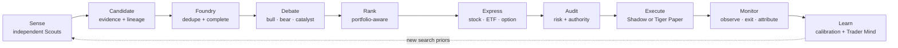
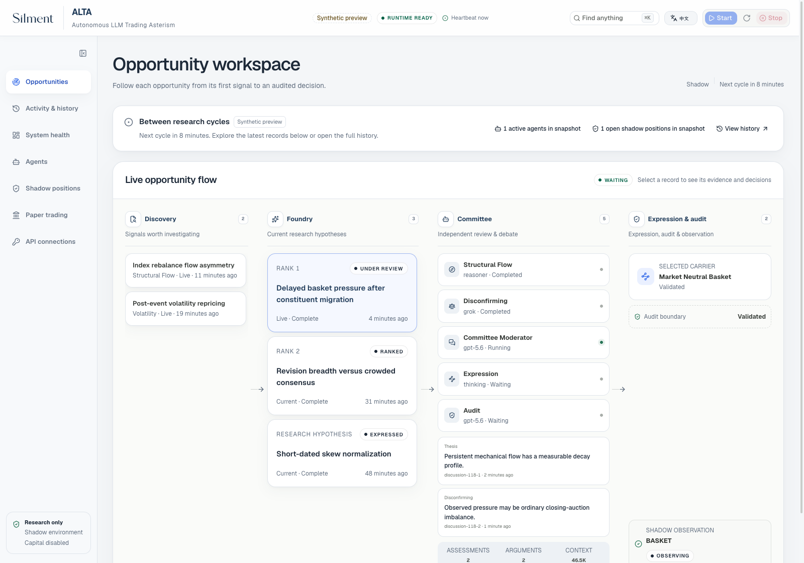
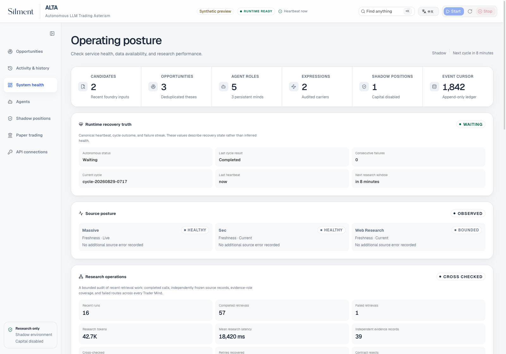
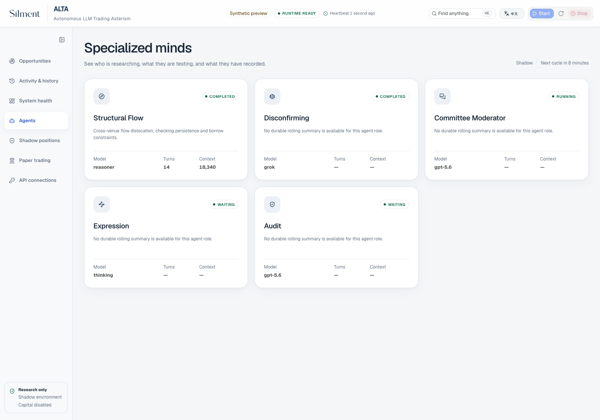
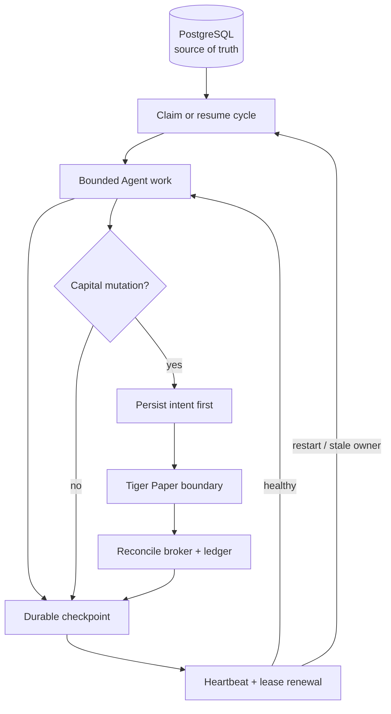

# ALTA

## Autonomous LLM Trading Asterism

_A virtual trading platform operated by specialized LLM agents._

[](https://github.com/kyky2347/ALTA/actions/workflows/ci.yml)
[](CHANGELOG.md)
[](LICENSE)
[](docs/research-scope.md)

**Trade the opportunity. The stock, ETF, or option is only its carrier.**

ALTA is an evidence-first research system for public markets. Specialized LLM
agents search independently, turn weak signals into falsifiable opportunities,
argue both sides, compare expressions, pass a separate risk audit, and measure
what happened in a replayable Shadow ledger.

It is built for a question that conventional agent demos usually avoid:

**Can a team of autonomous researchers preserve curiosity without giving up
evidence, accountability, recovery, or portfolio discipline?**

> [!IMPORTANT]
> ALTA is experimental, research-only software. It is not investment advice,
> a recommendation, an order-management system, or evidence of profitable
> Alpha. There is no live-trading mode. The only broker boundary is explicit,
> operator-authorized **Tiger Paper** execution; live credentials and real
> capital must never be connected.

[中文说明](README.zh-CN.md) · [Architecture](docs/architecture/overview.md) ·
[Getting started](docs/operations/getting-started.md) ·
[Research scope](docs/research-scope.md) · [Security](SECURITY.md)

### Latest: clearer decisions, fresher evidence, safer recovery

- **Find the signal:** distinguish live, current and expired clues; keep old
  research inspectable without promoting it as a fresh opportunity.
- **Follow the work:** an operating brief, focused opportunity cards, Agent
  handoffs and a searchable decision history in English or Chinese.
- **Keep your place:** retain valid data through disconnects and malformed
  responses; prevent delayed polls from undoing acknowledged operator changes.

## The five-minute mental model

ALTA treats an idea as a lifecycle, not a chat response:



The LLMs own open-ended research and judgment. Deterministic code owns the
parts that must remain exact: schemas, lineage, permissions, capital limits,
idempotency, leases, state transitions, recovery, and accounting.

That separation is the design. Agents get room to think; the system never has
to trust their prose as authority.

## One opportunity, many minds

| Desk                   | Responsibility                                                                                            | What it must produce                                      |
| ---------------------- | --------------------------------------------------------------------------------------------------------- | --------------------------------------------------------- |
| Scouts                 | Search filings, market structure, price/volume, macro, ownership, options, cross-asset and open-web clues | A cited Candidate or an honest abstention                 |
| Foundry                | Normalize, deduplicate and freeze claim lineage                                                           | One stable, falsifiable Opportunity                       |
| Underwriters           | Build independent bull, bear, catalyst and implementation cases                                           | Structured disagreement, not consensus theatre            |
| Research Director      | Allocate attention and rank competing work                                                                | Decision value adjusted for urgency and portfolio overlap |
| Expression desk        | Compare stock, ETF and option carriers                                                                    | Executable payoff candidates with costs and liquidity     |
| Risk & audit           | Challenge evidence, sizing, concentration and authority                                                   | Approve, resize, defer, Shadow-only or reject             |
| Execution & monitoring | Revalidate prices, submit authorized Paper intents and watch exits                                        | Durable intent, fill history, telemetry and attribution   |
| Learning loop          | Score forecasts, costs and realized outcomes                                                              | Downside-only calibration and evolving Trader Minds       |

No single agent can create evidence, approve its own risk, and move broker
capital. Debate diversity comes from independently routed model roles, while
the final mutation boundary remains deterministic and fail-closed.

## What is actually implemented

| Capability              | Current state                                                                                                      |
| ----------------------- | ------------------------------------------------------------------------------------------------------------------ |
| Opportunity lifecycle   | Durable Candidates, Opportunities, assessments, debates, ranks, expressions, audits, positions and exits           |
| Autonomous research     | Multi-lane Scouts with bounded tool use, retries, source health, citation checks and independent abstention        |
| Long-horizon continuity | Due-time scheduling, exact-question follow-ups, thesis deadlines and restart-safe work recovery                    |
| Portfolio intelligence  | Stress, underlying, catalyst, Alpha-source and systematic-exposure concentration controls                          |
| Expression selection    | Carrier comparison, price freshness, liquidity, costs, payoff shape and execution reserve                          |
| Evaluation              | Point-in-time forward outcomes, benchmark-relative Alpha, selection adjustment and forecast calibration            |
| Execution               | Shadow by default; gated Tiger Paper-only intents with authorization generation, lease and reconciliation          |
| Operations              | One-command console, authenticated API/SSE, live Agent activity, decision ledger, health and control surfaces      |
| Resilience              | PostgreSQL source of truth, disposable Redis support state, cycle recovery, orphan cleanup and bounded degradation |

ALTA deliberately does **not** claim that these contracts produce Alpha. Its
job is to make that claim testable without confusing persuasive model output,
backtests, or Shadow marks with real evidence.

## Operator console

The bilingual console follows the entire research-to-position path. It shows
what each Agent is doing, which tools it used, what changed, why a decision was
made, and which authority boundary is active. Secrets are write-only: the UI
can report configured/healthy/expired, never reveal a stored value.



<details>
<summary>Explore system health and Agent handoffs</summary>





</details>

Captured from the current production build on September 9, 2026, with the
English interface and explicitly labeled, read-only **synthetic preview** data.
No real credentials, account details or market-provider payloads are shown.
After starting the console, append `?preview=1` to its URL to explore this view
without starting research or placing orders.

The console is an operational lens, not a performance advertisement. Shadow
returns, confidence ranges and model opinions are labeled according to their
actual evidence level.

## Start with one command

Prerequisites: macOS or Linux, Node.js 22+, Corepack, Python 3.12+, `uv`, Docker
Desktop or Docker Engine, and about 20 GB of free disk space.

```bash
git clone https://github.com/kyky2347/ALTA.git
cd ALTA
corepack pnpm install --frozen-lockfile
./alta dashboard
```

`./alta dashboard` builds the web console when needed and opens it on a stable
loopback endpoint. Re-running the command reuses an installed console instead
of creating a confusing second port. From the console, **Start** prepares the
locked Python environment, wakes an installed OrbStack or Docker Desktop on
macOS when necessary, starts PostgreSQL and Redis, and brings up the research
backend. ALTA never installs a container engine or gains broker authority on
its own.

For a deterministic first run with no paid providers:

```bash
./alta fixture seed
./alta run --cycle-id first-look
```

Useful operator commands:

```bash
./alta doctor              # dependencies and safe configuration
./alta status              # concise runtime state
./alta service status      # autonomous supervisor state
./alta service start       # continuous Shadow research
./alta service stop        # graceful stop and child cleanup
./alta test                # first-party Node/harness suite
```

See [Getting started](docs/operations/getting-started.md) for provider setup,
environment isolation and clean shutdown.

## Modes and authority

```text
Replay fixtures  →  autonomous Shadow  →  explicitly armed Tiger Paper
 deterministic       no broker mutation       Paper account only
```

- **Replay** reproduces orchestration and state contracts with synthetic data.
- **Shadow** uses research and market inputs but simulates positions locally.
- **Tiger Paper** is off by default and requires a valid Paper account,
  operator authorization, a current preflight, account binding and fresh risk
  approval. Revocation is fail-closed and may enter close-only drain.
- **Live trading does not exist.** Unknown, stale, duplicated or mismatched
  broker state becomes `manual_review`; it is never guessed through.

Agent-requested size is treated as a proposal. Final whole-share quantity is
clipped by deterministic risk, liquidity, broker buying power, concentration,
price freshness and current authorization. Every mutation begins as a durable
intent and is reconciled after interruption.

## Built for interruption

Long-running research fails in less glamorous ways than a model benchmark:
power disappears, providers time out, processes overlap, and a thesis can wait
weeks for a catalyst. ALTA therefore makes recovery part of the domain model.



Key properties:

- one claimed autonomous cycle at a time, with stale-owner takeover;
- exact checkpoints instead of replaying an entire Agent conversation;
- monotonic capital authorization checked inside the mutation lease;
- backoff and circuit breakers for optional data sources;
- graceful termination of Agent, App Server and supervisor process trees;
- idempotent migrations and restart reconciliation;
- authenticated control plane bound to `127.0.0.1` by default.

The console retains its last valid snapshot through malformed responses and
connection failures. Late polls cannot overwrite acknowledged operator changes;
cached opportunity freshness is rechecked on every read. See the
[local reliability review](docs/audits/console-reliability.md) for verification
scope and remaining limitations.

These are strong local-runtime contracts, not a claim of exchange-grade or
bank-grade availability. Operational assumptions and remaining limitations are
kept explicit in [the runbook](docs/operations/autonomous-shadow.md).

## Evidence before performance

ALTA's research loop is designed to reduce common sources of imaginary edge:

1. Every claim keeps source and observation lineage.
2. Discovery, debate, expression and audit are separate decisions.
3. Point-in-time evaluation uses completed market sessions and frozen forecasts.
4. Trial volume is recorded so selection-adjusted confidence can be shown.
5. Comparable closes feed forecast and execution-cost calibration.
6. Calibration can only reduce new risk; it cannot manufacture expected return.
7. Shadow evidence and Paper fills remain clearly separated from live results.

The intended edge comes from breadth of search, independent disagreement,
cross-domain clue synthesis, better expression, disciplined abstention and a
durable learning record—not from asking one model for a ticker.

## Verified, not promised

The release baseline remains `0.26.0`; newer changes are recorded under
[Unreleased](CHANGELOG.md). The September 9 local review verified:

| Automated checks                                                          | Browser and integration checks                                                            |
| ------------------------------------------------------------------------- | ----------------------------------------------------------------------------------------- |
| **644 passed:** 201 Node · 386 runtime · 38 Paper boundary · 19 dashboard | **84** view/language/viewport combinations in Chromium                                    |
| TypeScript, lint, formatting and production build passed                  | **7** authenticated read routes through PostgreSQL, Python and the Node gateway           |
| Recovery and freshness regression coverage                                | Disconnect/reconnect, malformed responses, delayed polls and bounded secure-session retry |

The real-stack smoke was read-only, with autonomous research and Tiger disabled.
Temporary services and test data stores were stopped afterward. These results
do not establish current broker connectivity, multi-day availability, physical
power-loss recovery, universal browser compatibility or profitable Alpha.
See the [reliability review](docs/audits/console-reliability.md) for limits and
the [publication security audit](docs/audits/security-audit.md) for scan scope.

## Repository map

```text
.
├── alta                         project-local operator command
├── alta-dashboard/              bilingual React operator console
├── alta-src/                    Node gateway, launch control and bounded tools
├── alta-runtime/
│   ├── python/                  Opportunity OS, orchestration, API and SSE
│   ├── capital-python/          isolated Tiger Paper-only executor
│   └── compose.yaml             loopback PostgreSQL and Redis
├── vendor/openai-codex/         pinned, attributed Codex Rust substrate
└── docs/                        architecture, operations, audits and roadmap
```

PostgreSQL is the system of record. Redis is disposable support state.
ALTA-owned application behavior stays outside `vendor/openai-codex/` whenever
practical.

## Read next

- [Architecture overview](docs/architecture/overview.md) — components and trust boundaries
- [Opportunity OS design](docs/architecture/opportunity-os.md) — full lifecycle and schemas
- [Autonomous operations](docs/operations/autonomous-shadow.md) — run, observe, recover, stop
- [Operator console](docs/operations/operator-console.md) — UI and control-plane contract
- [Reproducibility](REPRODUCIBILITY.md) — what a clean clone can and cannot reproduce
- [Attribution](ATTRIBUTION.md) — vendored code, dependencies and conceptual references
- [Contributing](CONTRIBUTING.md) · [Changelog](CHANGELOG.md) · [Roadmap](docs/implementation/roadmap.md)

## License and provenance

ALTA-authored source is licensed under the [Apache License 2.0](LICENSE).
Vendored and package-managed dependencies retain their own licenses, copyright
notices and terms.

ALTA includes a modified Apache-2.0 snapshot of
[OpenAI Codex](https://github.com/openai/codex) at a pinned commit as its local
App Server and Agent-harness substrate. Modified files, retained notices,
package dependencies, API-only integrations and conceptual references are
listed in [ATTRIBUTION.md](ATTRIBUTION.md) and
[`vendor/openai-codex/CHANGES.md`](vendor/openai-codex/CHANGES.md).

ALTA is independently maintained. It is not an OpenAI product, is not endorsed
by any named data or brokerage provider, and must be used only within the
[research scope](docs/research-scope.md).
