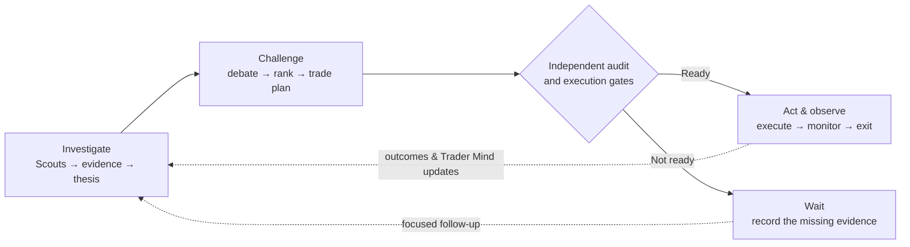
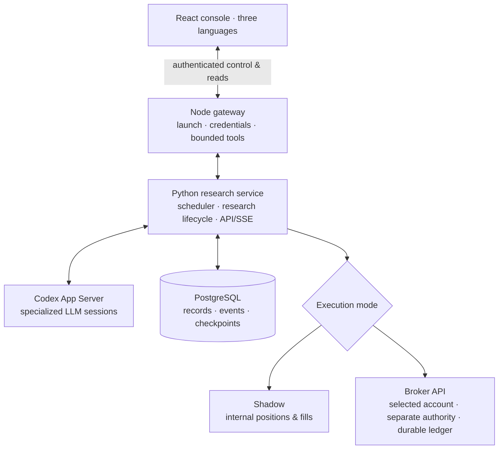

# ALTA

## Autonomous LLM Trading Asterism

_A virtual trading platform operated by specialized LLM agents._

[](https://github.com/kyky2347/ALTA/actions/workflows/ci.yml)
[](LICENSE)
[](docs/research-scope.md)

[简体中文](README.zh-CN.md) · [繁體中文](README.zh-HK.md) ·
[Quick start](#run-locally) · [Architecture](docs/architecture/overview.md) ·
[Verification](docs/audits/broker-routing-2026-09-13.md) · [Website](https://alta.silment.com)

**Start with the opportunity. Choose the instrument that best expresses it.**

ALTA is a local, multi-agent market-research system with an operator console,
internal simulation and a separate broker execution boundary. Four specialist
Scouts pursue leads; independent reviewers challenge the evidence; a strategy
desk compares ways to act. Every handoff leaves an inspectable record.

The idea is a virtual research firm, not a chatbot that recommends a ticker:
a thesis must survive disagreement, costs and time before it deserves capital.

> [!IMPORTANT]
> Experimental research software—not investment advice, a production OMS or
> evidence of profitable Alpha. Execution has two modes: **Shadow** and
> **Broker API**. Broker orders require a verified, explicitly selected account
> and separate authorization. Six connectors exist; live-account acceptance is
> not established. [Current execution limits ↓](#two-modes-one-explicit-destination)

## See the work

Follow an opportunity from its source evidence to reviewer decisions. Open any
image for the full view; saved hypotheses are not approved trades.

[](docs/assets/alta-operator-console-en.jpg)

| Research team                                                                           | Inside an opportunity                                                                                             |
| --------------------------------------------------------------------------------------- | ----------------------------------------------------------------------------------------------------------------- |
| [](docs/assets/alta-agent-desk-en.jpg) | [](docs/assets/alta-opportunity-detail-en.jpg) |
| Who investigated, which model ran and what it produced.                                 | The thesis, supporting evidence and reviewer decisions.                                                           |

| Execution controls                                                                                                               | Model routing                                                                                             |
| -------------------------------------------------------------------------------------------------------------------------------- | --------------------------------------------------------------------------------------------------------- |
| [](docs/assets/alta-broker-connections-en.jpg) | [](docs/assets/alta-model-settings-en.jpg) |
| Two modes, an explicit destination and separate authority.                                                                       | Choose models by role while preserving independent review.                                                |

Research captures: September 12, 2026; execution setup: September 13. English UI;
Agent artifacts retain their authored language. The setup capture shows an
unauthorized configuration, not a connected broker. Scope and image hashes:
[research review](docs/audits/console-readability-2026-09-12.md) ·
[execution review](docs/audits/broker-routing-2026-09-13.md). No credentials or account details.

## Run locally

**Requirements:** macOS or Linux, Node.js 22+ with npm, Python 3.12, `uv`,
Docker/OrbStack and sufficient disk space. Initial setup needs internet; building
the pinned custom harness also needs its Rust toolchain.

```shell
git clone https://github.com/kyky2347/ALTA.git
cd ALTA
npm run dashboard
```

The command installs locked frontend dependencies when needed, builds the console
and opens an authenticated loopback page. Continue in the console:

| Step            | What to do                                                                                       |
| --------------- | ------------------------------------------------------------------------------------------------ |
| **1 · Connect** | Enter your research/data credentials. Saved secrets are never returned.                          |
| **2 · Assign**  | Choose available models under **Agents → Agent models**. Opposing review roles must differ.      |
| **3 · Start**   | Prepare the locked backend environment and start managed research services. Begin in **Shadow**. |
| **4 · Inspect** | Open a Scout record, follow its citations and compare reviewer verdicts.                         |
| **5 · Stop**    | Drain research and stop the managed database/cache. This does **not** liquidate broker holdings. |

Saving a key never grants trading permission. Model access, data entitlements and
broker account permissions are separate requirements. A healthy service may be
waiting for its next cycle; a `Wait` decision can be the correct result.

[Setup and troubleshooting](docs/operations/getting-started.md) ·
[Operator guide](docs/operations/operator-console.md) ·
[Reproducibility](REPRODUCIBILITY.md)

## How the firm works



**Research is open-ended; authority is explicit.** LLMs choose what to investigate
and propose how to use it. Code enforces freshness, risk, account isolation and
durable transitions. A persuasive thesis cannot approve its own execution.

### Four minds, different questions

Each Scout has a Trader Mind—its research style, interests and accumulated
lessons. They share tools, not a single agenda.

| Scout              | Question                                                           |
| ------------------ | ------------------------------------------------------------------ |
| Change / event     | What changed in a filing, business or catalyst—and when?           |
| Market dislocation | Why have prices or related securities diverged?                    |
| Causal / policy    | Which second-order effects reach other businesses or industries?   |
| Expectation gap    | What does the market appear to expect, and what could overturn it? |

The toolset includes date-aware search, issuer crawling, feeds, public datasets
and archive lookups. News and social claims are leads, not verified conclusions.
Event time stays separate from retrieval time: a newly fetched page may describe
an old event. Bounded budgets, source pacing and recorded partial results keep
research inspectable. [Retrieval design and limits →](docs/audits/research-retrieval-review.md)

### From an idea to an accountable decision

| Stage              | What must remain inspectable                                                              |
| ------------------ | ----------------------------------------------------------------------------------------- |
| **Thesis**         | What changed, why expectations may be wrong, a falsifier and a time horizon.              |
| **Challenge**      | Counterevidence, independent reviewer decisions and portfolio-aware ranking.              |
| **Expression**     | Eligible instruments, direction, sizing, costs and the case for waiting.                  |
| **Follow-through** | Monitoring, exits, persistent follow-up questions and catalyst deadlines.                 |
| **Learning**       | Point-in-time forecasts, forward outcomes, benchmark comparisons and Trader Mind updates. |

Stocks, ETFs and supported option expressions can be research candidates; the
broker executor has a narrower scope below. The obvious ticker may be illiquid,
already repriced or duplicate another position's risk. `Wait` preserves the
reason and next research question instead of forcing a trade.

The three-language console links evidence, Agent work, decisions and event
history by record ID. Counts of saved records, completed work and currently
running Agents are separate; none is a proxy for investment performance.

## Two modes, one explicit destination

| Mode           | What happens                                                                                                                         |
| -------------- | ------------------------------------------------------------------------------------------------------------------------------------ |
| **Shadow**     | ALTA manages internal fills, costs, positions and exits. No broker orders.                                                           |
| **Broker API** | Audited plans use the selected broker and explicitly configured **Paper or Live account**. No automatic fallback to Tiger or Shadow. |

```text
Configure → Verify account → Save destination → Authorize → Start
               Paper / Live is an account setting, not a third mode
```

Authorization binds the provider, account, environment and configuration revision.
The backend accepts persisted research and independent audit artifacts—not
browser-supplied orders. A separate monitor refreshes quotes, reconciles orders
and manages exits without waiting for an LLM research cycle.

| Connector status                 | Current boundary                                                                                                                                                   |
| -------------------------------- | ------------------------------------------------------------------------------------------------------------------------------------------------------------------ |
| **Tiger · Alpaca · IBKR · Futu** | Conditional execution paths exist; actual account verification and explicit authorization are required. IBKR also needs a non-executing preview before each order. |
| **Longbridge / Longport**        | Authorization blocked: account/environment identity proof is incomplete.                                                                                           |
| **Schwab**                       | Authorization blocked: permission/history proof and automatic OAuth renewal are incomplete.                                                                        |

These are implementation states, **not six live-account acceptance results**.
The initial broker lifecycle supports **one active plan per account, long USD
stocks/ETFs, whole shares and DAY limit orders**. Options, shorts and multi-plan
portfolio execution are outside that boundary. The legacy Tiger Paper executor
remains isolated for compatibility, not a third selectable mode.

Use an empty, dedicated account for initial authorization. Revoke, reconcile and
resolve existing exposure before switching. Exits are software-managed, not
broker-native protective orders; downtime can delay them. **Stopping ALTA does
not close broker positions.** [Provider matrix and operating limits →](docs/broker-expansion.md)

## Under the hood



The browser is a control surface, not the scheduler. A managed backend owns
research and recovery; PostgreSQL preserves its records, while Redis supports
coordination. Broker intents enter isolated durable ledgers before submission.
Uncertain orders reconcile by identity rather than being blindly retried.

```text
alta-dashboard/                React console · English / 简体中文 / 繁體中文
alta-src/                      Node gateway · bounded tools · launch/control
alta-runtime/python/           research lifecycle · PostgreSQL · API/SSE
alta-runtime/capital-python/   isolated Tiger Paper executor
alta-runtime/broker-python/    isolated broker connectors and execution
vendor/openai-codex/            pinned, attributed Agent harness
docs/                          architecture · operations · verification
```

ALTA is useful for studying multi-agent judgment and building inspectable
financial workflows. It is not a low-latency trading engine or a turnkey
institutional stack. Recovery mechanisms are not a 24×7 uptime certification.

## Verify the work

The [September 13 review](docs/audits/broker-routing-2026-09-13.md) records
**916 passing tests** across Node, research, legacy Paper, broker and frontend
suites, plus lint/build checks, clean-source installation and sampled browser
checks. No real account was authorized and no broker order was sent in that
review. [Earlier no-order research run →](docs/audits/operator-scout-reliability-2026-09-12.md)

Run the offline/contract checks without paid APIs:

```shell
./alta env setup --dev
./alta test
./alta env python -m pytest -q alta-runtime/python/tests
uv run --frozen --project alta-runtime/capital-python pytest -q alta-runtime/capital-python/tests
uv run --frozen --all-extras --project alta-runtime/broker-python pytest -q alta-runtime/broker-python/tests
node --test alta-dashboard/tests/*.test.mjs
corepack pnpm check
./alta env down
```

Integration tests need managed PostgreSQL; plain `pytest` without `DATABASE_URL`
is not the complete check. See [Reproducibility](REPRODUCIBILITY.md) for the full
gate, deterministic replay and clean-install scope.

Still unproven: sustained out-of-sample Alpha, live-account order acceptance,
every power-loss scenario and universal browser compatibility. Test results
describe tested behavior, not a guarantee of profit or fault-free operation.

[Architecture](docs/architecture/overview.md) · [24×7 runbook](docs/operations/autonomous-shadow.md) ·
[Security](SECURITY.md) · [Contributing](CONTRIBUTING.md) · [Changelog](CHANGELOG.md)

## License and provenance

ALTA-authored source is [Apache-2.0](LICENSE). A modified, pinned
Apache-2.0 [OpenAI Codex](https://github.com/openai/codex) snapshot supplies the
local App Server/harness; ALTA owns the research lifecycle and execution policy.
Other packages and APIs retain their own licenses and terms. See
[ATTRIBUTION.md](ATTRIBUTION.md), [NOTICE](NOTICE) and the
[vendored change record](vendor/openai-codex/CHANGES.md).

Independently maintained; not endorsed by OpenAI or any named provider.
Operators remain responsible for provider terms, exchange entitlements and
data-redistribution rights.
