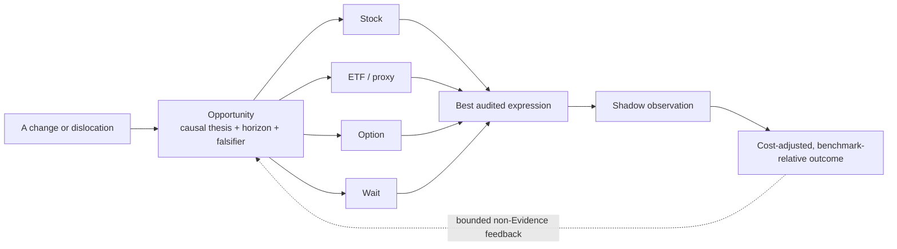
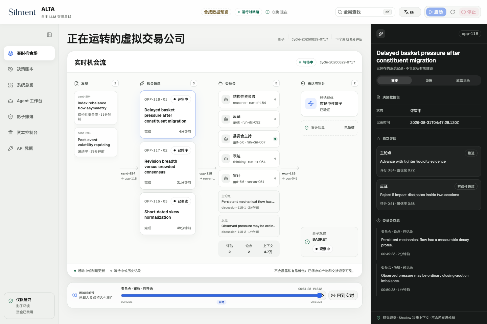
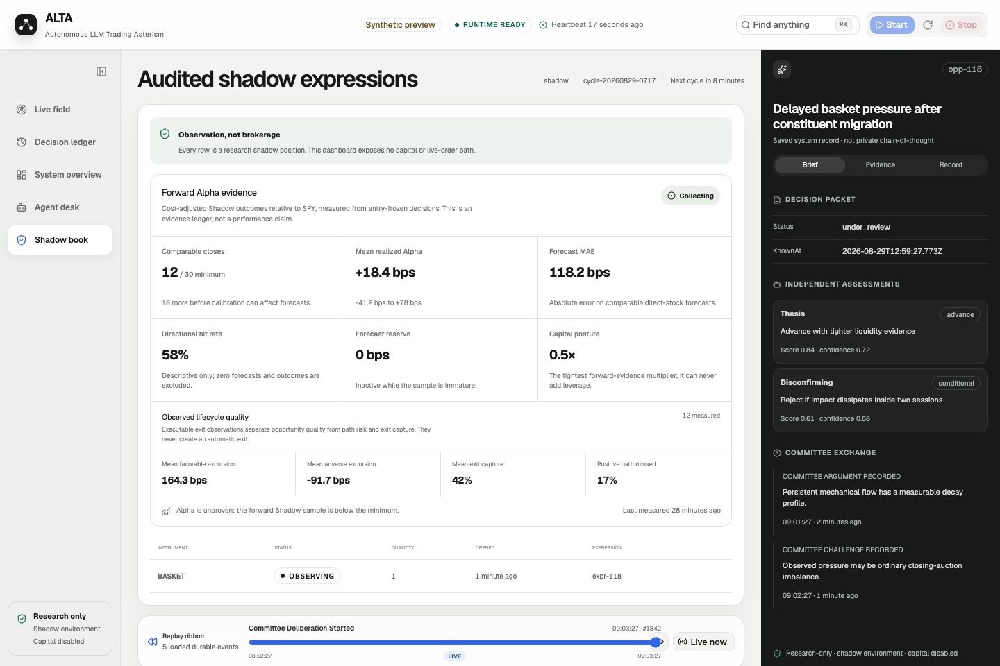
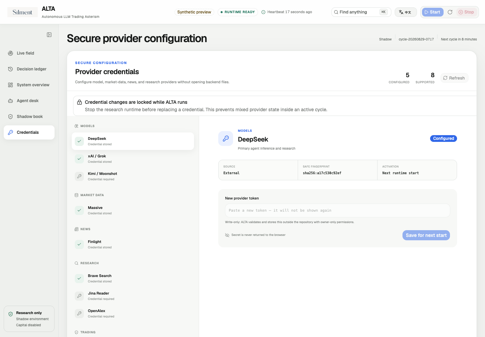
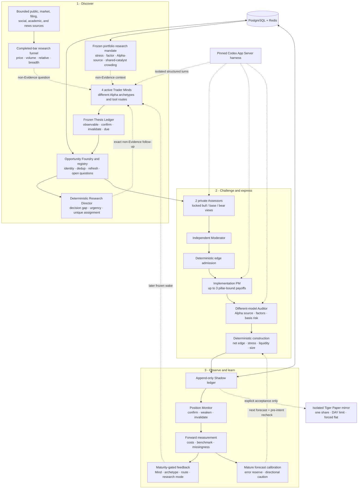

# ALTA

## Autonomous LLM Trading Asterism

_A virtual trading platform operated by specialized LLM agents._

[](https://github.com/kyky2347/ALTA/actions/workflows/ci.yml)
[](CHANGELOG.md)
[](LICENSE)
[](docs/research-scope.md)

ALTA is an evidence-first, opportunity-centric research system for public
markets. Specialized LLM agents independently search for changes and
dislocations, turn them into falsifiable opportunities, challenge one another's
underwriting, compare possible expressions, and measure the result in a durable
Shadow ledger.

> [!IMPORTANT]
> ALTA is experimental, research-only software. It is not investment advice, a
> trade recommendation, an order-management system, or evidence of profitable
> Alpha. It has no live-trading mode and must not be connected to live brokerage
> credentials or real capital.

**Current release:** `0.26.0` (`FORWARD_EVIDENCE_VERIFIED`) · **Normal mode:**
Replay / Shadow · **Broker boundary:** explicit Tiger Paper acceptance only ·
**Real-world Alpha:** unproven

**Local development state:** institutional book intelligence and a replayable
market-research funnel are integrated. Completed daily bars can create at most
one non-Evidence anomaly question per Trader Mind; each Mind must independently
re-verify the observation and causal wedge. A deterministic Research Director
now removes expired or position-monitor-owned work, ranks exact open questions
by decision value and horizon urgency, gives each follow-up Mind a different
question, and preserves at least two independent-discovery seats. Aggregate
stress, Alpha-source, and shared-catalyst concentration constrain construction,
and full-book rotation must improve both expected Alpha dollars and Alpha per
unit of stress capital. The current local tree also centralizes every Agent
context budget, gives malformed Scout output one fresh bounded attempt, backs
off degraded optional connectors, and refuses to spend private-assessment
tokens on Opportunities that deterministic gates already reject. Research
quality now credits only frozen Evidence or exact tool results that the
Candidate actually cites; unrelated browsing remains visible as process cost
but cannot inflate source breadth. The implementation desk also receives
time-adjusted Alpha dollars, stress efficiency, and execution-reserve headroom
for every admissible payoff, while a guarded buy limit may reach—but never chase
above—the observed ask. Mature, comparable direct-stock forecast errors now
close the underwriting loop: after 30 cost-adjusted forward closes, repeated
overforecasting becomes a downside-only Alpha reserve and weak directional
calibration caps new size. The local console exposes that proof burden without
presenting Shadow results as proven performance. Closed positions now retain an
observed executable-price path so favorable/adverse excursion, drawdown, and
exit capture can distinguish discovery quality from implementation leakage;
those diagnostics are descriptive and cannot auto-tune exits. Historical or
malformed positions without a trustworthy risk ticket are charged their full
current notional as stress loss rather than receiving a favorable assumption.

[Quick start](#quick-start) · [Architecture](docs/architecture/overview.md) ·
[Operations](docs/operations/autonomous-shadow.md) ·
[Operator console](docs/operations/operator-console.md) ·
[Research scope](docs/research-scope.md) · [Security](SECURITY.md) ·
[Attribution](ATTRIBUTION.md) · [中文说明](README.zh-CN.md)

## The idea

**ALTA trades opportunities. Stocks, ETFs, and options are only possible
expression vehicles.**

Most agent-trading demos start after a human has selected a ticker. ALTA starts
earlier: four orthogonal Trader Minds ask what changed, why the market may not
have absorbed it, what causal path connects the evidence to a security, and what
would prove the thesis wrong. A valid cycle may end with `Wait` or no position.

The design separates two kinds of intelligence:

- LLM agents own open-ended discovery, interpretation, disagreement, and
  implementation hypotheses.
- Deterministic software owns time, provenance, identity, budgets, replay,
  risk, execution constraints, and the capital boundary.
- Forward Shadow outcomes—not Agent confidence or activity—are the only basis
  for performance evaluation and bounded research incentives.



This makes a ticker an implementation choice, not the unit of research. An
attractive company with a fully priced security may still be `Wait`; the same
opportunity may be better expressed through a proxy or option; and an elegant
trade structure cannot rescue weak evidence.

## Operator console

[](docs/assets/alta-operator-console.png)

_Synthetic operator preview. It demonstrates the observable workflow and uses
no brokerage account, real capital, private credentials, or performance data._

[](docs/assets/alta-forward-evidence.png)

_Forward evidence is kept separate from brokerage. The console labels sample
maturity, uncertainty, forecast error, capital posture, and observed lifecycle
quality without presenting Shadow results as proven Alpha._

[](docs/assets/alta-credential-center.png)

_Synthetic credential-center preview. It contains no real provider state,
fingerprints, tokens, account identifiers, or brokerage data._

## How ALTA works



Only structured artifacts cross Agent hand-offs. Private Assessors do not see
one another's first view; the expression proposer and implementation Auditor use
different model routes; rank scores stay hidden from the expression role; and
no Agent receives an order tool.

The Research Director is code, not another opinionated Agent. It scores only
the cost of leaving a decision gap unresolved: Opportunity state, question
origin, and remaining horizon. Expired work and active Shadow positions leave
the queue; exact question assignments are frozen into each Run; duplicated
follow-up work is rejected; and the score can never enter ranking or capital.

### The specialized team

| Role                    | Mandate                                                                                                                           | Authority boundary                                                    |
| ----------------------- | --------------------------------------------------------------------------------------------------------------------------------- | --------------------------------------------------------------------- |
| Change / event Mind     | Find revisions, operating artifacts, and event propagation                                                                        | Read-only research; cannot rank or trade                              |
| Market-dislocation Mind | Find price, volatility, flow, breadth, and relative-value anomalies                                                               | Must identify a falsifiable non-technical mechanism                   |
| Causal-policy Mind      | Trace official policy, macro, input-cost, and supply-chain transmission                                                           | Must map issuer-level exposure and timing                             |
| Expectation-gap Mind    | Find measurable gaps between priced expectations and emerging fundamentals                                                        | Must seek counterevidence and an observable resolution path           |
| Research Director       | Prioritize exact unresolved questions, allocate unique follow-ups, and protect independent exploration                            | Deterministic non-Evidence process control; cannot judge or trade     |
| Two private Assessors   | Underwrite independent scenario distributions, base rates, variants, and first rejections                                         | Locked views; no instrument selection                                 |
| Moderator and ranker    | Reconcile disagreements, preserve uncertainty, and admit only decision-grade edge                                                 | Moderator is an Agent; rank mechanics are deterministic               |
| Implementation PM       | Compare direct stock, ETF/proxy, option, and `Wait`                                                                               | Proposes a bounded slate; cannot submit orders                        |
| Independent Auditor     | Reclassify intended Alpha, systematic exposures, basis risk, and hedge posture                                                    | Different model from the proposer; may select only one or `Wait`      |
| Position Monitor        | Review frozen thesis pillars against newer point-in-time evidence                                                                 | Appends reviews; cannot rewrite original underwriting                 |
| Portfolio intelligence  | Translate current stress, factor, Alpha-source, and shared-catalyst concentration into a frozen research mandate and capacity map | Deterministic context and limits; cannot manufacture evidence or edge |

The default model team is heterogeneous: DeepSeek V4 Flash handles active
discovery, DeepSeek V4 Pro handles thesis underwriting and expression, Grok 4.6
provides disconfirming assessment and independent audit, and Kimi K3 moderates.
Every run records the actual provider and model. Availability and behavior
remain external-provider dependencies, not repository guarantees.

## What is implemented

| Area          | Current capability                                                                                                                                                                                                                                                                    |
| ------------- | ------------------------------------------------------------------------------------------------------------------------------------------------------------------------------------------------------------------------------------------------------------------------------------- |
| Discovery     | Four concurrent Trader Minds, autonomous tool calls, a completed-bar anomaly funnel, an urgency-aware Research Director with unique follow-up assignments and two protected exploration seats, route rotation, a frozen book-aware mandate, no-op support, and bounded process memory |
| Evidence      | Raw-first point-in-time records, stable identity, content deduplication, immutable thesis pillars, cited-source research quality, provenance, and replay                                                                                                                              |
| Deliberation  | Private heterogeneous assessment, scenario odds, reference-class base rates, priced-in/variant separation, bounded moderation, and conservative admission                                                                                                                             |
| Expression    | Up to three Stock / ETF / Option / Wait hypotheses, real quote or option-chain gates, comparable Alpha/stress/execution economics, and independent audit                                                                                                                              |
| Portfolio     | Cost deduction, Alpha decay, mature forecast-error reserve, single-trade and aggregate stress limits, fail-closed legacy risk, liquidity, gross/factor/Alpha-source/shared-catalyst buckets, stress-efficient capital competition, and pre-intent revalidation                        |
| Learning      | Cost-adjusted SPY-relative Shadow measurement, observed MFE/MAE/drawdown/exit capture, frozen cohorts, configuration drift, missingness, maturity-gated performance attribution, and comparable forecast calibration                                                                  |
| Incentives    | Symmetric, revocable research-budget bonus based only on a conservative forward Alpha bound; no rank, risk, capital, or broker influence                                                                                                                                              |
| Reliability   | Single-owner scheduler, two watchdogs, canonical context budgets, one auditable fresh Scout retry, connector backoff, same-frozen-wake recovery, idempotent transitions, and clean shutdown                                                                                           |
| Observability | Authenticated local operator console plus loopback JSON/SSE for runtime, Agent runs, opportunities, debates, expressions, positions, cohorts, and Alpha summaries                                                                                                                     |
| Capital       | Disabled by default; isolated CLI-only Tiger Paper acceptance with exact-account binding, one-share limits, and final-flat verification                                                                                                                                               |

### Where the research edge is intended to come from

ALTA is not a news summarizer. News is one locator among many. Trader Minds can
begin from market and options dislocations, filings, public pricing and product
changes, operational artifacts, supply-chain evidence, policy transmission,
estimate primitives, public software ecosystems, academic work, or public
social positioning. The system is designed to look for:

- information that is public but fragmented across source families;
- second-order beneficiaries and losers whose causal exposure is overlooked;
- expectation gaps with an observable path to resolution;
- temporary flow, volatility, or implementation dislocations with a fundamental
  mechanism; and
- a cleaner payoff vehicle than the obvious underlying security.

These are research hypotheses. ALTA does not claim that the architecture has
produced persistent out-of-sample Alpha.

When Massive discovery is explicitly enabled, ALTA reuses the bounded daily-bar
ingestion to screen completed sessions for unusual relative return, price-volume
behavior, range expansion, and cross-sectional breadth/dispersion. The screen
does not emit a Candidate or direction. It assigns at most one question to each
orthogonal Mind, excludes the current incomplete session and future-known rows,
and requires fresh finance data plus causal and rival-explanation research
before the Mind may return a cited Candidate.

## Quick start

The credential-free path verifies the deterministic lifecycle without calling
an LLM, market-data provider, news service, or broker.

### Prerequisites

- macOS or Linux;
- Node.js 22+ and Corepack;
- `uv`;
- Docker Desktop, OrbStack, or another Docker Compose-compatible runtime; and
- Rust only when rebuilding the project-local Codex harness.

```shell
git clone https://github.com/kyky2347/ALTA.git
cd ALTA
./alta dashboard
```

That single command performs a locked frontend install/build when needed and
prints a one-time loopback URL. Open it, add any optional provider credentials
in **Credentials**, then press **Start ALTA**. On a fresh clone, that button
prepares the isolated Python environment, starts PostgreSQL and Redis, runs
migrations, installs the current user's host service, and waits for genuine
backend readiness. No separate frontend deployment or manual service install is
required. The host still needs the prerequisites listed above; ALTA does not
silently install Node, `uv`, Docker, or an operating-system service manager.

For contributor verification:

```shell
corepack pnpm install --frozen-lockfile
./alta env setup --dev

./alta test
./alta env python -m pytest -q alta-runtime/python/tests
uv run --frozen --project alta-runtime/capital-python \
  pytest -q alta-runtime/capital-python/tests
```

Run the deterministic lifecycle and exact replay:

```shell
./alta env up
./alta env python -m alta_asterism migrate upgrade
./alta env python -m alta_asterism demo
./alta env python -m alta_asterism replay
./alta env python -m alta_asterism soak
./alta env down
```

`Wait` and `MVP_IDLE` are valid outcomes. They mean an opportunity did not clear
the evidence or implementation gates, not that the scheduler failed.

## Agent-backed Shadow operation

Build the pinned project-local Codex App Server substrate when using real Agent
turns. The V8 sandbox may be compiled from source:

```shell
V8_FROM_SOURCE=1 ./alta setup
./alta doctor
```

Maintainers may instead supply checksum-verified local V8 artifacts through
`ALTA_RUSTY_V8_CACHE_DIR`, or set both `RUSTY_V8_ARCHIVE` and
`RUSTY_V8_SRC_BINDING_PATH`. Build products, runtime state, databases, and
generated secrets remain under ignored `.alta/` state.

Provider entry points are:

```shell
./alta openai
./alta deepseek
./alta grok
./alta kimi
./alta models
```

Real credentials must remain outside the repository—in an operating-system
secret manager, the process environment, or owner-only
`~/.config/alta/credentials/` files. `.env.example` contains empty placeholders
and non-sensitive defaults only. Research child environments do not inherit
repository, market-data, database, Redis, or broker credentials.

Before enabling external adapters or unattended operation, read the
[getting-started guide](docs/operations/getting-started.md) and
[Autonomous Shadow operations](docs/operations/autonomous-shadow.md). Start with
one controlled Shadow cycle. The host service is then managed with:

```shell
./alta service install
./alta service status
./alta service stop
./alta service uninstall
./alta env down
```

The normal unattended service remains Shadow-only. The optional Tiger path is a
separate, explicitly invoked engineering acceptance and is never enabled by the
24×7 scheduler.

## Local operator console

ALTA includes a responsive real-time operator console built around two linked
views: **Asterism Trace** shows opportunities moving through discovery,
completion, committee challenge, expression, audit, and Shadow observation;
**Decision Ledger** replays the append-only record behind those transitions.
Selecting any durable object opens its saved evidence, assessments, hand-offs,
model route, tool provenance, artifacts, and audit state. The console never
claims to expose a model's private chain-of-thought.

The complete operator shell is available in English and Simplified Chinese.
Use the language button in the global action bar to switch instantly; the
choice survives reloads, and dates, numbers, statuses, controls, errors, empty
states, and mobile layouts follow the selected locale. Durable Agent and
research artifacts remain in their saved source language rather than being
silently rewritten for display.

```shell
./alta dashboard
```

The command remains in the foreground and owns only the loopback control plane;
`Control-C` ends the console without silently stopping an already-running
research service. It automatically performs a frozen-lockfile frontend build
when the checkout is new or UI sources changed. The printed URL creates an
HttpOnly local session; the browser never receives the Opportunity API bearer
token. Start, restart, safe-stop, and credential replacement require exact
same-origin CSRF validation.

The **Credentials** view lists every supported external token slot—DeepSeek,
xAI/Grok, Kimi, Massive, Finlight, Brave, Jina, and OpenAlex—by provider and
purpose. It exposes only configuration state, source type, and a short one-way
fingerprint. Raw secrets are write-only, cleared after submission, atomically
stored outside the repository under owner-only permissions, and never returned
to the browser. Environment-supplied credentials are visible as locked metadata
and cannot be shadowed. Replacements are allowed only while the research
runtime is fully stopped, preventing one cycle from mixing provider state.
OpenAI continues to use the official Codex authentication flow rather than an
API-key field.

On a fresh clone, **Start ALTA** prepares the isolated environment and installs
the user-level research service before starting it; subsequent starts are
idempotent and wait for readiness. **Stop safely** stops the service,
PostgreSQL, and Redis while leaving the foreground console available. The
control plane remains Shadow research only: Tiger is displayed as a Paper-only
boundary, but this capital-disabled build does not accept broker credentials,
reach Tiger, submit an order, or expose an order API. An optional separately
managed console service remains available through `./alta dashboard
install|open|status|logs|stop|uninstall`. See the
[operator-console guide](docs/operations/operator-console.md).

The console is designed for imperfect operating conditions: refreshes are
single-flight and time-bounded, transient failures recover with capped backoff,
healthy partial responses remain visible, and the last synchronized browser
snapshot is explicitly marked stale instead of silently disappearing. Lifecycle
actions use an owner-only cross-process lease and power-durable persisted phases,
so concurrent clicks and a restarted console reconcile with real service state.
An owner-only session secret keeps an already authorized browser connected
across a console-process restart; CSRF material rotates per process and the
browser refreshes it after detecting the new console instance. A versioned
console contract fails closed with a specific rebuild instruction instead of
letting a stale frontend issue ambiguous controls. Docker lifecycle commands,
the migration boundary, upstream reads, and browser requests all have bounded
deadlines.
The autonomous runtime remains independent of the dashboard and recovers through
the host service manager, Python supervisor, PostgreSQL durable volume, Redis
append-only state, database ownership lock, and frozen-cycle replay boundaries.
The console has its own host-managed lifecycle and persistent browser session,
so its failure cannot stop research and its restart does not sign out an already
authorized browser. This is recoverable single-host operation, not multi-host
high availability; off-host backups, redundant infrastructure, alert delivery,
and an external SLO remain deployment responsibilities.

## Observability contract

The console consumes ALTA's loopback JSON/event surface through a local
server-side proxy. Direct `/api/v1` access remains read-only and does not expose
an order API.

| Endpoint                        | Purpose                                                            |
| ------------------------------- | ------------------------------------------------------------------ |
| `/health/live`, `/health/ready` | Process and dependency health                                      |
| `/api/v1/system/summary`        | Durable object counts                                              |
| `/api/v1/system/runtime`        | Agent, source, heartbeat, credential-revision, and safety state    |
| `/api/v1/mvp/status`            | Current cycle and recent events                                    |
| `/api/v1/events`                | Forward/backward cursor-paged append-only history for replay       |
| `/api/v1/runs/{id}`             | Role runs, frozen research queue/assignment, and stage outcomes    |
| `/api/v1/opportunities/{id}`    | Evidence, thesis, debate, ranking, and audit trail                 |
| `/api/v1/expressions/{id}`      | Expression, construction, and Shadow state                         |
| `/api/v1/alpha/summary`         | Forward Alpha, lifecycle quality, calibration, and capital posture |
| `/api/v1/evaluation/summary`    | Frozen cohort, drift, coverage, missingness, and readiness         |
| `/api/v1/stream`                | Cursor-based server-sent events                                    |

## Verification status

The current local working tree passes:

| Gate                      |                                                                           Result |
| ------------------------- | -------------------------------------------------------------------------------: |
| Node gateway / harness    |                                                                        155 tests |
| Opportunity OS            |                                                                        263 tests |
| Isolated capital package  |                                                                         25 tests |
| Deterministic lifecycle   |       3 Candidates → 3 Opportunities → 1 audited Shadow position → observed exit |
| Replay                    |               `16be618841b4ced276fea1c3297bd0a934093b995bce50bfadad0b74e9f9816c` |
| Accelerated soak          |                                    14 cycles, zero failures, zero manual repairs |
| Foreground service        |                                 `live` and `ready`, capital disabled, clean stop |
| Research Director deploy  |                    2 unique follow-ups + 2 explore; 4/4 Runs succeeded; idle end |
| Supervised wall-clock run |         26 completed idle cycles; 3 Opportunities; 0 ranks, positions, or orders |
| Sensitive-file check      |       No credential files or credential-like values found in first-party changes |
| Forecast calibration      | 30-sample maturity gate, downside-only reserve, size cap, and pre-intent recheck |
| Lifecycle diagnostics     |         PIT executable path, MFE/MAE/drawdown/capture; descriptive and read-only |

The Research Director cold start exposed and fixed two real context-budget
defects: a global queue could exceed the 16 KiB frozen-wake limit, and a
prospective incentive could displace the assigned follow-up parent at the
12 KiB prompt limit. The rerun persisted two different exact follow-ups and two
independent exploration Runs under `alpha-trader-v15`; all four Minds succeeded,
the cycle ended `MVP_IDLE`, consecutive failures returned to zero, capital
remained disabled, and the service stopped cleanly. This verifies orchestration
and refusal behavior, not profitable discovery.

The soak advances simulated event time; it is not 24 hours of live wall-clock
model operation. Engineering verification proves paths and refusal behavior,
not strategy profitability.

## Safety model

- Supported environments are `replay`, `shadow`, and `paper`; no `live` mode
  exists.
- Missing, stale, illiquid, inconsistent, or unauditable evidence becomes
  `Wait`.
- A Shadow fill requires a forward quote observed after intent; historical
  prices are not backfilled as invented fills.
- Research Agents receive neither broker credentials nor an order tool.
- Tiger mutation is disabled by default and confined to an isolated Paper-only
  package with exact-account binding, one-share DAY limits, and final-flat
  reconciliation.
- Positive small samples never create leverage. Negative evidence can reduce
  later synthetic Shadow capital.
- Interrupted cycles rebuild from the original frozen wake rather than silently
  replacing evidence with later information.

Read [SECURITY.md](SECURITY.md) and the
[research scope](docs/research-scope.md) before using external services.

## Repository layout

```text
.
├── alta                         project-local command
├── alta-src/                    Node gateway, launch control, bounded tools
├── alta-runtime/
│   ├── python/                 Opportunity OS, orchestration, API and SSE
│   ├── capital-python/         isolated Tiger Paper-only executor
│   └── compose.yaml            loopback PostgreSQL and Redis
├── vendor/openai-codex/        pinned, attributed Codex Rust substrate
└── docs/                       architecture, operations, audits and roadmap
```

PostgreSQL is the system of record; Redis is disposable support state. ALTA-owned
application behavior lives outside `vendor/openai-codex/` whenever practical.

## Reproducibility and provenance

Lockfiles cover Node, both Python packages, the Rust workspace, and container
image digests. Deterministic fixtures use synthetic, license-safe data. A clean
clone can reproduce software contracts, migrations, replay, recovery, API/SSE,
Shadow accounting, and first-party tests; it cannot reproduce future model
prose, provider responses, market conditions, or returns.

ALTA contains a modified Apache-2.0 source snapshot of
[OpenAI Codex](https://github.com/openai/codex) at a pinned commit as its App
Server and agent-harness substrate. The vendored boundary, 13 modified Rust
files, retained notices, package dependencies, API-only integrations, and
conceptual architecture references are documented in
[ATTRIBUTION.md](ATTRIBUTION.md) and
[`vendor/openai-codex/CHANGES.md`](vendor/openai-codex/CHANGES.md). Referenced
projects are not presented as ALTA-authored code, and projects listed as
conceptual comparisons are not copied or vendored.

## Documentation

- [Architecture overview](docs/architecture/overview.md)
- [Detailed Opportunity OS design](docs/architecture/opportunity-os.md)
- [Getting started](docs/operations/getting-started.md)
- [Autonomous Shadow operations](docs/operations/autonomous-shadow.md)
- [Research scope and non-goals](docs/research-scope.md)
- [Reproducibility contract](REPRODUCIBILITY.md)
- [Security policy](SECURITY.md)
- [Attribution and third-party boundaries](ATTRIBUTION.md)
- [Changelog](CHANGELOG.md)
- [Contributing](CONTRIBUTING.md)

## License

ALTA-authored source is licensed under the [Apache License 2.0](LICENSE).
Vendored and package-managed dependencies remain subject to their own licenses,
copyright notices, and terms. Service names and trademarks belong to their
respective owners. Compatibility statements do not imply endorsement,
partnership, or official status.

ALTA is independently maintained and is not an OpenAI product or an endorsed
investment system.
