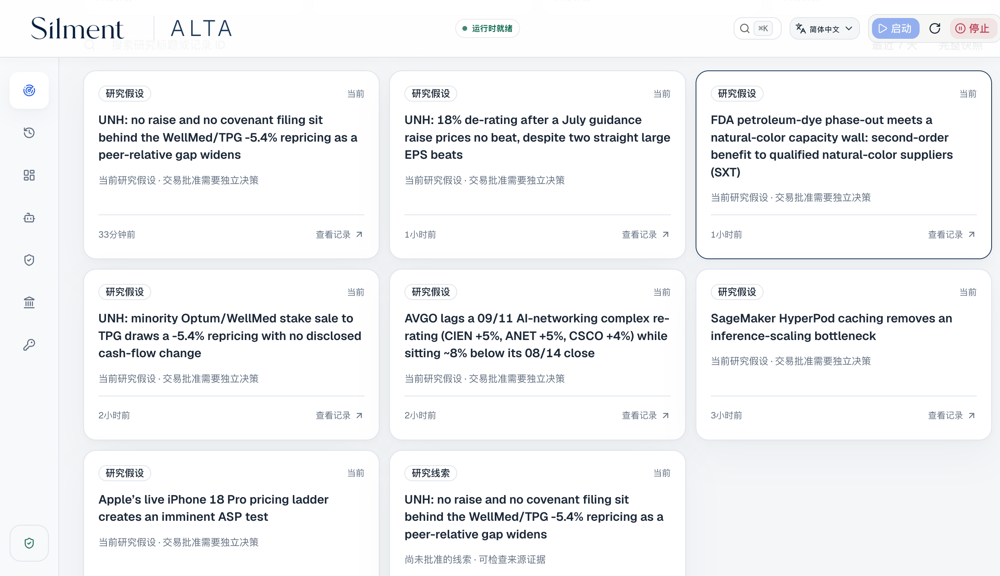
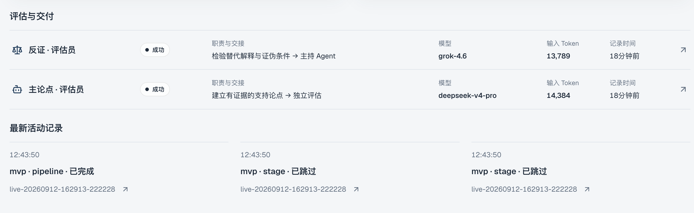
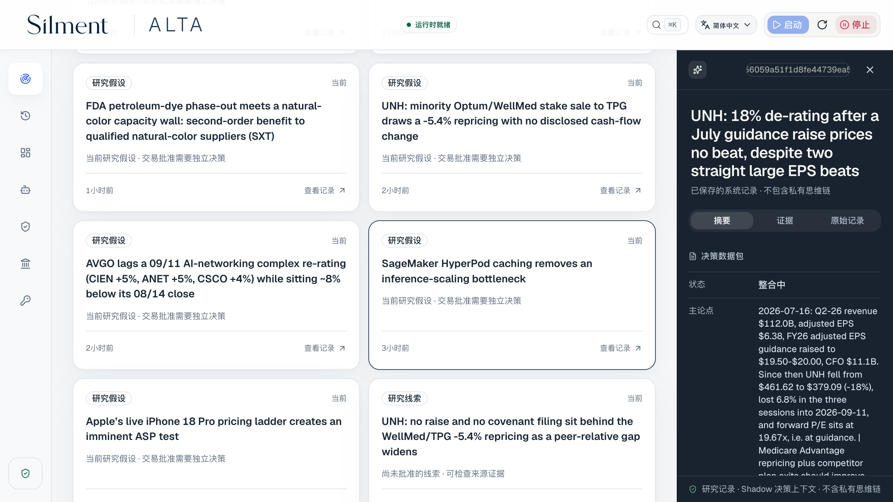
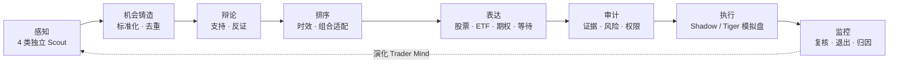

# ALTA

## Autonomous LLM Trading Asterism

_由专业 LLM Agent 协作运行的虚拟交易平台。_

[](https://github.com/kyky2347/ALTA/actions/workflows/ci.yml)
[](LICENSE)
[](docs/research-scope.md)

[English](README.md) · [繁體中文](README.zh-HK.md) ·
[快速启动](#本地运行) · [系统架构](docs/architecture/overview.md) ·
[验收记录](docs/audits/release-readiness-2026-09-12.md) · [网站](https://alta.silment.com)

**交易的是机会；股票、ETF 或期权，只是兑现机会的载体。**

ALTA 把自主市场研究变成持久、可检查的工作流程。四类 Scout 分别寻找变化、
市场错位、因果关联和预期差；独立评审挑战假设，表达席位比较利用机会的方法，
确定性程序负责风险、权限和执行边界。

目标是一家虚拟研究机构，而不只是推荐股票的聊天机器人。
判断一条线索是否有价值，要看它能否经得起证据、反对意见、成本和时间的检验。

> [!IMPORTANT]
> 本项目是实验性研究软件，不是投资建议、订单管理系统或盈利证明。
> 自主执行支持内部 **Shadow Paper** 和明确授权的 **Tiger 模拟盘**。
> 其他券商连接器属于独立、尚未完成的集成，不是已启用的自主实盘交易。

## 看见系统如何工作

当前版本看板，展示近期已保存的研究记录和专业研究团队。
点击图片可查看完整尺寸；研究假设不等于已批准交易。

[](docs/assets/alta-operator-console-zh.png)

| 研究团队                                                                                | 机会内部                                                                                              |
| --------------------------------------------------------------------------------------- | ----------------------------------------------------------------------------------------------------- |
| [](docs/assets/alta-agent-desk-zh.png) | [](docs/assets/alta-opportunity-detail-zh.png) |
| 独立评审的分工、模型与已记录工作。                                                      | 原始决策摘要，可在看板追查完整记录。                                                                  |

2026 年 9 月 12 日 · 简体中文界面 · Agent 原始产物保留其撰写语言。
截图范围、记录 ID 和图片哈希见[发布验收记录](docs/audits/release-readiness-2026-09-12.md)。
不包含密钥或账户资料。

## 这家虚拟机构如何协作



**LLM 决定什么值得研究，程序决定什么可以改变持久状态或资金。**
任何 Agent 都不能包办证据、风险批准和资金操作。证据不足时等待，不临场编造。

| 层次   | 已有实现                                                                                    |
| ------ | ------------------------------------------------------------------------------------------- |
| 发现   | 4 类 Scout、13 个有边界的只读工具，日期感知搜索、发行人网站抓取、订阅源、学术与历史档案检索 |
| 判断   | 独立模型路由、可证伪假设、反证、考虑组合的排序与载体比较                                    |
| 连续性 | 持久化跟进问题、催化事件期限、检查点恢复与 Trader Mind 演化                                 |
| 评估   | 时点冻结预测、前瞻结果、相对基准表现与只能下调风险的校准                                    |
| 运维   | 三语看板、API/SSE、运行历史、只写密钥、模型设置与启停控制                                   |

Scout 每次尝试默认 **11 次工具调用、98k 按系统预算口径计入的 Token、300 秒**，仍有硬上限。
增加预算用于补证，不是增加机会数量的配额。数据源有节流、取消和分层超时，
不完整的检索结果仍会标注。[检索设计与实测限制 →](docs/audits/research-retrieval-review.md)

## 本地运行

**前提：**macOS 或 Linux、Node.js 22+ 与 npm、Python 3.12、`uv`、
Docker/OrbStack 和足够磁盘空间。首次安装需要联网；
构建固定版本的自定义 harness 还需要对应 Rust 工具链。

```shell
git clone https://github.com/kyky2347/ALTA.git
cd ALTA
npm run dashboard
```

该指令会在需要时安装锁定的前端依赖、构建当前看板，并打开本机已鉴权页面。然后：

1. **API 连接**：填写自己的供应商密钥；保存后不会回显。
2. **Agent 协作 → Agent 模型**：指定可用模型；相互独立的评审角色必须使用不同模型。
3. **启动**：准备锁定的后端环境，启动受管依赖和研究服务。
4. **停止**：安全结束研究服务，并停止受管数据库与缓存。

券商交易权限默认关闭，需要单独授权；保存密钥不等于允许交易。
harness、供应商要求和排障步骤见[部署指南](docs/operations/getting-started.md)。

如希望手动安装依赖，先运行 `corepack pnpm install --frozen-lockfile`，再运行 `./alta dashboard`。

### 不使用付费 API 的验证

```shell
./alta env setup --dev
./alta test
./alta env python -m pytest -q alta-runtime/python/tests
uv run --frozen --project alta-runtime/capital-python pytest -q alta-runtime/capital-python/tests
uv run --frozen --all-extras --project alta-runtime/broker-python pytest -q alta-runtime/broker-python/tests
node --test alta-dashboard/tests/*.test.mjs
corepack pnpm check
./alta env down
```

集成测试需要受管 PostgreSQL 环境；没有 `DATABASE_URL` 时直接运行 `pytest`
不等于完整验收指令。确定性演示、回放和干净源码安装见[复现说明](REPRODUCIBILITY.md)。

## 执行能力不等于交易权限

| 模式或边界   | 真实支持范围                                                                                                 |
| ------------ | ------------------------------------------------------------------------------------------------------------ |
| Shadow Paper | ALTA 管理内部成交、成本、持仓、观察和退出，不操作券商                                                        |
| Tiger 模拟盘 | 已有适配执行器；精确账户绑定、明确授权、最新审计与重启对账                                                   |
| 五家预适配   | Alpaca、IBKR、Futu/moomoo、Longbridge/Longport、Schwab：私有配置、供应商代码和只读检查，端到端账户验收待完成 |

新 Tiger 实盘连接器同样尚未验收。独立六券商模块含执行引擎代码，
但**尚未接入自主研究执行循环**。本地网关、OAuth、账户权限和核验不能靠
一个通用密钥输入框替代。[供应商矩阵与待完成工作 →](docs/broker-expansion.md)

## 为中断和恢复而设计

PostgreSQL 是事实来源，Redis 提供辅助状态。工作由带隔离令牌的单一所有者认领，
券商意图先持久化再提交，订单状态不确定时先对账、不盲目重试。
断连时前端保留最后有效快照，过期的控制请求不能覆盖已确认操作。

9 月 12 日验收覆盖 **816 项测试**、前端生产构建、真实无下单研究、
鉴权 API 与干净源码安装。发布记录保留发现的问题、修复、最终结果和停止证据，
并不构成 24×7 可用性认证或盈利保证。

尚未证明：持续样本外 Alpha、所有断电场景、所有浏览器兼容性，以及其他券商真实账户的下单验收。

## 工程结构

```text
alta-dashboard/                React 看板 · English / 简体中文 / 繁體中文
alta-src/                      Node 网关 · 有边界工具 · 启停控制
alta-runtime/python/           研究生命周期 · PostgreSQL · API/SSE
alta-runtime/capital-python/   隔离的 Tiger 模拟盘执行器
alta-runtime/broker-python/    隔离的实验性连接器与执行库
vendor/openai-codex/            固定版本、保留归属的 Agent harness
docs/                          架构 · 运维 · 验收
```

[架构](docs/architecture/overview.md) · [操作指南](docs/operations/operator-console.md) ·
[持续运行手册](docs/operations/autonomous-shadow.md) · [安全](SECURITY.md) ·
[贡献指南](CONTRIBUTING.md) · [更新记录](CHANGELOG.md)

## 许可与来源

ALTA 自有代码采用 [Apache-2.0](LICENSE)。项目以修改过的固定版本
[OpenAI Codex](https://github.com/openai/codex)（Apache-2.0）作为本地 App Server/harness，
并使用单独授权的依赖和 API。保留上游声明；修改和依赖见
[ATTRIBUTION.md](ATTRIBUTION.md)、[NOTICE](NOTICE) 与[上游修改记录](vendor/openai-codex/CHANGES.md)。

独立维护，不由 OpenAI 或任何被提及的数据供应商、券商背书。
供应商条款、交易所数据权限和再分发授权仍需使用者自行确认。
