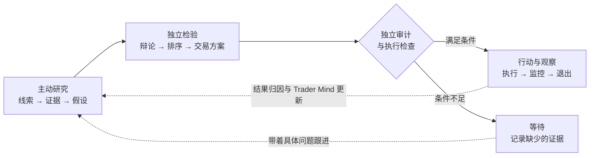
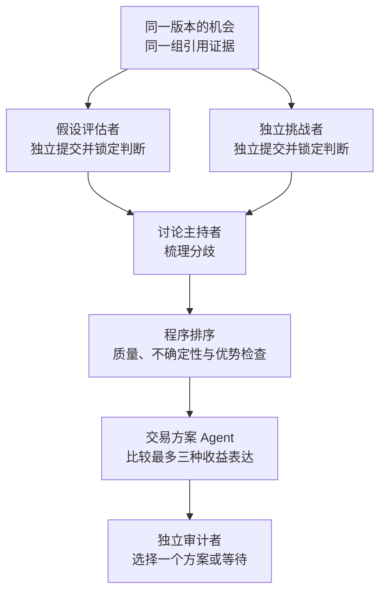
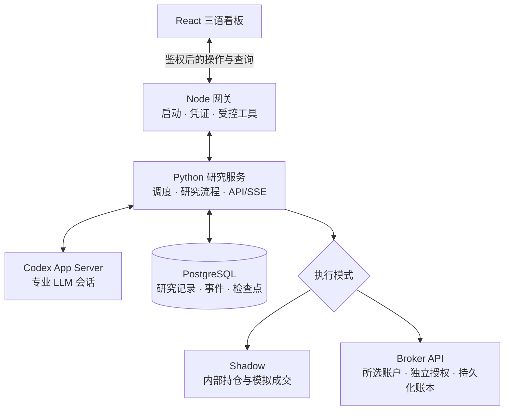

# ALTA

## Autonomous LLM Trading Asterism

_由专业 LLM Agent 分工协作的虚拟交易平台。_

[](https://github.com/kyky2347/ALTA/actions/workflows/ci.yml)
[](LICENSE)
[](docs/research-scope.md)

[English](README.md) · [繁體中文](README.zh-HK.md) ·
[快速启动](#本地运行) · [系统架构](docs/architecture/overview.md) ·
[验收记录](docs/audits/broker-routing-2026-09-13.md) · [网站](https://alta.silment.com)

**先找到机会，再选择最适合兑现它的交易工具。**

ALTA 是一套在本地运行的多 Agent 市场研究系统，包含操作看板、内部模拟和独立的券商执行模块。
四类 Scout 主动追踪线索，独立评审检验证据，交易方案 Agent 比较如何行动。
从研究到决策，每次交接都有记录可查。

目标是一家虚拟研究机构，而不只是推荐股票的聊天机器人：
一个判断需要经得起反对意见、成本和时间的检验，才值得投入资金。

> [!IMPORTANT]
> 本项目是实验性研究软件，不是投资建议、生产级订单管理系统或盈利证明。
> 执行只有两种模式：**Shadow** 和 **Broker API**。券商交易须明确选择账户、
> 完成核验并单独授权。六家连接器已实现，不代表实盘账户已完成验收。
> [当前执行范围 ↓](#两种模式明确的执行目标)

## 你能用它做什么

ALTA 把三项工作放进同一个本地工作台：研究过程可追查，决策有据可依，后续结果可以检验判断。

| 寻找机会                                 | 形成决策                                          | 持续跟进                                       |
| ---------------------------------------- | ------------------------------------------------- | ---------------------------------------------- |
| Scout 自主寻找变化、异常和未解决的问题。 | 独立评审检验假设，交易方案 Agent 比较工具与成本。 | 持久化记录串联监控、退出、前瞻结果与后续研究。 |

研究者追查分歧与证据质量，开发者分开改进判断与执行模块，
操作者看清已完成工作、尚存疑问和已授权操作。

## 看见系统如何工作

从来源证据到评审结论，沿着记录了解一条机会。点击图片可查看完整尺寸；
已保存的研究假设不等于已批准交易。

[](docs/assets/alta-operator-console-zh.jpg)

| 研究团队                                                                                | 机会内部                                                                                              |
| --------------------------------------------------------------------------------------- | ----------------------------------------------------------------------------------------------------- |
| [](docs/assets/alta-agent-desk-zh.jpg) | [](docs/assets/alta-opportunity-detail-zh.jpg) |
| 谁研究过、用了哪个模型、留下了什么产物。                                                | 投资假设、支持证据与评审结论。                                                                        |

| 执行控制                                                                                                        | 模型分工                                                                                            |
| --------------------------------------------------------------------------------------------------------------- | --------------------------------------------------------------------------------------------------- |
| [](docs/assets/alta-broker-connections-zh.jpg) | [](docs/assets/alta-model-settings-zh.jpg) |
| 两种模式、明确的执行目标与独立授权。                                                                            | 按角色选择模型，保留独立评审。                                                                      |

研究截图：2026 年 9 月 12 日；执行设置：9 月 13 日。简体中文界面，Agent 原始产物保留撰写语言。
设置截图展示尚未授权的配置，不代表已连接券商。截图范围及哈希：
[研究验收](docs/audits/console-readability-2026-09-12.md) ·
[执行验收](docs/audits/broker-routing-2026-09-13.md)。不包含密钥或账户资料。

## 本地运行

**前提：**macOS 或 Linux、Node.js 22+ 与 npm、Python 3.12、`uv`、
Docker/OrbStack 和足够磁盘空间。首次安装需要联网；
构建固定版本的自定义 harness 还需要对应 Rust 工具链。

```shell
git clone https://github.com/kyky2347/ALTA.git
cd ALTA
npm run dashboard
```

该指令会在需要时安装锁定的前端依赖、构建看板，并打开本机已鉴权页面。接下来在看板中操作：

| 步骤         | 要做什么                                                                     |
| ------------ | ---------------------------------------------------------------------------- |
| **1 · 连接** | 填写自己的研究和数据供应商密钥；保存后不会回显。                             |
| **2 · 分工** | 在 **Agent 协作 → Agent 模型**中选择可用模型；对立评审角色必须使用不同模型。 |
| **3 · 启动** | 准备锁定的后端环境，启动受管研究服务。先使用 **Shadow**。                    |
| **4 · 查看** | 打开 Scout 记录，追查引用，比较评审结论。                                    |
| **5 · 停止** | 结束研究并停止受管数据库与缓存。这**不会**清空券商持仓。                     |

保存密钥不等于允许交易。模型访问权限、行情订阅资格和券商账户权限需要分别具备。
服务健康时也可能在等待下一个周期；`Wait` 可以是正确的研究结论。

[部署与排障](docs/operations/getting-started.md) ·
[操作指南](docs/operations/operator-console.md) · [复现说明](REPRODUCIBILITY.md)

### 把看板当作研究工作台来读

先带着问题看，而不只是看数量。沿着共用记录 ID，追查线索、评审与状态变化。

| 你想弄清什么               | 去哪里看                                                               |
| -------------------------- | ---------------------------------------------------------------------- |
| 为什么会有这条机会？       | **研究雷达 → 详情**：来源引用、时间、投资假设与决策记录。              |
| Agent 到底在做什么？       | **Agent 工作台**：角色、模型、已保存产物、工具活动、上下文用量与延迟。 |
| 离开之后发生了什么？       | **活动与历史**：有序事件、历史分页和回放时间轴。                       |
| 现在持有什么，为什么持有？ | **Shadow 持仓**查看内部仓位；**API 交易**查看所选券商账户。            |
| 哪些地方需要人处理？       | **系统概览 / API 连接**：数据源状态、系统健康与验证结果。              |

详情展示已提交摘要、结构化产物与来源，不是模型内部思维链。
语言切换不改写研究记录，历史回放也不会把旧决策变成实时活动。

## 这家虚拟机构如何协作



**研究可以开放，权限必须明确。** LLM 自主选择研究方向、提出利用机会的方法；
程序负责时效性、风险、账户隔离和持久化状态检查。再有说服力的假设，也不能自行批准执行。

### 四类研究者，各有自己的问题

每个 Scout 都有自己的 Trader Mind：研究风格、关注方向和积累的经验。
它们共用工具，不共用一份研究议程。

| Scout      | 主要追问什么                                             |
| ---------- | -------------------------------------------------------- |
| 变化与事件 | 公告、业务或催化事件到底发生了什么变化？什么时候发生的？ |
| 市场错位   | 价格或相关资产为什么出现分化？                           |
| 因果与政策 | 哪些间接影响会传导到其他公司或行业？                     |
| 预期差     | 市场似乎在期待什么？哪些证据可能推翻这些期待？           |

工具覆盖日期感知搜索、发行人网站抓取、订阅源、公开数据和历史档案检索。
新闻和社交媒体信息是线索，不是已核实的结论。事件时间与获取时间分开记录：
刚抓取的页面也可能在讲旧事。有上限的预算、数据源节流和不完整结果记录，让检索过程可检查。
[检索设计与限制 →](docs/audits/research-retrieval-review.md)

### 每一步由谁负责



两位评估者先锁定判断，再接触对方的评估。主持者依据记录讨论，不能用共识补上缺失来源。
排序由程序完成，不是 Agent 投票；交易方案交给审计者之前，还须通过行情和组合检查。

跨角色交接的是有版本的结构化产物，不是一段不断变长的群聊。
模型可以按角色配置，但对立评估之间、交易方案与审计之间必须使用不同模型。
模型多样性是一项控制措施，并不证明它们的判断在统计上完全独立。

### 从想法到可追溯的决策

| 阶段         | 必须留下什么                                          |
| ------------ | ----------------------------------------------------- |
| **假设**     | 什么变了、市场预期可能错在哪里、证伪条件与时间范围。  |
| **检验**     | 反证、独立评审结论，以及考虑组合风险的排序。          |
| **交易方案** | 可用工具、方向、仓位、成本，以及等待的理由。          |
| **持续跟进** | 监控、退出、持久化的跟进问题和催化事件期限。          |
| **学习**     | 时点冻结预测、前瞻结果、基准比较和 Trader Mind 更新。 |

股票、ETF 和已支持的期权方案可以作为研究对象；券商执行器的范围更窄，见下文。
最直观的标的可能流动性不足、已经重新定价，或与已有仓位暴露于同一种风险。
`Wait` 会保留理由和下一个研究问题，而不是强行生成交易。

三语看板通过记录 ID 关联证据、Agent 工作、决策和事件历史。
已保存记录、已完成工作和当前运行的 Agent 分开计数；这些数字都不等于投资表现。

### 一条机会带着哪些记录流转

Opportunity 是研究身份，Candidate 是新线索，Expression 是利用机会的方案。
去重与版本管理让跟进仍然指向原问题，不把每次唤醒都算作“新机会”。

```text
Opportunity · 稳定身份，有版本的投资假设
├── 证据      来源 · 事件与观察时间 · 内容哈希
├── 假设      因果判断 · 证伪条件 · 预期时间范围
├── 评审      已锁定评估 · 分歧 · 决策
├── 交易方案  工具 · 仓位 · 成本 · 独立审计
└── 后续跟进  未解决问题 · 观察 · 退出与结果记录
```

这些记录不能像聊天字段一样任意改写。读者可以追查决策当时知道什么，
而不引入事后信息；同一事件的多篇报道也不必变成多笔交易。

### 机会的寿命，可以长于一个研究周期

研究议程会保留未解决的问题和催化事件期限。后续唤醒可以安排有明确目标的跟进，
其他 Scout 则继续探索。关闭标签页不会取消这份议程，持久化后端才是它的管理者。
这让系统可以围绕需要几天或几周才能验证的假设持续工作，
而不必让一段聊天会话从头到尾一直活着。

Trader Mind 的经验和组合背景用于分配注意力，不会因此变成来源证据。
前瞻结果归因于入场时冻结的决策，反馈和预测校准都有样本成熟度要求。
现有校准可以在证据恶化时收紧风险，不能因为几次好运就自主放宽执行规则。
这种设计支持长期研究，但长期可靠性和投资能力仍需持续观察来证明。

## 两种模式，明确的执行目标

| 模式           | 实际行为                                                                                   |
| -------------- | ------------------------------------------------------------------------------------------ |
| **Shadow**     | ALTA 管理内部成交、成本、持仓和退出，不向券商下单。                                        |
| **Broker API** | 已审计计划使用所选券商，以及明确配置的**模拟盘或实盘账户**；不会自动退回 Tiger 或 Shadow。 |

```text
配置凭证 → 核验账户 → 保存执行目标 → 单独授权 → 启动
             Paper / Live 是账户属性，不是第三种模式
```

授权绑定券商、账户、环境和配置版本。后端接收已持久化的研究与独立审计产物，
不接受浏览器直接提供的订单。独立监控循环刷新报价、对账并管理退出，不必等待 LLM 研究结束。

| 连接器状态                       | 当前边界                                                                                |
| -------------------------------- | --------------------------------------------------------------------------------------- |
| **Tiger · Alpaca · IBKR · Futu** | 已有带核验条件的执行路径，仍需真实账户核验和明确授权。IBKR 每次下单前还需无成交的预检。 |
| **Longbridge / Longport**        | 授权被阻止：账户与环境的身份核验尚不完整。                                              |
| **Schwab**                       | 授权被阻止：权限、完整订单核验和自动 OAuth 续期尚不完整。                               |

以上是实现状态，**不是六家实盘账户的验收结果**。
当前券商执行支持**每个账户一个活跃计划、做多美元股票或 ETF、整股及当日有效限价单**，
不支持该路径下的期权、做空或多计划组合执行。
旧 Tiger 模拟盘执行器仅作隔离兼容保留，不是第三个可选模式。

首次授权需要空的专用账户。切换前须撤销授权、对账并处理已有仓位。
退出由软件管理，不是券商原生保护单；停机可能延误退出。
**停止 ALTA 不会平掉券商持仓。** [供应商矩阵与运行限制 →](docs/broker-expansion.md)

## 系统如何搭在一起



浏览器负责展示和操作，不负责调度。受管后端维持研究与恢复，PostgreSQL 保存正式记录，
Redis 辅助协调。券商订单意图先写入隔离的持久化账本，再提交；
订单状态不确定时按标识对账，不盲目重试。

```text
alta-dashboard/                React 看板 · English / 简体中文 / 繁體中文
alta-src/                      Node 网关 · 有边界工具 · 启停控制
alta-runtime/python/           研究生命周期 · PostgreSQL · API/SSE
alta-runtime/capital-python/   隔离的 Tiger 模拟盘执行器
alta-runtime/broker-python/    隔离的券商连接器与执行模块
vendor/openai-codex/            固定版本、保留归属的 Agent harness
docs/                          架构 · 运维 · 验收
```

ALTA 适合研究多 Agent 判断机制，以及构建可检查的金融工作流。
它不是低延迟交易引擎，也不是开箱即用的机构交易系统。
具备恢复机制，不等于获得了 24×7 可用性认证。

### 现实发生中断时

研究进度、浏览器连接和券商状态是三件不同的事。
不能因为没有收到响应，就推断订单没发出去；
也不能因为标签页断线，就认为后端已经停止研究。

| 中断情况             | 设计中的处理方式                                                                           |
| -------------------- | ------------------------------------------------------------------------------------------ |
| 浏览器断线           | 保留最后有效的内存快照、标记过期并退避重试。后端已停时重新加载页面，不能恢复原浏览器快照。 |
| 工具或模型超时       | 有限重试并保留失败记录；不完整证据不能悄悄进入执行阶段。                                   |
| 工作进程或主机重启   | 根据持久化记录恢复，检查工作所有权并延迟重试，避免同一工作出现两个有效执行者。             |
| 订单确认状态不明     | 按已保存的订单标识向券商对账，不盲目再下一单。                                             |
| LLM 回答期间价格变化 | 刷新所选工具的行情，重做准入检查；旧方案不是追价许可。                                     |

这些是有测试覆盖的工程机制，不代表所有中断都能无人值守地恢复。
软件管理的退出仍依赖券商会话、当前有效数据和运行中的后端。
未解决的仓位或状态不明的订单，可能需要操作者检查后才能安全继续。

## 验证，而不只看介绍

[9 月 13 日验收](docs/audits/broker-routing-2026-09-13.md)记录了 Node、研究、
旧模拟盘、券商和前端五组测试，合计 **916 项通过**，以及 lint、构建、干净源码安装和抽样浏览器检查。
该轮未授权真实账户，未发送券商订单。[此前的无下单研究实测 →](docs/audits/operator-scout-reliability-2026-09-12.md)

三类证据回答的是不同的问题：

| 证据类型           | 能说明什么                                             |
| ------------------ | ------------------------------------------------------ |
| **软件检查**       | 确定性契约、状态转换、恢复行为和干净安装是否符合预期。 |
| **已记录研究运行** | 到达过哪些来源，Agent 提交了什么，决策在哪一步停下。   |
| **前瞻投资结果**   | 冻结决策之后的结果，扣除已记录成本，并与基准比较。     |

搜索成功不等于假设已核实，假设获批不等于订单成交，
一笔赚钱的观察也不等于已经证明 Alpha。评估或扩展项目时，应把这些指标分开。

无需付费 API 即可运行离线与契约检查：

```shell
./alta env setup --dev
./alta test
./alta env python -m pytest -q alta-runtime/python/tests
uv run --frozen --project alta-runtime/capital-python pytest -q alta-runtime/capital-python/tests
uv run --frozen --all-extras --project alta-runtime/broker-python pytest -q alta-runtime/broker-python/tests
node --test alta-dashboard/tests/*.test.mjs
corepack pnpm check
./alta env down
```

集成测试需要受管 PostgreSQL；缺少 `DATABASE_URL` 时直接运行 `pytest` 不等于完整检查。
全部验收指令、确定性回放和干净安装范围见[复现说明](REPRODUCIBILITY.md)。

尚未证明：持续样本外 Alpha、实盘账户下单验收、所有断电场景和所有浏览器兼容性。
测试结果说明已测行为，不代表盈利保证或永不出错。

[架构](docs/architecture/overview.md) · [持续运行手册](docs/operations/autonomous-shadow.md) ·
[安全](SECURITY.md) · [贡献指南](CONTRIBUTING.md) · [更新记录](CHANGELOG.md)

## 许可与来源

ALTA 自有代码采用 [Apache-2.0](LICENSE)。修改过的固定版本
[OpenAI Codex](https://github.com/openai/codex)（Apache-2.0）提供本地 App Server/harness；
ALTA 负责研究生命周期与执行规则。其他依赖和 API 保留各自的许可与条款。
来源及修改见 [ATTRIBUTION.md](ATTRIBUTION.md)、[NOTICE](NOTICE)
与[上游修改记录](vendor/openai-codex/CHANGES.md)。

独立维护，不由 OpenAI 或任何被提及的供应商背书。
供应商条款、交易所数据权限和再分发授权仍需使用者自行确认。
