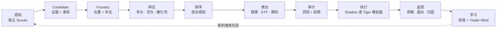
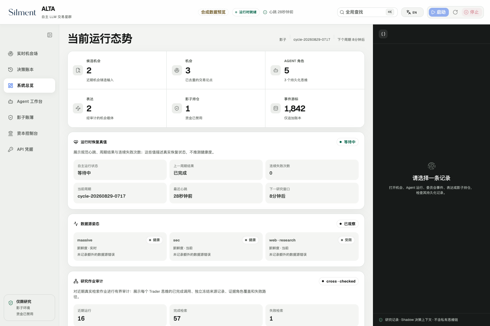
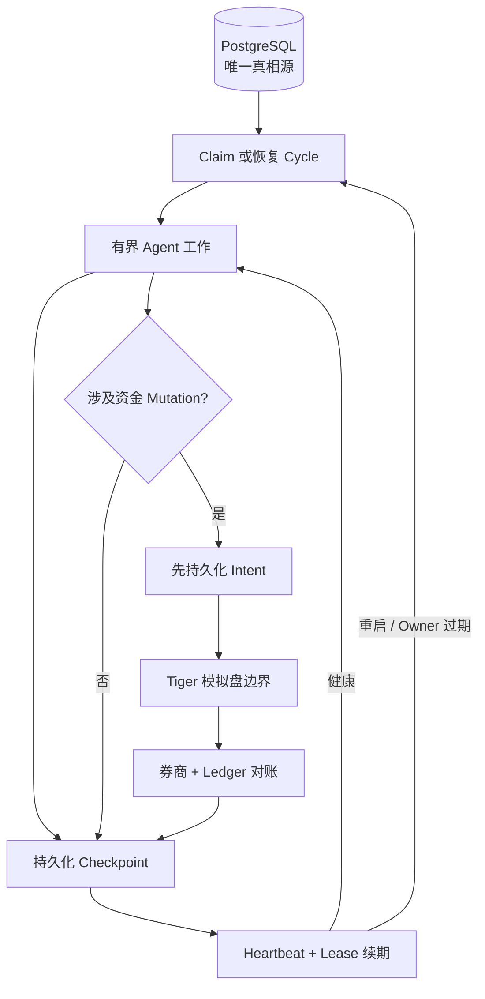

# ALTA

## Autonomous LLM Trading Asterism

_由专业化 LLM Agent 共同运营的虚拟交易平台。_

[](https://github.com/kyky2347/ALTA/actions/workflows/ci.yml)
[](CHANGELOG.md)
[](LICENSE)
[](docs/research-scope.md)

**交易的是机会，股票、ETF 或期权只是表达机会的载体。**

ALTA 是一个面向公开市场、Evidence-first、Opportunity-centric 的研究系统。
专业化 LLM Agent 独立寻找线索，把弱信号写成可证伪的 Opportunity，互相辩论，
比较不同表达方式，通过独立风险审计，并把结果记录在可回放的 Shadow 账本中。

它试图回答的不是“一个模型能不能推荐股票”，而是：

**一组自主研究者能否在保留好奇心和判断空间的同时，做到证据可追溯、决策可审计、
故障可恢复、组合有纪律？**

> [!IMPORTANT]
> ALTA 是实验性、仅供研究的软件，不构成投资建议、交易推荐、订单管理系统或已经
> 产生 Alpha 的证明。系统不存在实盘模式。唯一的券商边界是操作员明确授权的
> **Tiger 模拟盘**；绝不能接入实盘凭据或真实资金。

[English](README.md) · [架构](docs/architecture/overview.md) ·
[快速开始](docs/operations/getting-started.md) ·
[研究边界](docs/research-scope.md) · [安全策略](SECURITY.md)

## 五分钟理解 ALTA

ALTA 把一个想法看成完整生命周期，而不是一次聊天输出：



LLM 负责开放式研究、反事实思考和判断；确定性代码负责不能模糊的部分：Schema、
证据谱系、权限、资金限制、幂等、租约、状态转换、恢复和账务。

这条分界线是系统设计的核心：让 Agent 尽可能聪明地思考，但绝不把它的文字当成
可以直接改变资金状态的权限。

## 一个机会，多种专业视角

| Desk                   | 职责                                                               | 必须交付的结果                                 |
| ---------------------- | ------------------------------------------------------------------ | ---------------------------------------------- |
| Scouts                 | 搜索公告、市场结构、量价、宏观、持仓、期权、跨资产与开放互联网线索 | 有引用的 Candidate，或诚实 abstain             |
| Foundry                | 规范化、去重并冻结 Claim 谱系                                      | 一个稳定、可证伪的 Opportunity                 |
| Underwriters           | 独立构建 bull、bear、catalyst 和 implementation 案例               | 结构化分歧，而不是表演式共识                   |
| Research Director      | 分配注意力并排序研究任务                                           | 考虑紧迫性和组合重叠的决策价值                 |
| Expression desk        | 比较股票、ETF 与期权载体                                           | 包含成本、流动性和 payoff 的可执行候选方案     |
| Risk & audit           | 挑战证据、仓位、集中度和权限                                       | 通过、缩量、延后、仅 Shadow 或拒绝             |
| Execution & monitoring | 重验价格、提交获批模拟盘 Intent、监控退出                          | 持久化 Intent、成交历史、遥测和归因            |
| Learning loop          | 评估预测、成本与结果                                               | 只会收紧风险的校准，以及持续演化的 Trader Mind |

任何单一 Agent 都不能同时创造证据、批准自己的风险并移动券商资金。模型角色保持
独立和多样，最终 Mutation 边界始终由确定性代码控制，并默认 fail closed。

## 现在真正实现了什么

| 能力                 | 当前状态                                                                   |
| -------------------- | -------------------------------------------------------------------------- |
| Opportunity 生命周期 | Candidate、Opportunity、评估、辩论、排序、表达、审计、持仓与退出全部持久化 |
| 自主研究             | 多搜索赛道、受限工具调用、重试、数据源健康、引用校验和独立 abstention      |
| 长周期连续性         | 到期调度、精确问题续研、Thesis deadline 和重启安全的工作恢复               |
| 组合智能             | Stress、Underlying、Catalyst、Alpha source 和系统性暴露的集中度控制        |
| 表达选择             | 载体比较、价格新鲜度、流动性、成本、Payoff shape 和执行储备                |
| 前向评估             | Point-in-time 结果、基准相对 Alpha、多重选择修正和预测校准                 |
| 执行边界             | 默认 Shadow；带授权代次、租约和对账的 Tiger 模拟盘 Intent                  |
| 运维                 | 一条命令控制台、鉴权 API/SSE、Agent 活动、决策账本、健康和控制面           |
| 恢复                 | PostgreSQL 真相源、可丢弃 Redis、Cycle 恢复、孤儿清理和有界降级            |

这些能力并不等于已经获得 Alpha。ALTA 的目标是让 Alpha 主张可以被严格检验，
而不是把有说服力的模型文本、回测或 Shadow 浮盈误当成真实证据。

## 实时操作台

中英文操作台覆盖从研究到持仓的完整路径：每个 Agent 在做什么、调用了哪些工具、
传递了什么信息、哪个判断发生变化、当前权限边界是什么，都可以追踪。密钥是只写的：
前端只显示“已配置 / 健康 / 过期”，永远不会回显已保存值。


| 系统与组合                                                    | Agent 工作台与交接                                            |
| ------------------------------------------------------------- | ------------------------------------------------------------- |
|  |  |

操作台是运维与研究观察窗口，不是收益宣传页。Shadow 收益、置信区间和模型观点都会
按照其真实证据等级标注。

## 一条命令启动

前置条件：macOS 或 Linux、Node.js 22+、Corepack、Python 3.12+、`uv`、
Docker Desktop 或 Docker Engine，以及约 20 GB 可用磁盘空间。

```bash
git clone https://github.com/kyky2347/ALTA.git
cd ALTA
corepack pnpm install --frozen-lockfile
./alta dashboard
```

`./alta dashboard` 会在需要时构建 Web 操作台，并通过固定的本机回环地址打开。
重复执行时会复用已经安装的操作台，不再产生令人困惑的第二个随机端口。随后可在
前端点击 **启动**：系统会准备锁定的 Python 环境；在 macOS 上按需唤醒已经安装的
OrbStack 或 Docker Desktop；再启动 PostgreSQL、Redis 和研究后端。ALTA 不会自行
安装容器引擎，也不会自行获得券商交易权限。

第一次体验可使用无需付费供应商的确定性 Fixture：

```bash
./alta fixture seed
./alta run --cycle-id first-look
```

常用运维命令：

```bash
./alta doctor              # 检查依赖与安全配置
./alta status              # 查看精简运行状态
./alta service status      # 查看自主 Supervisor
./alta service start       # 启动持续 Shadow 研究
./alta service stop        # 优雅停止并清理子进程
./alta test                # 第一方 Node / harness 测试
```

供应商配置、环境隔离和完整停止流程请查看
[快速开始](docs/operations/getting-started.md)。

## 模式与权限

```text
Replay Fixture  →  自主 Shadow  →  明确解锁的 Tiger 模拟盘
   确定性             不操作券商           只允许 Paper 账户
```

- **Replay** 用合成数据复现编排与状态契约。
- **Shadow** 使用研究和行情输入，但只在本地模拟持仓。
- **Tiger 模拟盘** 默认关闭；需要有效模拟账户、操作员授权、当前有效的 Preflight、
  账户绑定和新鲜风险审批。撤销权限后默认 fail closed，必要时只允许平仓。
- **不存在实盘模式。** 任何未知、过期、重复或不匹配的券商状态都会进入
  `manual_review`，系统不会猜测后继续。

Agent 提出的仓位只是 Proposal。最终整数股数量会被确定性的风险、流动性、券商购买力、
集中度、价格新鲜度和当前授权裁剪。每次 Mutation 都先持久化 Intent，中断后必须对账。

## 为中断而设计

长时间研究最常见的故障并不酷：断电、断网、供应商超时、进程重叠，以及等待数周
才兑现的催化剂。ALTA 把恢复能力直接放进领域模型。



关键契约：

- 同一时间只能有一个已 Claim 的自主 Cycle，Owner 过期后才能接管；
- 从精确 Checkpoint 恢复，而不是重放整段 Agent 对话；
- 资金授权采用单调递增代次，并在 Mutation Lease 内再次检查；
- 可选数据源采用 Backoff 与 Circuit breaker；
- 优雅终止 Agent、App Server 和 Supervisor 进程树；
- Migration 幂等，重启后进行券商状态对账；
- Control plane 默认鉴权并只绑定 `127.0.0.1`。

这是较强的本地运行契约，但不是“交易所级”或“银行级”可用性声明。运行假设与
剩余限制会在[自主运行手册](docs/operations/autonomous-shadow.md)中明确记录。

## 先证明，再谈收益

ALTA 的研究闭环专门约束常见的虚假优势：

1. 每个 Claim 保存来源和 Observation 谱系。
2. 发现、辩论、表达和审计是不同决策。
3. Point-in-time 评估使用已完成交易时段和冻结预测。
4. 记录总试验次数，展示经过多重选择修正的置信度。
5. 可比的已平仓结果会校准预测误差和执行成本。
6. 校准只能降低新风险，不能凭空增加预期收益。
7. Shadow 证据、模拟盘成交和实盘收益在定义上严格分离。

系统试图从广泛搜索、独立分歧、跨领域线索组合、更好的载体选择、纪律性 abstention
和持久学习记录中获得研究优势，而不是让一个模型随口给出股票代码。

## 已验证状态

当前工作版本为 `0.26.0`（`FORWARD_EVIDENCE_VERIFIED`）。发布门槛覆盖：

- **190** 个 Node Gateway / harness 测试；
- **373** 个 Opportunity OS Python 测试；
- **38** 个隔离资金边界测试；
- Dashboard 单元测试、Lint 与生产构建；
- Ruff Lint 与格式检查；
- 锁定依赖安装和敏感信息扫描。

最近一次有界部署从中断 Cycle 恢复，隔离了重复工作，完成四个独立 Scout 角色，
到达 `MVP_IDLE`，随后确认 Dashboard、服务、Agent 子进程、PostgreSQL、Redis 和
回环监听端口全部安全停止。资金权限全程关闭，没有提交券商订单。这个结果验证的是
一条恢复路径，不代表投资收益或 24×7 生产可用性已经得到证明。

## 仓库结构

```text
.
├── alta                         项目本地运维命令
├── alta-dashboard/              中英文 React 操作台
├── alta-src/                    Node Gateway、启动控制与受限工具
├── alta-runtime/
│   ├── python/                  Opportunity OS、编排、API 与 SSE
│   ├── capital-python/          隔离的 Tiger 模拟盘执行器
│   └── compose.yaml             本机 PostgreSQL 与 Redis
├── vendor/openai-codex/         固定版本并完整归属的 Codex Rust 基座
└── docs/                        架构、运维、审计与路线图
```

PostgreSQL 是唯一真相源，Redis 是可以重建的辅助状态。只要可行，ALTA 自有业务逻辑
始终放在 `vendor/openai-codex/` 之外。

## 继续阅读

- [架构总览](docs/architecture/overview.md) — 组件与信任边界
- [Opportunity OS 设计](docs/architecture/opportunity-os.md) — 生命周期与 Schema
- [自主运行](docs/operations/autonomous-shadow.md) — 运行、观察、恢复、停止
- [操作台](docs/operations/operator-console.md) — UI 与 Control plane 契约
- [可复现性](REPRODUCIBILITY.md) — Clean clone 能与不能复现什么
- [第三方归属](ATTRIBUTION.md) — Vendored 代码、依赖和概念参考
- [贡献指南](CONTRIBUTING.md) · [变更记录](CHANGELOG.md) · [路线图](docs/implementation/roadmap.md)

## 许可证与归属

ALTA 自有代码采用 [Apache License 2.0](LICENSE)。Vendored 和包管理依赖保留各自
许可证、版权声明和使用条款。

ALTA 使用固定 Commit 的
[OpenAI Codex](https://github.com/openai/codex) Apache-2.0 修改快照，作为本地
App Server 与 Agent harness 基座。修改文件、保留声明、包依赖、API-only 集成和
概念参考全部列在 [ATTRIBUTION.md](ATTRIBUTION.md) 与
[`vendor/openai-codex/CHANGES.md`](vendor/openai-codex/CHANGES.md)。

ALTA 是独立维护的研究项目，不是 OpenAI 产品，也未得到文中任何数据或券商服务商
的背书。使用时必须遵守[研究边界](docs/research-scope.md)。
