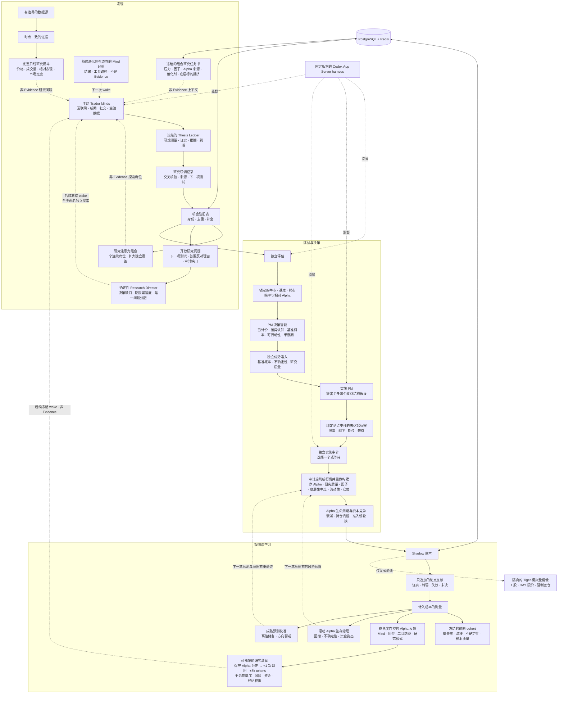
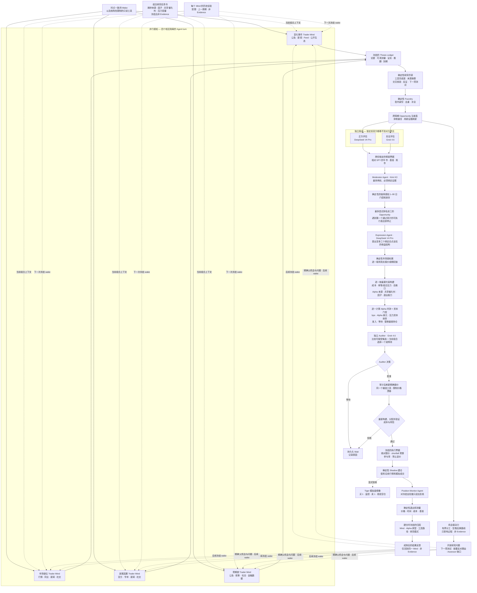

# ALTA

## Autonomous LLM Trading Asterism

_A virtual trading platform operated by specialized LLM agents._

[](LICENSE)
[](docs/research-scope.md)

> [!NOTE]
> 本文件是供中文读者使用的辅助说明。项目的正式说明、政策、许可边界和最新状态以
> [英文 README](README.md) 及其引用的英文文件为准。本文件不会替代英文文档。

ALTA 是一个仅用于研究、以证据为先的公开市场多模型 Agent 系统。自主 Agent 会主动寻找有意义的
变化，把变化转化成可验证的机会，相互挑战推理，并在持久化 Shadow 账本中评估留下来的想法。

> [!IMPORTANT]
> ALTA 是实验性研究软件，不构成投资建议、交易推荐或经纪系统，也不承诺能够产生 Alpha。
> 禁止连接实盘经纪账户凭据，禁止用它管理真实资金。

**状态：** `0.26.0`（`FORWARD_EVIDENCE_VERIFIED`）· **常规模式：**
Replay / Shadow · **经纪账户路径：** 仅显式 Tiger 模拟盘验收 · **Alpha：** 尚未证明

**本地开发状态：** 已接入机构化组合智能和可重放的市场研究漏斗。完整日线最多给每个 Trader
Mind 分配一个非 Evidence 异常问题，Mind 必须重新核验行情、因果路径和反方解释。系统还会用
严格时点一致的 Research Attention Portfolio 检查近期生产候选是否过度集中于同一标的：
保留一个知情的连续研究席位，其余探索席位必须扩大独立标的覆盖。组合层继续限制总压力损失、
Alpha 来源、共享催化剂与跨载体底层标的集中度；同一底层标的不能靠改用股票、
ETF 或期权绕过组合风险边界；满仓轮换还必须提升预期 Alpha 美元和单位压力
资本效率。新的确定性 Research Director 会剔除已经过期或已经由持仓监控负责的问题，按决策缺口
和剩余期限给研究排队，把不同问题分配给不同 Mind，并始终保留至少两名 Mind 继续独立发现。
当前本地树还统一了所有 Agent 交接的字节预算；结构化输出错误的 Scout 只有一次全新且受限的
重试；可选数据源故障会指数退避；确定性门槛已经判定不能进入排序的 Opportunity 不再浪费两次
私有评估模型调用。
成熟、可比的股票预测误差现在也会闭合承销回路：只有达到 30 个计入成本、相对 SPY 的前向
Shadow 平仓样本后，持续高估才会被转换成只向下的 Alpha 储备；方向校准偏弱还会把新仓位限制
在半仓。小样本只展示、不调参，良好结果也不会自动增加杠杆。实时操作台会直接显示样本成熟度、
置信区间、预测误差、储备和资金姿态，但不会把 Shadow 数据写成已证明的业绩。已平仓持仓还会保留
持有期间真实捕获的可执行价格路径，用来区分机会发现质量、路径风险与退出损失；这些诊断只读且不会
自动优化退出。缺少可信风险票据的历史或畸形持仓按当前全额名义价值计入压力损失，不再获得有利的
零风险假设。
完整的前向成交现在还会闭合一条独立的执行成本回路：系统按股票、ETF、期权分别记录相对到达中价
的短缺、开平仓佣金、实际往返成本和冻结预算偏差。只有同类载体达到 30 个可比较平仓样本后，正向
成本超支与受限误差准备才会变成只向下的 Alpha 准备金；下单意图前必须重新校验，永远不能增加
预期收益或杠杆。

[架构](docs/architecture/overview.md) · [快速开始](#快速开始一条命令启动) ·
[实时操作台](docs/operations/operator-console.md) ·
[运行指南](docs/operations/autonomous-shadow.md) ·
[研究范围](docs/research-scope.md) · [English](README.md)

ALTA 是独立维护的项目，不是 OpenAI 产品。项目把 OpenAI Codex 作为 Apache-2.0
授权的源码基础和 App Server 协议实现使用；具体边界见
[ATTRIBUTION.md](ATTRIBUTION.md)。

## 为什么要做 ALTA

大多数 Agent 交易演示开始时，人已经选好了股票。ALTA 把起点向前移动：Scout 会追问发生了
什么变化、市场为什么可能还没有完全吸收、什么证据能够证明想法是错的。一轮健康的研究完全
可以以“没有机会、没有持仓”结束。

系统最重要的设计原则是：

> 让 LLM 自由发现和推理；用确定性代码保护证据、时间、预算、可重放性以及资金安全边界。

因此，ALTA 采用以机会为中心的工作流：



Research Director 是确定性代码，不是又一个会表达观点的 Agent。它只衡量一个决策缺口继续
悬而未决的研究成本：Opportunity 状态、问题来源和剩余期限。队列分数不能进入排序、表达或资金；
每个 Run 都会冻结精确的问题分配，恢复时重新合并全局队列，重复回答别人的问题会在持久化前被拒绝。

信任边界和组件归属见[架构概览](docs/architecture/overview.md)。

### 本地操作台预览

[](docs/assets/alta-operator-console.png)

_这是明确标注的 Synthetic Preview，不含经纪账户、真实资金、私密凭据或真实业绩数据。_

[](docs/assets/alta-forward-evidence.png)

[](docs/assets/alta-credential-center.png)

_凭据中心截图同样只使用合成状态，不包含真实 Provider 状态、指纹、Token、账户标识或经纪数据。_

_前向证据与经纪账户边界分离；看板展示样本成熟度、不确定性、预测误差、资金姿态和观察到的
生命周期质量，但不会把 Shadow 结果表述为已证明的 Alpha。_

### 当前真正实现了什么

| 范围           | 当前状态                                                                                                                                                                                                                |
| -------------- | ----------------------------------------------------------------------------------------------------------------------------------------------------------------------------------------------------------------------- |
| 研究生命周期   | 完整日线异常漏斗、主动多来源探索、按决策缺口和期限排序的 Research Director、唯一跟进问题分配、至少两席独立探索、空跑后轮换路线、可证伪 Thesis Ledger、研究尽调、独立挑战、情景与决策承销、表达锦标赛、Shadow 监控和测量 |
| 证据与状态     | 时点 Evidence、不可改写的论点支柱、受限问题与过程记忆、研究注意力组合、建仓时冻结的研究归因、成熟度门控的 Mind Alpha 反馈、可撤销的只读研究激励、Replay                                                                 |
| 资金生存       | 仅用当前政策、每仓最新一条前向结果缩小后续 Shadow 仓位；成熟预测误差和执行成本超支会扣减后续承销 Alpha，弱方向校准会缩仓，小样本和正结果永远不会自动放大杠杆；未知历史风险按全额名义价值计量                            |
| 组合构建       | 单笔与组合总压力预算、总敞口、成熟预测与执行成本准备金、共享因子桶、Alpha 来源、共享催化剂和跨股票/ETF/期权的底层标的集中度、流动性，以及按 Alpha 美元和压力资本效率进行的持仓竞争                                      |
| 无人值守服务   | 内部调度器、单主租约、按机会积压调整节奏、统一上下文预算、数据源退避、开放持仓更快观察、runtime 重建、一次可审计 Scout 重试、健康看门狗和安全退出                                                                       |
| 只读可观测性   | Runtime、Run、Opportunity、冻结 cohort、缺失率、MFE/MAE/回撤/退出捕获和 Shadow 测量的 loopback JSON 与 SSE 接口                                                                                                         |
| 经纪账户边界   | 默认禁用；隔离的 CLI 只允许一个精确 Tiger 模拟盘账户与 1 股限价验收                                                                                                                                                     |
| 真实世界 Alpha | **尚未建立**；承销校准仍属探索性，仍需积累更大规模、计入成本的独立前向 Shadow 样本                                                                                                                                      |

### 最新本地验收

当前本地工作树通过了 168 项 Node/harness 测试、284 项 Opportunity OS Python 测试和
25 项隔离 capital 包测试。2026-08-27 08:19–17:00 EDT 的受监督真实墙钟试运行观察到 28 个
自主周期身份：26 个完成为 `MVP_IDLE`，2 个在修复前因上下文预算边界失败；系统形成 3 个
Opportunity 和 4 份独立评估，但产生 0 个 Rank、0 个 Expression、0 个持仓和 0 个订单。两处
上下文边界缺陷均已增加回归覆盖。Tiger 模拟盘因 RSA 签名预检失败而始终未连接、未下单；服务、
Agent 子进程、监听端口、PostgreSQL 和 Redis 最终全部安全停止。这证明的是自主运行和失败恢复
路径，不证明 Alpha 或跑赢市场。

最新一次本地机会驱动力验收会把确定性的探索/跟进分工冻结进每个生产 wake，始终保留两名 Mind
继续独立发现新机会，轮换负责跟进的 Mind，并在连续空跑后要求更换研究路线。调度测试覆盖普通、
未解决机会和开放持仓三档节奏。完整 Fixture 生命周期再次产生 3 个 Candidate、3 个 Opportunity、
一个通过审计的表达和完成观察的 Shadow 持仓；Replay 的 SHA-256 哈希一致，14 周期 soak 零失败，
前台服务冷启动达到 `live`/`ready` 且 capital 为 disabled，随后正常停止。

最新 Research Director 冷启动先真实暴露并修复了两处上下文预算问题：全局研究队列超过 16 KiB
冻结输入边界，以及只有未来奖励契约时错误牺牲 follow-up 父机会。修复后，本轮两个 Run 分别冻结
不同的 Opportunity 和精确问题，另外两个 Run 保持独立探索；4/4 Trader Mind 成功，周期以
`MVP_IDLE` 结束，连续失败为 0，capital 始终 disabled，随后服务安全停止。这个结果证明队列分工、
真实 Agent 运行和失败恢复路径，不代表发现了可盈利机会。

2026-08-29 EDT 的最新一次受限托管部署同样达到 `live`/`ready`，活动自主周期以
`MVP_IDLE` 完成，保留 4 份 Mind 状态，连续失败为 0，并通过鉴权 API 与中英文控制台展示 v8
时点组合风险边界。本轮还真实发现并修复了独立表达审计交接中“应用按紧凑 JSON 计数、
PostgreSQL 按 `jsonb::text` 计数”的字节边界不一致。资本始终 disabled，没有连接经纪执行路径，
也没有下单；随后浏览器、操作台、调度器、服务、PostgreSQL、Redis 和两个本机监听端口均已验证
安全关闭。这是可运行性、风险约束和恢复边界的证据，不是收益或 Alpha 证明。

最新一轮可维护性优化把网关准入、协议路由、流式失败处理、Alpha 反馈聚合、Trader Mind
记忆迁移、Scout 输出校验、前向 cohort 投影、Opportunity 详情物化、Alpha 汇总序列化和两套
runtime 命令分派拆成了职责单一且有测试覆盖的单元；组合构建也已分离准入、净 Alpha、压力、
流动性、敞口和数量计算。研究、排序、表达、Shadow 与 capital 策略语义均未改变。

随后进行的 `0.24.0` 真实宿主部署在没有外部 Agent 调用的情况下达到 `ready`，并由主动研究自主
产生一个 Candidate。实测发现并修复了两个真实问题：MCP 工具目录发现错误占用研究调用额度，
以及决策级 Candidate 超出私评输入上限。对同一个生产 Candidate 的精确复放现在会有序保留
2/3 条证据，把冻结输入压到 7,900 字节，并只向评估者暴露实际保留的 Evidence ID。实测周期仍以
`MVP_IDLE` 安全结束，没有表达、持仓、capital 进程、Paper 事件或订单。这是运行与保守决策的
证据，不是盈利 Alpha 的证据。

## 快速开始：一条命令启动

前置条件：macOS 或 Linux、带 npm 的 Node.js 22+（有 Corepack 时优先使用）、`uv`，以及为 PostgreSQL 和
Redis 提供运行环境的 OrbStack 或 Docker Desktop。

首次下载时，可以在任意目录直接粘贴这一整行：

```shell
git clone https://github.com/kyky2347/ALTA.git ALTA && npm --loglevel=error --prefix ALTA run dashboard
```

已有项目时，不论终端当前在哪个目录，都可以使用带路径的单行命令：

```shell
npm --loglevel=error --prefix "/你的绝对路径/ALTA" run dashboard
```

若终端已经在仓库根目录，简写仍是 `./alta dashboard`。命令会在首次运行或前端源码更新后自动按
锁文件安装依赖、构建前端，在默认端口被占用时选择空闲 loopback 端口，并主动打开系统默认浏览器；
只有无桌面浏览器的环境才会打印需要手工打开的准确地址。打开后可先在 **Credentials / 凭据**
页面配置可选 Provider，再点击 **Start ALTA / 启动 ALTA**。全新 clone 中，这个按钮会准备隔离
的 Python 环境、启动
PostgreSQL 与 Redis、执行迁移、安装当前用户的宿主服务，并等待后端真正达到 ready。无需另外部署
前端或手工安装研究服务，但宿主机仍需先具备上述基础依赖；ALTA 不会静默安装 Node、`uv`、Docker
或系统服务管理器。

### 确定性研究 Fixture

```shell
corepack pnpm install --frozen-lockfile
./alta env setup --dev
./alta env python -m alta_asterism demo
./alta env python -m alta_asterism replay
./alta env python -m alta_asterism soak
./alta env down
```

请从 ALTA 源码目录运行这些命令；确定性路径不依赖模型、数据或经纪账户凭据。

这条路径只使用合成 Fixture，不需要模型、市场数据或经纪账户凭据；Replay 哈希具有确定性。

## Agent 如何协作

ALTA 不会把所有角色放进同一个共享对话。每个角色只接收有边界、已冻结的输入，并返回结构化
产物。独立意见先锁定再共享；身份识别、排序、市场验证和 Shadow 账本则始终由确定性代码控制。



单个 Scout 的失败会被隔离；每个 Scout 都可以返回没有候选机会。Auditor 看不到排序分数。
Agent 节点负责研究判断，确定性节点负责来源追踪、可重放性和 fail-closed 安全。Position
Monitor 可以标记证伪条件，但不能临时发明替代交易。只有一个已经独立审计的新 Opportunity
在扣除时间衰减后的预期净 Alpha 超过原持仓冻结的替换门槛、预期 Alpha 美元不减少、且单位压力
资本效率也有足够改善时，确定性资本层才允许轮换。
任何 Agent 都拿不到下单工具。

Trader Mind 和持仓监控使用 DeepSeek V4 Flash 处理有边界的重复工作。真实 24×7 路径要求
每个 Trader Mind 即使已经收到被动 Evidence，也必须至少主动研究一次。四个 Mind 都能使用
Web 深度研究、全球新闻、公共社交搜索和公共金融数据；Feed、Archive、Academic、Crawl 和
其它额外只读工具按照各自的 Alpha 原型分配；代码托管平台 API 不属于 ALTA 的研究工具面。
每轮结束后，系统确定性地写入一条
只属于该 Mind 的受限经验摘要，并在后续 wake 回注。它可以帮助避免重复走弯路，但不能代替
新 Evidence 支撑 Candidate；摘要还会记录受限的全新探索/问题跟进历史。

每个完成的 Scout 产物还会带一份由真实工具 provenance 推导出的确定性研究尽调记录。它记录
Agent 实际完成了多少主动与非新闻研究，但来源族群、域名和交叉核验只计算 Candidate 明确绑定的
冻结 Evidence 或精确工具结果；无关浏览仍作为过程成本可见，却不能抬高研究质量。记录还会说明是否给出受益者
传导链、反证与下一项可观测测试。它只是过程元数据，不是 Evidence，也不会自动批准或否决；
下游 Agent 可以据此惩罚浅层、单一新闻驱动的研究，同时仍能保留对非常规 Alpha 路径的判断空间。

后续 wake 还会收到最近活跃 Opportunity 的开放研究问题，每个机会最多两条。确定性代码从上一轮
Scout 的下一项测试、首要反对理由，以及两位已锁定 Assessor 指出的缺失 Evidence 中提取问题。
冻结的机会驱动力最多安排两名 Trader Mind 跟进，剩余 Mind 继续做相互正交的新机会探索，而且
跟进分工会在不同周期确定性轮换。连续两个自主周期空跑后，下一轮必须改变实体、来源类别或因果
假设之一，不能原样重复失败路线。跟进必须绑定冻结的父 Opportunity 和原问题，Candidate 仍必须
提交真正的新 Evidence；没有发现时可以诚实返回 no-op。驱动力和问题都只是过程记忆，不是证据、
信心、排序加分或资金指令，也不会放宽任何下游门槛。

无人值守调度器现在使用三档有界节奏：普通研究间隔、存在未解决 Opportunity 时更短的复查间隔，
以及存在开放 Shadow 持仓时最短的观察间隔。运行状态会暴露选中的原因和下一间隔。模型分数不能
控制调度，这一机制也不会强迫系统提出表达或交易。

每个生产 Candidate 还必须从本 Trader Mind 的冻结任务中选择一个 Alpha 原型。Shadow 建仓时，
系统会把贡献 Candidate、Mind、Alpha 原型、全新探索/问题跟进模式，以及已经完成的受限研究工具路径一起冻结进 Position
Thesis。扣除成本、相对 SPY 的闭仓结果，只会在后续时点一致的 wake 中回到同一个 Mind。一个
Mind 至少有 30 个带基准的闭仓样本后才会看到绩效数值；原型、研究路径和研究模式切片还必须各有
10 个样本。成熟后的单侧保守 Alpha 下界为正时，该 Mind 下一轮会获得 1 次额外只读研究调用和
8,000 tokens；样本未成熟或下界不为正时没有奖励。Candidate 数量、自报信心、绝对盈利和换手率
都不计分。这些反馈仍不是 Evidence，不能自动改变模型、排序、风险限制、表达、资金或经纪权限。

需要判断的角色默认采用异构模型团队：DeepSeek V4 Pro 负责正方评估和表达设计，Grok 4.6 负责独立反证和实现审计，Kimi
K3 负责综合两份已经锁定的观点。正反双方以及表达/审计必须使用不同模型，每次运行都会持久化
实际 Provider 和模型身份。

Trader Mind 只能调用按角色限制的 ALTA 内部只读 MCP 插件面。桌面版 ChatGPT/Codex App 和
不受限制的第三方插件不会被注入隔离研究 turn，因为它们不属于 ALTA 的只读、预算化证据契约。
任何 Agent 都拿不到经纪账户或下单工具。

## 当前状态

Opportunity OS 版本：`0.26.0` — `FORWARD_EVIDENCE_VERIFIED`

启动器为了兼容固定的自定义 Codex harness，继续保留 `ALTA v3.5` 发行标识；各应用包独立使用
语义化版本。

`0.26.0` 把前向证据从“最终收益”扩展到真实捕获的持仓价格路径：MFE、MAE、观察回撤、退出捕获
和到达最佳价格的时间能够帮助区分研究质量、路径风险与退出损失，但不能自动调参、改变资金或下单。
缺少可信实现票据的历史持仓同时按当前全额名义价值计入压力损失，避免低估未知风险。

`0.25.0` 增加了延迟、对称、可撤销的研究激励，而不是奖励 Agent 制造活动量。每个 Trader Mind
在样本成熟前都会看到同一份未来奖励契约：只有已经平仓、扣除成本、相对基准计算的 Shadow Alpha
才可能获得奖励。达到 30 个可比较闭仓样本后，确定性代码计算单侧保守 Alpha 下界；下界为正时，
该 Mind 的下一次冻结 wake 会多获得 1 次只读研究调用和 8,000 tokens，下界不再为正时奖励立即
撤销。未成熟样本不暴露绩效，负面或不确定结果进入换路线的恢复指引；Candidate 数量、自报信心、
绝对盈利和换手率都不计奖励。奖励通道只读取追加写入的结果，无法影响排序、表达、风险、资金或
经纪权限。

`0.24.0` 把过去只用于展示的 PM 判断变成了前置、失败即等待的决策门槛。每位独立评估者必须先
估计可辩护的参考类别基准概率，再给出本次证据对应的内部概率；两份独立概率提升都必须大于零，
两份预期 Alpha 中更低的一份在扣除预测分歧 25% 的准备金后仍须为正，而且实际研究过程必须达到
`0.60` 的交叉核验门槛。失败的 Candidate 会在表达、市场验证和审计之前停止。排序分数也从奖励
原始预测概率改为奖励更保守的独立概率提升，并保留全部输入和拒绝原因供 Replay 与检查。这是在
减少伪阳性，不代表留下来的预测一定正确或能够盈利。

`0.23.0` 在前向测量和下一次 Shadow 入场之间增加了滚动、时点一致的资金生存控制器。它只读取
当前组合政策下每个持仓最新一条已计入成本、相对 SPY 的闭仓结果，并以最近 30 个持仓为窗口。
样本积累阶段使用 50% 资金；至少 10 个样本且近期平均 Alpha 为负时维持 50% 观察仓；滚动回撤
达到 synthetic NAV 的 100 个基点，或成熟窗口的描述性 95% 上界不大于零时，降至 10% 生存仓。
表达 PM 看到的是同一份冻结姿态，系统又会在入场意图前重新读取，因此旧计划不能在组合恶化后
继续用更大的仓位。旧的负样本滚出窗口后可以恢复到普通预算，但任何正样本都不能把仓位提高到
100% 以上。这些是生存控制，不是 Alpha 证明。

`0.22.0` 在不把模型预测当成事实的前提下补齐了“证据到资本”的闭环。排序、组合构建和 Alpha
时钟不再只取两份独立预期 Alpha 中较低的一份，还会额外减去预测分歧的 25% 作为不确定性准备。
均值、较低预测、分歧、准备金和折价后结果都会保留，便于审计。研究过程质量也正式进入资金准入：
低于 `0.60` 必须 `Wait`，大于等于 `0.60`、但低于 `0.80` 最多只能得到半仓 starter size；
大于等于 `0.80` 也只能使用正常风险预算，绝不会因此获得额外杠杆。

前向校准现在读取建仓实施计划中精确冻结、已经计入成本的预测，并且每个持仓只采用最新一条绩效
测量，避免重复事件扩大样本。只读 API 会报告样本量、均值、中位数、离散度、正 Alpha 比率和描述性
95% 区间；至少有 30 个闭仓样本后，正向结果才会被标记为“仍需外部验证的信号”。这些机制减少
乐观选择和事后重构，但仍然不能证明 Alpha，也不能保证未来跑赢市场。

`0.21.0` 把研究过程质量和预测分歧变成显式决策输入。确定性代码根据实际记录的交叉核验、独立
来源家族、研究路径多样性和非新闻研究计算质量分量；排序可以奖励这些已完成的工作，而只达到
screen 级别或缺少尽调记录的研究会被限制在决策级门槛以下。它衡量的是研究过程，不是 Evidence，
也不能挽救不满足新鲜度、可行动性、流动性或独立审计门槛的论点。

两位独立评估者的预测仍分别保留。排序、组合构建和 Alpha 时钟准入使用两份相对 Alpha 预测中
更保守的一份，而不是让乐观平均值抵消另一位评估者的负面判断；系统同时持久化预测分歧，供未来
校准。这是保守承销政策，不代表预测一定正确，也不代表 Alpha 已被证明。

`0.20.0` 把 Alpha 隔离升级为组合层的强类型合同。每个收益结构都必须声明 Alpha 来源、完整的
系统性敞口、对冲姿态和 basis risk；不同模型的 Auditor 会独立复核并给出隔离分数。确定性代码
只采用论点纯度、时机匹配、论点一致性、实施质量和独立隔离分数中的最保守值，不允许提案者用
更高的自信放大仓位。

未分类敞口、审计分歧、低于门槛的纯度，以及必须依赖配对、价差、篮子或动态对冲才能成立的
Alpha 都会 `Wait`；刚过门槛的想法只能使用 starter size。已有持仓即使 ticker 不同，只要共享
市场、行业、风格、宏观、流动性、拥挤或事件跳空敞口，就会共同消耗同一个风险桶。最紧的风险桶
会与单笔损失、总敞口、流动性和执行限制一起决定仓位，并在入场意图前再次校验。这些机制追求
更干净的风险调整后研究结果；是否改善真实 Alpha 仍只能由固定、计入成本的前向 Shadow 样本验证。

`0.19.0` 要求每一份新的独立承销都包含 PM 决策智能记录。两位评估者必须分别说明市场已经计价
什么、自己的差异认知是什么、最合适的参考类和基准概率是什么、哪些条件必须成立，并把公司论点
状态与证券是否已经具备行动条件分开判断。他们还必须锁定主要不确定性、可观测的行动触发器和
保守的信息优势半衰期。

确定性代码保留两份判断而不会把分歧平均掉：两位评估者都不认为证券 ready 时，排序会拒绝；
一份 `ready` 加一份 `conditional` 则保留给实施和独立审计继续检查。组合构建使用更短的半衰期
衰减预期 Alpha，表达 PM 和审计 Agent 看到同一份已计价、差异认知、参考类、可行动性和时间
记录。旧承销仍然可读，但缺少新记录时只能 `Wait`。这些控制提高决策质量与可测量性，不代表也
不保证 Alpha。

`0.18.0` 在机会发现和投资表达之间增加了时点一致的 Thesis Ledger。每个生产 Candidate
必须给出一至三条因果支柱：原始论断、具体可观测量、相互分开的证实与推翻条件，以及不晚于
Opportunity horizon 的到期时间。Foundry 会为它们生成稳定身份、合并语义重复项，同时保留
Candidate 和 Evidence 来源；原始论点一旦冻结就不能被后来的 Agent 改写。

任何非 `Wait` 的股票、ETF 或期权收益结构都必须准确声明它在兑现哪些冻结支柱。被独立审计
选中的支柱会随表达进入 Position Thesis。后续 wake 中，Position Monitor 只能根据更新且冻结的
Evidence 追加 `confirming`、`weakening`、`invalidated` 或 `unresolved` 复核；缺项、重复、
虚构或无引用的复核全部关闭失败，最终持有或退出仍由确定性代码决定。这让研究错误和表达错配
可以被测量，但不证明 Alpha，也不会把 Agent 写出的阈值自动升级成风险规则。

`0.17.0` 把彼此隔离的主动搜索连接成了一个有边界的自主研究闭环。最近的 Opportunity 会携带
最多两条时点一致的开放问题，来源是上一轮下一项测试、首要反对理由和两位独立 Assessor 指出的
证据缺口。每个 Trader Mind 自主判断应该探索全新异常，还是跟进一条适合自己差异化工具的问题。
系统会拒绝虚构的父机会和未登记问题；跟进依旧必须产生新 Evidence，全新探索也不会被降级。

研究谱系会穿过 Candidate、Foundry 合并、下游 Agent 上下文、Shadow 建仓、绩效归因和只读 API。
全新探索与问题跟进的绩效仍受 30 个 Mind 样本和 10 个模式切片样本门控，且不能自动修改模型、
Prompt、排序、工具、风险、表达或资金。这提高的是研究学习与研究资源分配能力，不是盈利证明。

`0.16.0` 同时收紧了主动研究和交易表达两端。每个 Scout 都会把实际工具完成度、来源多样性、
交叉核验、受益者传导链、反证和下一项测试写成结构化尽调记录；下游把它当作非 Evidence 的
过程质量信息，而不是用一个固定分数替代 LLM 判断。

实施 PM 现在会提出至多三个真正不同的收益结构假设。确定性代码会逐一取得真实行情门控、
组合构建、Alpha 时钟和资本分配结果，再由不同模型的独立 Auditor 选择其中一个或 `Wait`。
Auditor 会直接比较时间调整后的 Alpha 美元、每单位压力损失的预期 Alpha 和执行预算余量，但这些
指标不会被合成为自动评分。选中后系统会再次取得同一工具的行情并重新构建。执行票据冻结到达时
中点、绝对限价、shortfall 预算、参与率上限、建议子单数量和单次不追价行为；买入限价最多等于
已经观察到的卖一价，不能在卖一价之上追价。Shadow 与显式 Tiger 模拟盘镜像使用同一个
冻结限价。全周期 Massive 八次请求预算继续 fail-closed，任何 Agent 仍拿不到订单工具。

`0.15.0` 把孤立的单仓定仓升级为主动资本流程。每张新计划都会冻结一个时点一致的 Alpha
时钟；随着支撑 Evidence 的机会期限流逝，尚未兑现的预期净 Alpha 会按透明的保守代理衰减。
当 Shadow 组合已满时，新候选会和“剩余 Alpha 最低”的现有持仓竞争；只有优势超过该持仓
冻结的替换门槛，系统才允许轮换。旧仓仍然通过已有的监控、后续行情、完整账本退出路径平仓，
随后候选会针对已经变化的组合重新验证；重试保持幂等。缺少原持仓承销、Alpha 已过期、退出
未成交或优势不足时，都确定性 `Wait`，不会为了换仓而强行交易。

同一张实施票据现在还会冻结受控执行计划：基于已观察流动性的参与率、DAY 限价偏移、硬性
追价上限、超时取消和禁止自动改价。Tiger 仍然只是 1 股模拟盘镜像；Agent 仍然没有下单工具，
系统也没有任何实盘账户路径。

`0.14.0` 在排序后的 Opportunity 与任何 Shadow 建仓之间加入了专业的实施边界。实施 PM
必须比较直接股票、ETF/代理、长期权和 Wait，明确想赚取的 Alpha、不想要但无法完全消除的
敞口、主动保留的敞口以及被否决的替代方案。确定性代码再把两份锁定的情景承销转成预期 Alpha
与压力损失预算；对直接工具扣除估算成本；最后取市场数据名义上限、单仓 NAV、剩余总敞口、
情景损失和退出流动性中最紧的一项决定仓位。独立 Auditor 会看到完整实施票据；审计后刷新精确
报价并重新构建一次；创建成交意图前还会按当时的组合总敞口再检查一次。缺少独立承销、流动性、
净 Alpha、风险预算或审计时，一律确定性 `Wait`。

所有 Trader Mind 也被明确要求不能默认从新闻出发。它们可以从市场或期权错位、文件、定价、
经营痕迹、公开软件、供应链、政策传导、预期原语或公共社交定位主动研究；新闻仍然可用，但只是
众多线索入口之一，不是系统中心。

`0.13.0` 在不让少数幸运样本变成系统政策的前提下，补上了研究学习的归因闭环。Candidate 的
Alpha 原型现在是强类型字段；建仓时会冻结贡献者与研究路径；后续 wake 只能读取严格时点一致、
只属于本 Mind 的扣成本、相对 SPY 的 Shadow 结果反馈。30 个 Mind 样本和 10 个切片样本门槛
会屏蔽小样本绩效数值。只读 Alpha 反馈 API 使用同一套冻结语义；模型、Prompt、排序、工具、
表达、风险和资金政策都不会被自动修改。

当前本地基线同时加固了中断周期恢复。每个角色隔离的 Scout 快照按完整数据库记录控制大小；
恢复器从各 Mind 的不可变片段重建同一个时点的 wake；Mind 后续演进不会使历史快照失效。
重试会保留原来的周期身份；scheduler 启动时会把 deadline 已过的遗留 Scout 工作收口，避免
看板永久显示幽灵 Run 或 Job。
私人评估的总体概率必须与其情景分布一致；Assessor 或 Moderator 的输出无效、超时或不可用时，
该 Opportunity 会因独立审查不足而无法进入排序，周期正常结束为 Idle，而不是编造审查结果或
打断 24×7 scheduler。一次真实 Shadow 中断恢复周期产生了 1 个 Candidate 和 1 个 Opportunity，
随后因 thesis 评估超时安全结束为 `MVP_IDLE`：没有表达、持仓、订单或 Massive 请求，并完成
精确回放。

`0.12.0` 把外部 API Key 更换变成正式运维契约。`./alta credentials` 只显示已配置的槽位，
不显示值；新 Key 只从隐藏输入或标准输入读取，经过格式、文件权限和歧义检查后，以 fsync 和
同目录 rename 原子替换。正在运行的宿主服务会受控重载；如果 readiness 失败，系统恢复旧文件
并再次尝试恢复服务。只读 API 只暴露非敏感的凭据版本和槽位列表。Trader Mind 记忆也升级为
受限滚动状态：累计结果与工具使用次数，只保留最近两次过程经验，仍然不能替代 Evidence 或
自行修改权限、排序和资金边界。

`0.11.0` 把主动发现变成每个生产 Trader Mind 的强制契约。四个 Mind 保持不同的 Alpha 原型、
搜索顺序和反证偏好，但都可以独立搜索互联网、全球新闻、公共社交来源和公共金融数据。跳过主动
研究只会让该 Mind fail-closed，不会阻塞成功的同伴。上一轮经验会按 Mind 和周期冻结、对照
PostgreSQL 验证，并作为非 Evidence 的受限记忆重放；崩溃恢复可以合并四份隔离快照，而不会
重新轮询数据源或混入未来信息。
运行时 API 会暴露 Mind 数量、Prompt 与工具目录版本、主动研究要求、记忆口径、核心工具面和
每个 Mind 的持久状态，因此操作人员能区分正在研究、降级和正常 Idle。

`0.10.0` 增加了持久化的赔率感知承销边界。两位独立 Assessor 都必须提交绑定证据、方向标准化、
相对 SPY 的牛市/基准/熊市情景，同时明确催化剂清晰度、拥挤风险、流动性风险和下一项可能重新
定价的事实。确定性排序不再奖励 Agent 自报的 confidence，而是把证据和 variant wedge 与共识
预期 Alpha、下行、赔率不对称、催化剂、实现风险和模型分歧结合起来。Expression Agent 和独立
Auditor 能看到两份锁定票据，但 Auditor 仍看不到排序分数。Alpha API 只对口径可比的直接股票
表达做事前/事后校准，小样本不会自动调 Prompt 或权重。

`0.9.0` 增加了在作出任何前向表现判断之前所需的测量边界。每个自主周期都会绑定一个不含密钥、
不可变且有大小边界的配置指纹；每条新 Agent Run 都显式记录 `cycle_id`。只读 cohort 汇总会
报告配置漂移、来源与 Agent 完成率、Idle/Wait/工具尝试覆盖率、基准数据缺失和最小样本就绪度。
这一层只测量系统，不会根据少量有利样本自动调整 Prompt 或权重。

`0.8.0` 为自主发现加入了跨周期的持久记忆。v2 身份由标准化的实体、事件或催化剂、方向以及
持有期区间构成，因此 LLM 的轻微措辞变化或相邻期限变化不会凭空制造一个新 Opportunity。
重复的来源内容会在评估前被抑制；真正新的 Raw 内容会刷新规范 Opportunity 并增加版本号。
如果该 thesis 已有 Shadow 持仓，新证据只会更新持仓对应的证据状态，不会重新进入表达和开仓
路径。每个 Scout 会收到最多四条受限的近期 Opportunity 快照作为记忆而非 Evidence；API 同时
暴露注册、合并和版本状态，便于未来看板解释。

`0.6.0` 验收通过 DeepSeek V4 Pro、Grok 4.6 和 Kimi K3 发起了真实结构化调用。一条只包含
一个 Opportunity 的受控生命周期持久化了五个判断角色的实际路由，并完成评估、异构模型辩论、
表达和独立审计。由于验收有意不接入市场和经纪适配器，系统以已验证的 `Wait` 结束，Shadow
持仓为 0，Paper 订单事件为 0。

`0.7.0` 在真实 macOS launchd 下完成了宿主服务验收：自动恢复 PostgreSQL/Redis、执行迁移，
并在没有外部 Agent/定时器的情况下跑完一轮自主周期。该周期从真实来源证据进入异构评估、调解、
排序、表达和审计，最终安全选择 `Wait`，没有新增持仓或订单。故障注入分别终止了 opportunityd
和宿主 Node 进程；两层 watchdog 都完成恢复，最终只有一个宿主 owner、一个 supervisor 和一个
scheduler 子进程。Linux systemd-user 定义通过确定性生成测试；真实执行的是 macOS 路径。

此前的真实数据验收发现并评估了一个 AMZN 零售广告假设，在明确授权后完成 Tiger 模拟盘
`买入 1 → 卖出 1 → 空仓` 镜像，并把 Massive 用量控制在 8 次预算内。这些结果证明的是受控
工程路径，不是可盈利 Alpha 或策略有效性。

| 验证项目                         |                                                        结果 |
| -------------------------------- | ----------------------------------------------------------: |
| Node / Opportunity OS / 资金边界 |                                 168 / 284 / 25 tests passed |
| 当前受控完整生命周期             |                4 Minds、3 Opportunities、1 Shadow、精确回放 |
| 研究与表达门控                   |     真实工具尽调；三个收益结构的市场锦标赛；独立选择或 Wait |
| 主动资本轮换                     |         剩余 Alpha 门槛、旧仓幂等退出与冻结绝对限价执行通过 |
| 前台 24×7 冒烟                   |     readiness 与 heartbeat 正常、Tiger 关闭、进程树干净停止 |
| 研究注意力真实部署               | 7 个历史 Candidate、头部标的 85.7%、1 个连续 + 3 个扩展席位 |
| 操作台恢复能力                   |           断网降级/重连、前端启停和停机快照状态均已真实验证 |
| 凭据轮换故障测试                 |                      原子替换、歧义拒绝、失败回滚与恢复成功 |
| 当前公共工具探测                 |                          Web、新闻、社交、金融数据 4/4 成功 |
| 异构模型真实角色验收             |                                5 个角色成功，Wait，0 个持仓 |
| 加速连续运行 soak                |                 86,400 event seconds，49 cycles，0 failures |
| 恢复能力验收                     |                           连续 4 轮失败后恢复并重建 runtime |
| 当前中断周期恢复                 |                 1 Candidate、1 Opportunity、审查超时后 Idle |
| 宿主崩溃恢复                     |                         launchd 恢复为唯一 1 / 1 / 1 进程树 |
| 干净归档与密钥扫描门控           |                                                        PASS |
| 默认资金模式                     |                                                    disabled |

这项 soak 推进的是模拟事件时间，不代表模型已经完成 24 小时真实墙钟运行。

2026-08-30 的受限真实部署从已有生产账本读取了 7 个历史 Candidate 和 2 个标的，测得头部标的
占比 85.7%，因此保留 1 个知情连续研究席位，并要求另外 3 个 Mind 扩展独立标的覆盖。连续研究席位
新增了 1 个 Candidate；探索席位没有持久化被规则禁止的同标的 Candidate。双语操作台正确展示了
冻结分工和可读的 Mind 摘要，并在 390、1,024、1,440 像素宽度下无横向溢出。最后从前端执行安全
停止，PostgreSQL、Redis、操作台、scheduler、服务、Agent 子进程和两个本机监听端口全部验证关闭。
资金能力始终为 disabled，没有尝试经纪订单。这证明协作和拒绝路径可以运行，不证明存在 Alpha。

公开仓库包含无凭据的 CI、Issue/PR 模板和依赖更新配置；它们不进入 Trader Mind 的研究工具面。
发布前必须让锁定的第一方测试、格式检查、干净 clone 复现以及完整 Git 历史密钥扫描全部通过。

详细条件、限制和运行证据见
[Autonomous Shadow operations](docs/operations/autonomous-shadow.md)。

## 安全模型

- 环境只允许 `replay`、`shadow` 和 `paper`，不存在 live 环境。
- 研究 Agent 永远不会获得数据库、数据服务商或经纪账户密钥。
- Tiger 变更能力默认禁用，只存在于隔离的验收执行器中。它以 SHA-256 精确绑定一个
  17 位模拟盘账户，拒绝实盘与 sandbox 配置，只允许 1 股 DAY 限价单，并要求运行前后均无持仓、无挂单。
- 行情缺失或过期、市场适配器失败、工具不可用或 Auditor 失败时，结果统一变为 `Wait`。
- Shadow 模拟成交必须使用意图产生之后观察到的真实行情，不能用历史旧价回填成交。
- 当没有机会通过筛选时，`MVP_IDLE` 是正常的周期结果。
- 中断后的周期从原始、持久化且冻结的 Wake 恢复，不会悄悄换用稍后的证据。

使用外部服务前，请阅读 [SECURITY.md](SECURITY.md) 和
[研究范围](docs/research-scope.md)。

## 仓库结构

```text
.
├── alta                         项目本地命令
├── alta-src/                    Node 启动器、Provider gateway、有边界工具
├── alta-runtime/
│   ├── python/                 Opportunity OS 与只读 API/SSE
│   ├── capital-python/         隔离的 Tiger 模拟盘验收边界
│   ├── migrations/             带版本的 PostgreSQL schema
│   └── compose.yaml            仅 loopback 的 PostgreSQL 与 Redis
├── vendor/openai-codex/        固定版本、有归属说明的 Codex Rust 基础
└── docs/                       架构、运行、审计和历史记录
```

`vendor/openai-codex/` 被有意与 ALTA 自有应用代码隔离。它包含复现 ALTA 自定义 App
Server 二进制文件所需的 Rust 基础，不代表 ALTA 声称拥有其作者身份。Python SDK 使用固定的官方
`openai-codex==0.144.4` 包，而不是复制另一份 SDK 源码。

## 构建项目本地 Codex harness

Agent 驱动的运行使用 ALTA 固定的 Codex 源码基础。安装
`vendor/openai-codex/codex-rs/rust-toolchain.toml` 声明的 Rust toolchain。可以从源码编译
V8 sandbox；维护者也可以把经过校验的 manifest、archive 与 binding 放进
`ALTA_RUSTY_V8_CACHE_DIR`，或同时设置指向本地文件的 `RUSTY_V8_ARCHIVE` 和
`RUSTY_V8_SRC_BINDING_PATH`。源码构建命令为：

```shell
V8_FROM_SOURCE=1 ./alta setup
./alta doctor
```

ALTA 把构建结果放在已被忽略的 `.alta/` 状态目录中，不会全局安装 `codex`，也不会改写
`~/.codex/config.toml`。OpenAI 身份验证继续使用官方本地 Codex 登录路径。

Provider 入口包括：

```shell
./alta openai
./alta deepseek
./alta grok
./alta kimi
./alta models
```

外部凭据必须由操作者从仅所有者可访问的 `~/.config/alta/credentials/` 目录、操作系统密钥
管理器或进程环境中注入。禁止把凭据保存在项目目录内，也禁止把真实值写入
`.env.example`、源码、Fixture 或日志。

可以在不把 Key 放进命令行历史的情况下检查或更换：

```shell
./alta credentials status
./alta credentials check
./alta credentials set deepseek
./alta credentials reload
```

`set` 支持 `deepseek`、`xai`/`grok`、`kimi`、`massive`、`finlight`、`brave`、
`jina` 和 `openalex`。同一槽位存在多个匹配文件时会拒绝操作，不会随机选择。
OpenAI 继续使用官方 Codex 登录；Tiger 模拟盘配置不属于这套 API Key 命令。

## 运行自主 Shadow 服务

请先阅读[运行指南](docs/operations/autonomous-shadow.md)。把 LLM 凭据放在仅所有者可读的
`~/.config/alta/credentials/llm/`，把 Massive/Finlight 凭据放在同级 `resources/`
目录；可选的 Brave/Jina/OpenAlex 研究 Key 放在 `tools/`。然后只需安装一次宿主服务：

```shell
./alta service install
./alta service status
```

安装器会检查端口冲突，生成不含 API key 的 owner-only 本地配置和 API token，并安装 macOS
LaunchAgent 或 Linux systemd-user unit。宿主服务负责重启后恢复 PostgreSQL、Redis 和迁移；
内层 supervisor 区分 liveness 与 readiness，清理卡住的完整 Agent 进程组并持续有界重试。
数据库 advisory lock 仍保证只有一个 scheduler。系统不需要 cron，也不需要另一个 Agent 按时调用。
日常命令为 `./alta service start|stop|restart|status|logs|uninstall`。

常规 24×7 路径仍然只有 Shadow，不会启用 Tiger 模拟盘变更。Tiger Paper 只存在于显式单周期
验收命令中。

项目现在包含一个响应式本地实时操作台：Asterism Trace 展示 Opportunity 从发现、补全、委员会
辩论、表达、审计到 Shadow 观察的实时流动；Decision Ledger 按顺序回放所有持久化事件。点击
Opportunity、Agent Run、表达或事件，会显示系统真正保存的输入、证据、评估、交接、模型路由、
工具来源和审计产物；界面不会伪称展示模型私有思维链。

操作台外壳完整支持英文和简体中文。全局操作区的语言按钮可以即时切换，选择会在刷新后保留；
日期、数字、状态、控制、错误、空状态和移动端布局都会随语言变化。Agent 和研究产物仍按数据库中
保存的原始语言展示，不会为了界面翻译而悄悄改写审计记录。

操作台命令在前台运行 loopback 控制平面；`Control-C` 只结束操作台，不会暗中停止已经运行的研究服务。
新 clone 或 UI 文件更新时会自动按冻结锁文件完成前端构建。一次性浏览器交接建立 HttpOnly 本机会话，
浏览器永远看不到 Opportunity API Bearer token；仅无界面或自动化环境需要传入 `--no-open`。启动、
重启、安全停止和凭据替换都要求精确同源与 CSRF。

**凭据**页面按用途列出全部受支持的外部 Token 槽位：DeepSeek、xAI/Grok、Kimi、Massive、
Finlight、Finnhub、Brave、Jina 和 OpenAlex，并明确区分必需凭据、可选增强，以及无 Key 也能工作的
供应商。内置的受限公共数据源网络也会完整列出，不再被误标为“缺失凭据”。页面只展示是否配置、
来源类型及短的单向 SHA-256 指纹；原始 Secret 只写、提交后立即清空、原子写入仓库外 owner-only
目录，并且永不回传浏览器。环境变量提供的凭据只显示锁定元数据，不能被文件覆盖。只有研究 runtime
完全停止后才允许更换，避免同一周期混用两套 Provider 状态。OpenAI 继续使用官方 Codex 登录流程，
而不是 API Key 输入框。

全新 clone 上第一次点击 **启动 ALTA** 会自动准备隔离环境并安装用户级研究服务；后续启动幂等且
必须等到 readiness。**安全停止**会停止研究服务、PostgreSQL 和 Redis，同时保留前台操作台供再次
启动。控制面仍然只管理 Shadow 研究：它可以检测仓库外、owner-only 的 Tiger 模拟盘配置安全元数据，
但浏览器绝不接收券商私钥；当前 capital-disabled 构建不连接 Tiger、不提交订单，也不提供订单 API。
若需要登录后自动恢复操作台本身，
仍可选用 `./alta dashboard install|open|status|logs|stop|uninstall`。完整说明见
[操作台指南](docs/operations/operator-console.md)。

操作台现在会把慢请求合并为单个在途刷新并设置超时；短暂断网采用带抖动的有界指数退避，网络恢复
或窗口重新获得焦点时立即追赶。部分接口失败不会抹掉其它健康数据，最后一次可信快照会明确标为
陈旧而不是静默消失，控制通道不可信时启停按钮自动锁定。生命周期操作使用 owner-only 跨进程锁并
通过文件和目录同步耐久记录阶段；重复启停、并发点击或操作台进程重启都会按真实服务状态协调。
owner-only 会话密钥允许已授权浏览器在操作台进程重启后继续连接，CSRF 则随进程轮换并由浏览器自动
刷新。前后端有显式协议版本，版本不匹配时会锁住控制并给出重建指引。Docker 启停、迁移、后端代理和
浏览器请求均有硬超时，避免依赖卡死无限占用操作。操作台本身只是前台控制客户端，不拥有自治运行；
断电重启后的恢复由宿主服务管理器、Python supervisor、PostgreSQL 持久卷、Redis AOF、数据库 owner
lock 和冻结周期重放共同负责。研究服务和操作台各自使用独立的用户级受管服务；macOS LaunchAgent
在登录后启动，操作台故障不会停止研究，操作台恢复也不会注销仍在有效期内的浏览器会话。这里实现的
是单机可恢复运行，不是多机高可用；异机备份、冗余基础设施、外部告警投递和 SLO 仍属于部署责任。

服务提供 loopback 健康检查以及以下只读接口。`/api/v1` 路由可以使用
`ALTA_API_TOKEN` 进行 Bearer 保护；服务不提供订单 API。

| 接口                            | 用途                                                       |
| ------------------------------- | ---------------------------------------------------------- |
| `/health/live`、`/health/ready` | 进程与依赖健康状态                                         |
| `/api/v1/system/summary`        | 持久化对象统计                                             |
| `/api/v1/system/runtime`        | Agent、数据源、心跳和安全状态                              |
| `/api/v1/mvp/status`            | 当前周期与近期事件                                         |
| `/api/v1/events`                | 支持前向/后向 cursor 分页的追加型历史账本                  |
| `/api/v1/runs/{id}`             | Run 详情和阶段结果                                         |
| `/api/v1/opportunities/{id}`    | 证据、辩论、排序和审计链路                                 |
| `/api/v1/expressions/{id}`      | 拟议工具和 Shadow 状态                                     |
| `/api/v1/alpha/summary`         | 前向 Alpha、生命周期与执行质量、承销校准和当前组合风险边界 |
| `/api/v1/evaluation/summary`    | 冻结 cohort、漂移、覆盖率和就绪度                          |
| `/api/v1/stream`                | 基于 cursor 的 Server-Sent Events                          |

## 测试

```shell
./alta env setup --dev
./alta test
./alta env python -m pytest -q alta-runtime/python/tests
uv run --project alta-runtime/capital-python pytest -q \
  alta-runtime/capital-python/tests
./alta env down
```

干净克隆定义和版本发布门控见 [REPRODUCIBILITY.md](REPRODUCIBILITY.md)。

## 文档

- [英文 README](README.md)
- [文档索引](docs/README.md)
- [架构概览](docs/architecture/overview.md)
- [Opportunity OS 详细设计](docs/architecture/opportunity-os.md)
- [入门指南](docs/operations/getting-started.md)
- [分阶段实现路线](docs/implementation/roadmap.md)
- [研究范围与非目标](docs/research-scope.md)
- [可复现性](REPRODUCIBILITY.md)
- [安全政策](SECURITY.md)
- [归属和第三方边界](ATTRIBUTION.md)
- [贡献指南](CONTRIBUTING.md)

## 许可证与归属

ALTA 使用 Apache License 2.0 发布，并保留上游 `NOTICE`。Vendored 和通过包管理器安装的依赖
继续受各自许可证约束。服务名称和商标属于其各自所有者。

兼容性说明不代表背书、合作关系或官方身份。重新分发修改后的构建前，请阅读
[ATTRIBUTION.md](ATTRIBUTION.md)。
