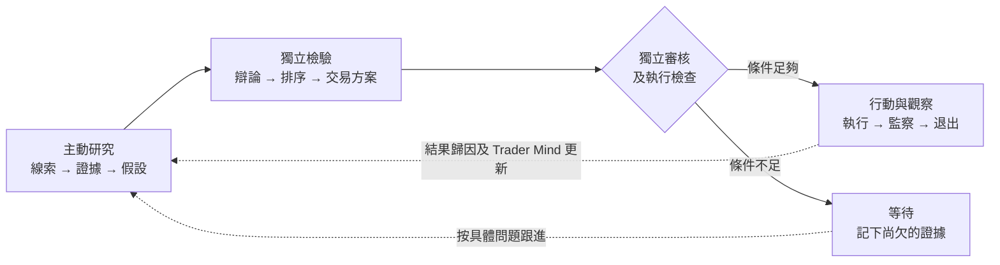
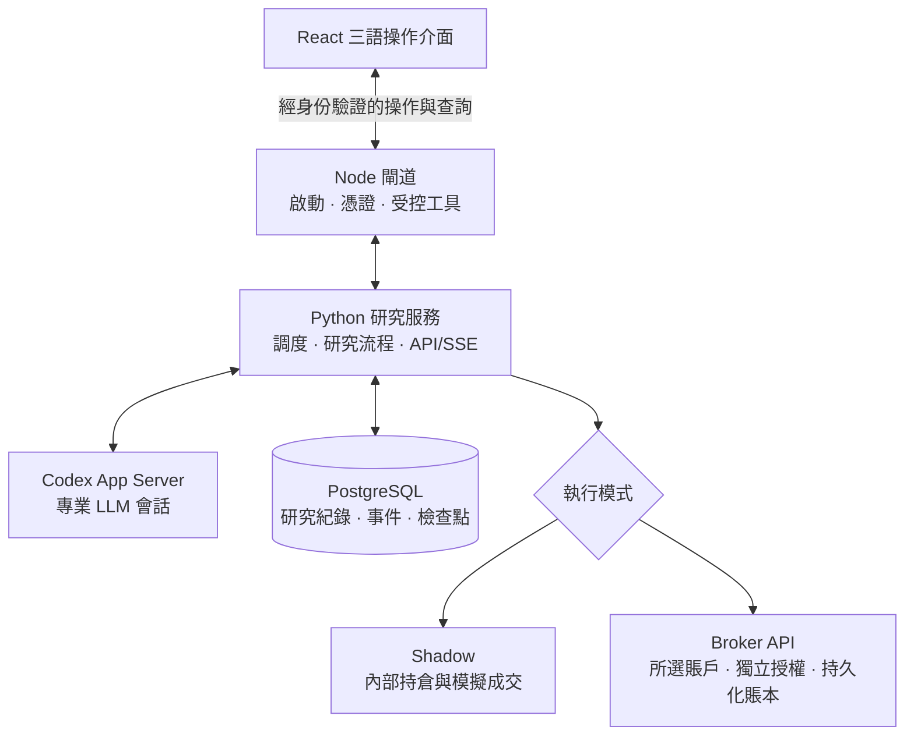

# ALTA

## Autonomous LLM Trading Asterism

_由專業 LLM Agent 分工協作的虛擬交易平台。_

[](https://github.com/kyky2347/ALTA/actions/workflows/ci.yml)
[](LICENSE)
[](docs/research-scope.md)

[English](README.md) · [简体中文](README.zh-CN.md) ·
[快速開始](#本機運行) · [架構](docs/architecture/overview.md) ·
[驗收紀錄](docs/audits/broker-routing-2026-09-13.md) · [網站](https://alta.silment.com)

**先找出機會，再選擇最適合把握它的交易工具。**

ALTA 是一套在本機運作的多 Agent 市場研究系統，設有操作介面、內部模擬及獨立的券商執行模組。
四類 Scout 主動追查線索，獨立評審檢驗證據，交易方案 Agent 比較如何行動。
由研究到決策，每次交接都有紀錄可追查。

目標是一家虛擬研究機構，而不只是推薦股票的聊天機械人：
一個判斷要經得起反對意見、成本和時間的考驗，才值得投入資金。

> [!IMPORTANT]
> 本項目屬實驗性研究軟件，不構成投資建議、正式營運用的訂單管理系統或盈利證明。
> 執行只有兩種模式：**Shadow** 與 **Broker API**。券商交易須明確選擇賬戶、
> 完成核驗並另行授權。六家連接器已實作，不代表實盤賬戶已完成驗收。
> [目前執行範圍 ↓](#兩種模式清楚的執行目標)

## 看見系統如何工作

由來源證據到評審結論，沿着紀錄了解一個機會。按圖片可查看完整尺寸；
已儲存的研究假設不等於已批准交易。

[](docs/assets/alta-operator-console-hk.jpg)

| 研究團隊                                                                                | 機會內部                                                                                              |
| --------------------------------------------------------------------------------------- | ----------------------------------------------------------------------------------------------------- |
| [](docs/assets/alta-agent-desk-hk.jpg) | [](docs/assets/alta-opportunity-detail-hk.jpg) |
| 誰研究過、用了哪個模型、留下了甚麼成果。                                                | 投資假設、支持證據及評審結論。                                                                        |

| 執行控制                                                                                                        | 模型分工                                                                                            |
| --------------------------------------------------------------------------------------------------------------- | --------------------------------------------------------------------------------------------------- |
| [](docs/assets/alta-broker-connections-hk.jpg) | [](docs/assets/alta-model-settings-hk.jpg) |
| 兩種模式、清楚的執行目標及獨立授權。                                                                            | 按角色選擇模型，保留獨立評審。                                                                      |

研究截圖：2026 年 9 月 12 日；執行設定：9 月 13 日。繁體中文介面，Agent 原始產物保留撰寫語言。
設定截圖展示尚未授權的配置，不代表已連接券商。截圖範圍及雜湊：
[研究驗收](docs/audits/console-readability-2026-09-12.md) ·
[執行驗收](docs/audits/broker-routing-2026-09-13.md)。不包含密鑰或賬戶資料。

## 本機運行

**前提：**macOS 或 Linux、Node.js 22+ 與 npm、Python 3.12、`uv`、
Docker/OrbStack 及足夠磁碟空間。首次安裝需要連線；
建置固定版本的自訂 harness 亦需要相應 Rust 工具鏈。

```shell
git clone https://github.com/kyky2347/ALTA.git
cd ALTA
npm run dashboard
```

指令會按需要安裝鎖定版本的前端依賴、建置操作介面，並開啟已完成身份驗證的本機頁面。接着：

| 步驟         | 要做甚麼                                                                   |
| ------------ | -------------------------------------------------------------------------- |
| **1 · 連線** | 填寫自己的研究及數據供應商密鑰；儲存後不會回傳。                           |
| **2 · 分工** | 在 **Agent 工作台 → Agent 模型**選擇可用模型；對立評審角色須使用不同模型。 |
| **3 · 啟動** | 準備鎖定的後端環境，啟動受管研究服務。先使用 **Shadow**。                  |
| **4 · 查看** | 打開 Scout 紀錄，查閱引用，比較評審結論。                                  |
| **5 · 停止** | 結束研究並停止受管資料庫及快取。這**不會**清空券商持倉。                   |

儲存密鑰不等於准許交易。模型使用權限、行情訂閱資格及券商賬戶權限須分別具備。
服務正常時亦可能在等候下一個週期；`Wait` 可以是正確的研究結論。

[部署及排障](docs/operations/getting-started.md) ·
[操作指南](docs/operations/operator-console.md) · [重現說明](REPRODUCIBILITY.md)

## 這家虛擬機構如何協作



**研究可以開放，權限必須清楚。** LLM 自行選擇研究方向，提出把握機會的方法；
程式負責資料時效、風險、賬戶隔離及持久化狀態檢查。再有說服力的假設，也不能自行批准執行。

### 四類研究者，各有自己的問題

每個 Scout 都有自己的 Trader Mind：研究風格、關注範圍及累積的經驗。
它們共用工具，但研究方向並不相同。

| Scout      | 主要研究甚麼                                   |
| ---------- | ---------------------------------------------- |
| 變化與事件 | 公告、業務或催化事件究竟有甚麼變化？何時發生？ |
| 市場錯配   | 價格或相關資產為何走勢分歧？                   |
| 因果與政策 | 哪些間接影響會傳導至其他公司或行業？           |
| 預期差     | 市場似乎在期待甚麼？哪些證據可能推翻這些預期？ |

工具涵蓋日期感知搜尋、發行人網站抓取、訂閱源、公開數據及歷史檔案檢索。
新聞和社交媒體資訊是線索，不是已核實的結論。事件時間與取得資料的時間分開記錄：
剛擷取的網頁也可能在講舊事。設上限的預算、數據源節流及不完整結果紀錄，讓檢索過程可供查核。
[檢索設計與限制 →](docs/audits/research-retrieval-review.md)

### 由想法到可追查的決策

| 階段         | 必須留下甚麼                                               |
| ------------ | ---------------------------------------------------------- |
| **假設**     | 甚麼變了、市場預期可能錯在哪裏、推翻判斷的條件及時間範圍。 |
| **檢驗**     | 反證、獨立評審結論，以及考慮組合風險的排序。               |
| **交易方案** | 可用工具、方向、倉位、成本，以及等待的理由。               |
| **持續跟進** | 監察、退出、持久化的跟進問題及催化事件期限。               |
| **學習**     | 時點凍結預測、前瞻結果、基準比較及 Trader Mind 更新。      |

股票、ETF 及已支援的期權方案可作研究對象；券商執行器的範圍較窄，詳見下文。
最直接想到的交易工具可能流動性不足、已重新定價，或與現有持倉承擔同一種風險。
`Wait` 會保留理由和下一個研究問題，不會勉強生成交易。

三語操作介面透過紀錄 ID 串連證據、Agent 工作、決策及事件歷史。
已儲存紀錄、已完成工作及目前運作的 Agent 分開計數；這些數字都不等於投資表現。

## 兩種模式，清楚的執行目標

| 模式           | 實際運作                                                                                   |
| -------------- | ------------------------------------------------------------------------------------------ |
| **Shadow**     | ALTA 管理內部成交、成本、持倉及退出，不向券商落盤。                                        |
| **Broker API** | 已審核計劃使用所選券商，以及明確設定的**模擬盤或實盤賬戶**；不會自動退回 Tiger 或 Shadow。 |

```text
設定憑證 → 核驗賬戶 → 儲存執行目標 → 另行授權 → 啟動
             Paper / Live 是賬戶屬性，不是第三種模式
```

授權綁定券商、賬戶、環境及設定版本。後端接收已持久化的研究及獨立審核產物，
不接受瀏覽器直接提供的訂單。獨立監察循環更新報價、對賬及管理退出，毋須等 LLM 完成研究。

| 連接器狀態                       | 目前邊界                                                                                        |
| -------------------------------- | ----------------------------------------------------------------------------------------------- |
| **Tiger · Alpaca · IBKR · Futu** | 已有通過核驗後可執行的流程，仍須真實賬戶核驗及明確授權。IBKR 每次落盤前另須完成不會成交的預檢。 |
| **Longbridge / Longport**        | 授權受阻：賬戶與環境的身份核驗仍不完整。                                                        |
| **Schwab**                       | 授權受阻：權限、完整訂單核驗及自動 OAuth 續期仍不完整。                                         |

以上是實作狀態，**不是六家實盤賬戶的驗收結果**。
目前券商執行支援**每個賬戶一個活躍計劃、做多美元股票或 ETF、整股及即日有效限價盤**，
不支援這個執行流程下的期權、沽空或多計劃組合執行。
舊 Tiger 模擬盤執行器只保留作隔離兼容用途，並非第三個可選模式。

首次授權須使用空的專用賬戶。切換前須撤銷授權、對賬及處理現有倉位。
退出由軟件管理，並非券商原生保護盤；停機可能延誤退出。
**停止 ALTA 不會平掉券商持倉。** [供應商矩陣及運行限制 →](docs/broker-expansion.md)

## 系統怎樣配合運作



瀏覽器負責展示和操作，不負責調度。受管後端維持研究及恢復，PostgreSQL 保存正式紀錄，
Redis 協助協調。券商訂單意圖先寫入隔離的持久化賬本，再提交；
訂單狀態不確定時按標識對賬，不盲目重試。

```text
alta-dashboard/                React 操作介面 · English / 简体中文 / 繁體中文
alta-src/                      Node 閘道 · 有邊界工具 · 啟停控制
alta-runtime/python/           研究生命週期 · PostgreSQL · API/SSE
alta-runtime/capital-python/   隔離的 Tiger 模擬盤執行器
alta-runtime/broker-python/    隔離的券商連接器及執行模組
vendor/openai-codex/            固定版本、保留歸屬的 Agent harness
docs/                          架構 · 運維 · 驗收
```

ALTA 適合研究多 Agent 的判斷能力，以及建立可查核的金融工作流程。
它不是低延遲交易引擎，也不是安裝後便能投入機構使用的完整交易系統。
具備恢復機制，並不等於獲得了 24×7 可用性認證。

## 驗證，而不只看介紹

[9 月 13 日驗收](docs/audits/broker-routing-2026-09-13.md)記錄了 Node、研究、
舊模擬盤、券商及前端五組測試，合共 **916 項通過**，另有 lint、建置、乾淨源碼安裝及抽樣瀏覽器檢查。
該輪沒有授權真實賬戶，亦沒有發送券商訂單。[此前的無下單研究實測 →](docs/audits/operator-scout-reliability-2026-09-12.md)

毋須付費 API 便可執行離線及契約檢查：

```shell
./alta env setup --dev
./alta test
./alta env python -m pytest -q alta-runtime/python/tests
uv run --frozen --project alta-runtime/capital-python pytest -q alta-runtime/capital-python/tests
uv run --frozen --all-extras --project alta-runtime/broker-python pytest -q alta-runtime/broker-python/tests
node --test alta-dashboard/tests/*.test.mjs
corepack pnpm check
./alta env down
```

整合測試需要受管 PostgreSQL；缺少 `DATABASE_URL` 時直接執行 `pytest` 不等於完整檢查。
全部驗收指令、確定性重播及乾淨安裝範圍見[重現說明](REPRODUCIBILITY.md)。

尚未證明：持續樣本外 Alpha、實盤賬戶下單驗收、所有斷電情境及所有瀏覽器兼容性。
測試結果說明已測行為，不代表盈利保證或永不出錯。

[架構](docs/architecture/overview.md) · [持續運行手冊](docs/operations/autonomous-shadow.md) ·
[安全](SECURITY.md) · [貢獻指南](CONTRIBUTING.md) · [更新紀錄](CHANGELOG.md)

## 許可與來源

ALTA 自有程式採用 [Apache-2.0](LICENSE)。修改過的固定版本
[OpenAI Codex](https://github.com/openai/codex)（Apache-2.0）提供本機 App Server/harness；
ALTA 負責研究生命週期及執行規則。其他依賴及 API 保留各自的許可與條款。
來源及修改見 [ATTRIBUTION.md](ATTRIBUTION.md)、[NOTICE](NOTICE)
及[上游修改紀錄](vendor/openai-codex/CHANGES.md)。

獨立維護，並非由 OpenAI 或任何提及的供應商背書。
供應商條款、交易所數據權限及再分發授權仍需使用者自行確認。
