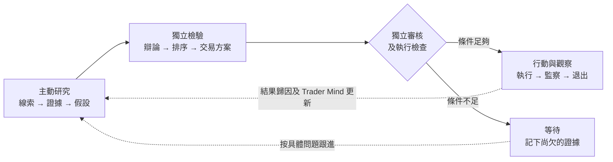
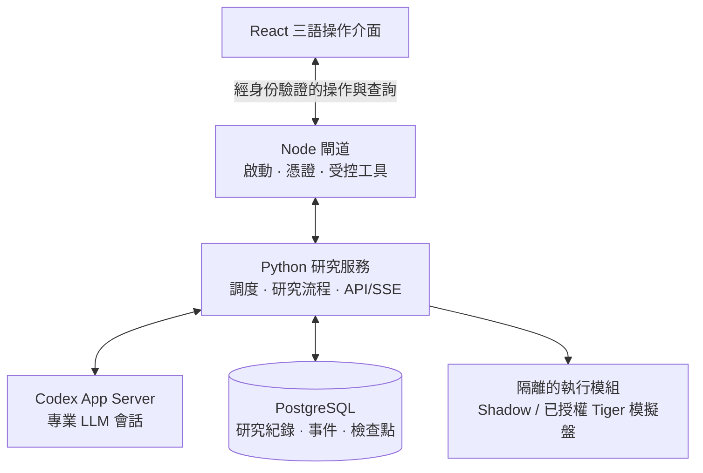

# ALTA

## Autonomous LLM Trading Asterism

_由專業 LLM Agent 分工協作的虛擬交易平台。_

[](https://github.com/kyky2347/ALTA/actions/workflows/ci.yml)
[](LICENSE)
[](docs/research-scope.md)

[English](README.md) · [简体中文](README.zh-CN.md) · [快速開始](#本機運行) ·
[架構](docs/architecture/overview.md) · [驗收紀錄](docs/audits/console-readability-2026-09-12.md) ·
[網站](https://alta.silment.com)

**交易的是機會；股票、ETF 或期權，只是把握機會的工具。**

ALTA 是一套在本機運作的多 Agent 市場研究系統，設有操作介面、內部模擬及獨立的券商執行模組。
四類 Scout 主動搜集線索，獨立評審檢驗假設，交易方案 Agent 比較如何把握機會。
由研究到決策，每次交接都有紀錄可追查。

目標是一家虛擬研究機構，而不只是推薦股票的聊天機械人。
一條線索是否有價值，要看它能否經得起證據、反對意見、成本和時間的考驗。

> [!IMPORTANT]
> 本項目屬實驗性研究軟件，不構成投資建議、訂單管理系統或盈利證明。
> 自主執行支援內部 **Shadow Paper** 及明確授權的 **Tiger 模擬盤**。
> 其他券商連接器屬獨立、尚未完成的整合，不是已啟用的自主實盤交易。

## 看見系統如何工作

最新版本看板，聚焦近期已儲存的研究紀錄與專業研究團隊。
按圖片可查看完整尺寸；研究假設不等於已批准交易。

[](docs/assets/alta-operator-console-hk.jpg)

| 研究團隊                                                                                | 機會內部                                                                                              |
| --------------------------------------------------------------------------------------- | ----------------------------------------------------------------------------------------------------- |
| [](docs/assets/alta-agent-desk-hk.jpg) | [](docs/assets/alta-opportunity-detail-hk.jpg) |
| 獨立評審的分工、模型及已儲存工作。                                                      | 假設與決策摘要，可在看板追查完整紀錄。                                                                |

| 券商連接                                                                                              | 模型分工                                                                                            |
| ----------------------------------------------------------------------------------------------------- | --------------------------------------------------------------------------------------------------- |
| [](docs/assets/alta-broker-connections-hk.jpg) | [](docs/assets/alta-model-settings-hk.jpg) |
| 六家券商各自的設定表單，密鑰儲存與執行權限分開處理。                                                  | 按角色選擇模型，保留獨立評審。                                                                      |

2026 年 9 月 12 日 · 繁體中文介面 · Agent 原始產物保留其撰寫語言。
截圖範圍、紀錄 ID 及圖片雜湊見[發佈驗收紀錄](docs/audits/console-readability-2026-09-12.md)。
不包含密鑰或賬戶資料。

## 這家虛擬機構如何協作



**LLM 決定甚麼值得研究，程式把關哪些決策可以寫入紀錄或動用資金。**
任何 Agent 都不能包辦舉證、風險批核和資金操作。證據不足便等待，不靠猜測填補。

| 層次   | 目前功能                                                                                    |
| ------ | ------------------------------------------------------------------------------------------- |
| 發現   | 4 類 Scout、13 個有邊界的唯讀工具；日期感知搜尋、發行人網站抓取、訂閱源、學術與歷史檔案檢索 |
| 判斷   | 獨立模型路由、可證偽假設、反證、考慮組合的排序及交易工具比較                                |
| 連續性 | 持久化跟進問題、催化事件期限、檢查點恢復及 Trader Mind 演化                                 |
| 評估   | 時點凍結預測、前瞻結果、相對基準表現及只能下調風險的校準                                    |
| 運維   | 三語看板、API/SSE、運行歷史、只寫密鑰、模型設定及啟停控制                                   |

Scout 每次嘗試預設 **11 次工具呼叫、196k 按系統預算口徑計入的 Token、420 秒**，仍設硬上限。
結構化草稿可在原有研究脈絡內修正一次，沿用預算、精確引用並留下審核紀錄。
證據過期或不足仍須等待，不以增加重試次數代替目前有效的訊號。
增加預算用於補足證據，不是增加機會數目的配額。數據源有節流、取消及分層逾時；
不完整的檢索結果仍會標示。[檢索設計與實測限制 →](docs/audits/research-retrieval-review.md)

### 四類研究者，各有自己的問題

Scout 共用工具，但研究方向並不相同。每個 Scout 都有自己的 Trader Mind，
包括研究風格、關注範圍及過往經驗；它們可以主動搜尋、追查線索，不只替新聞摘要。

| Scout      | 主要研究甚麼                                   |
| ---------- | ---------------------------------------------- |
| 變化與事件 | 公告、業務或催化事件究竟有甚麼變化？何時發生？ |
| 市場錯配   | 價格或相關資產為何走勢分歧？差距能否合理解釋？ |
| 因果與政策 | 政策及產業變化會怎樣傳導，影響其他公司或行業？ |
| 預期差     | 市場似乎在期待甚麼？哪些證據可能推翻這些預期？ |

新聞只是研究的起點。Agent 亦可查閱發行人網站、公告、公開數據、行情及其他網上資料。
剛擷取的網頁不代表剛發生的事件，系統會區分事件時間與取得資料的時間。
社交媒體和二手報道可以提供線索，但不能單憑一段有說服力的摘要，就當作已核實的事實。

### 先看清機會，再選交易工具

ALTA 把**投資假設**與**交易方案**分開記錄。機會需要交代：甚麼變了、
市場預期可能錯在哪裏、甚麼證據足以推翻判斷，以及影響可能何時出現。
之後才比較可用工具、方向、成本和倉位；最終可以選股票、ETF、已支援的期權方案，也可以不交易。

```text
候選線索          機會假設             決策                結果
來源 + 時間  →  邏輯 + 推翻條件  →  評審 + 交易方案  →  監察 + 退出
     └──────── 關聯 ID、引用及事件紀錄貫穿全程 ────────┘
```

最直接想到的交易工具未必合適：流動性可能不足、價格可能已經改變，
幾個表面不同的機會也可能承擔同一種風險。好的投資故事不能取代最新報價、組合檢查及獨立審核。
條件不足時，系統會記下等待原因和跟進問題，不把「沒有下單」當作必須修好的故障。

### 操作介面不只顯示數字

| 你想了解甚麼             | 可以在哪裏查看                    |
| ------------------------ | --------------------------------- |
| 為何出現這個機會？       | 機會詳情的摘要、證據及原始紀錄    |
| 誰研究過，誰持不同意見？ | Agent 工作台、模型分工及相關評審  |
| 目前狀態之前發生過甚麼？ | 活動歷史及可回看的事件時間線      |
| 現在可以執行嗎？         | 決策狀態、執行模式及授權檢查      |
| 哪些地方需要人處理？     | 系統狀態、連線情況及 API 驗證結果 |

英文、簡體和繁體介面使用相同的操作方式及紀錄 ID；Agent 的研究內容保留原本的撰寫語言。
快照數量、已完成工作及正在運作的 Agent 會分開顯示。
畫面上卡片較多，不代表獨立機會較多，更不代表回報較好。

## 系統怎樣配合運作



瀏覽器負責展示和操作，研究循環由受管後端維持。後端處理調度及恢復，
PostgreSQL 保存工作紀錄；關閉分頁不會丟失研究，程序重啟後亦有紀錄可供恢復。
改裝的 Codex harness 提供 Agent 會話和工具呼叫，ALTA 則負責研究流程與執行規則。
Redis 協助協調工作，但不代替正式賬本。

這套系統適合研究多 Agent 的判斷能力、建立可審核的金融工作流程，以及持續評估投資假設。
它不是低延遲交易引擎，也不是安裝後便能投入機構使用的完整交易基建。
目前可以驗證的是由研究到模擬執行的可查核流程；是否具備投資優勢，仍須由往後的結果證明。

## 本機運行

**前提：**macOS 或 Linux、Node.js 22+ 與 npm、Python 3.12、`uv`、
Docker/OrbStack 及足夠磁碟空間。首次安裝需要連線；
建置固定版本的自訂 harness 亦需要相應 Rust 工具鏈。

```shell
git clone https://github.com/kyky2347/ALTA.git
cd ALTA
npm run dashboard
```

指令會按需要安裝指定版本的前端依賴、建置最新介面，並開啟已完成身份驗證的本機頁面。之後：

1. **API 連線**：填寫自己的供應商密鑰；儲存後不會回傳。
2. **Agent 工作台 → Agent 模型**：指定可用模型；相互獨立的評審角色必須使用不同模型。
3. **啟動**：準備鎖定的後端環境，啟動受管依賴及研究服務。
4. **停止**：安全結束研究服務，並停止受管資料庫及快取。

券商交易權限預設關閉，需要獨立授權；儲存密鑰不等於准許交易。
harness、供應商要求及排障步驟見[部署指南](docs/operations/getting-started.md)。

**首次啟動後，應該看甚麼？** 服務正常不代表正在研究，也可能只是在等候下一個週期。
研究開始後，可先打開 Scout 紀錄、查閱引用，再比較評審意見。候選線索不等於已獲批准的機會，
假設獲認可也不代表可以即時下單。先用 Shadow Paper，沿着紀錄了解決策，再考慮授權券商。
模型使用權限、行情訂閱資格和可用資金各有不同要求，啟動程序不能單憑 API key 推斷是否齊備。

如想手動安裝依賴，先執行 `corepack pnpm install --frozen-lockfile`，再執行 `./alta dashboard`。

### 不使用付費 API 的驗證

```shell
./alta env setup --dev
./alta test
./alta env python -m pytest -q alta-runtime/python/tests
uv run --frozen --project alta-runtime/capital-python pytest -q alta-runtime/capital-python/tests
uv run --frozen --all-extras --project alta-runtime/broker-python pytest -q alta-runtime/broker-python/tests
node --test alta-dashboard/tests/*.test.mjs
corepack pnpm check
./alta env down
```

整合測試需要受管 PostgreSQL 環境；沒有 `DATABASE_URL` 時直接執行 `pytest`
不等於完整驗收指令。確定性示範、重播及乾淨源碼安裝見[重現說明](REPRODUCIBILITY.md)。

## 執行能力不等於交易權限

| 模式或邊界   | 真實支援範圍                                                                                                   |
| ------------ | -------------------------------------------------------------------------------------------------------------- |
| Shadow Paper | ALTA 管理內部成交、成本、持倉、觀察及退出，不操作券商                                                          |
| Tiger 模擬盤 | 已有適配執行器；精確賬戶綁定、明確授權、最新審計及重啟對賬                                                     |
| 五家預適配   | Alpaca、IBKR、Futu/moomoo、Longbridge/Longport、Schwab：私有設定、供應商程式及唯讀檢查，端到端賬戶驗收尚待完成 |

新 Tiger 實盤連接器同樣尚未驗收。獨立六券商模組包含執行引擎程式，
但**尚未接入自主研究執行循環**。本機閘道、OAuth、賬戶權限及核驗不能靠
一個通用密鑰輸入框取代。[供應商矩陣與待完成工作 →](docs/broker-expansion.md)

## 為中斷及恢復而設計

PostgreSQL 保存正式紀錄，Redis 提供輔助狀態。每項工作由一個有效執行者接手，
過期的執行者不能繼續改寫狀態。訂單意圖先存入賬本才提交；狀態不確定時先對賬，不盲目重試。
斷線時前端保留最後有效快照，過期控制請求不能覆蓋已確認操作。

[最新介面驗收](docs/audits/console-readability-2026-09-12.md)記錄前端修復、完整自有程式測試及乾淨源碼安裝；
[研究驗收](docs/audits/operator-scout-reliability-2026-09-12.md)另行記錄真實無下單研究及經身份驗證的 API 檢查。
發佈紀錄保留發現的問題、修復、
最終結果及停止證據，不構成 24×7 可用性認證或盈利保證。

尚未證明：持續樣本外 Alpha、所有斷電情境、所有瀏覽器兼容性，以及其他券商真實賬戶的下單驗收。

## 工程結構

```text
alta-dashboard/                React 看板 · English / 简体中文 / 繁體中文
alta-src/                      Node 閘道 · 有邊界工具 · 啟停控制
alta-runtime/python/           研究生命週期 · PostgreSQL · API/SSE
alta-runtime/capital-python/   隔離的 Tiger 模擬盤執行器
alta-runtime/broker-python/    隔離的實驗性連接器與執行庫
vendor/openai-codex/            固定版本、保留歸屬的 Agent harness
docs/                          架構 · 運維 · 驗收
```

[架構](docs/architecture/overview.md) · [操作指南](docs/operations/operator-console.md) ·
[持續運行手冊](docs/operations/autonomous-shadow.md) · [安全](SECURITY.md) ·
[貢獻指南](CONTRIBUTING.md) · [更新紀錄](CHANGELOG.md)

## 許可與來源

ALTA 自有程式採用 [Apache-2.0](LICENSE)。項目以修改過的固定版本
[OpenAI Codex](https://github.com/openai/codex)（Apache-2.0）作為本機 App Server/harness，
並使用另行授權的依賴及 API。保留上游聲明；修改及依賴見
[ATTRIBUTION.md](ATTRIBUTION.md)、[NOTICE](NOTICE) 及[上游修改紀錄](vendor/openai-codex/CHANGES.md)。

獨立維護，並非由 OpenAI 或任何提及的數據供應商、券商背書。
供應商條款、交易所數據權限及再分發授權仍需使用者自行確認。
