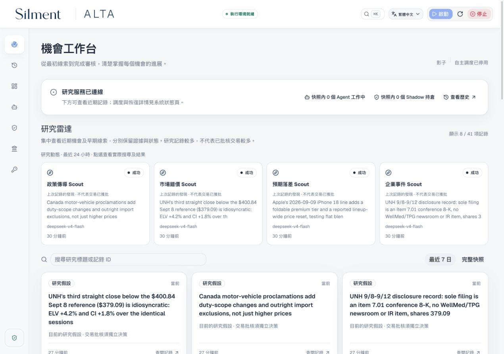
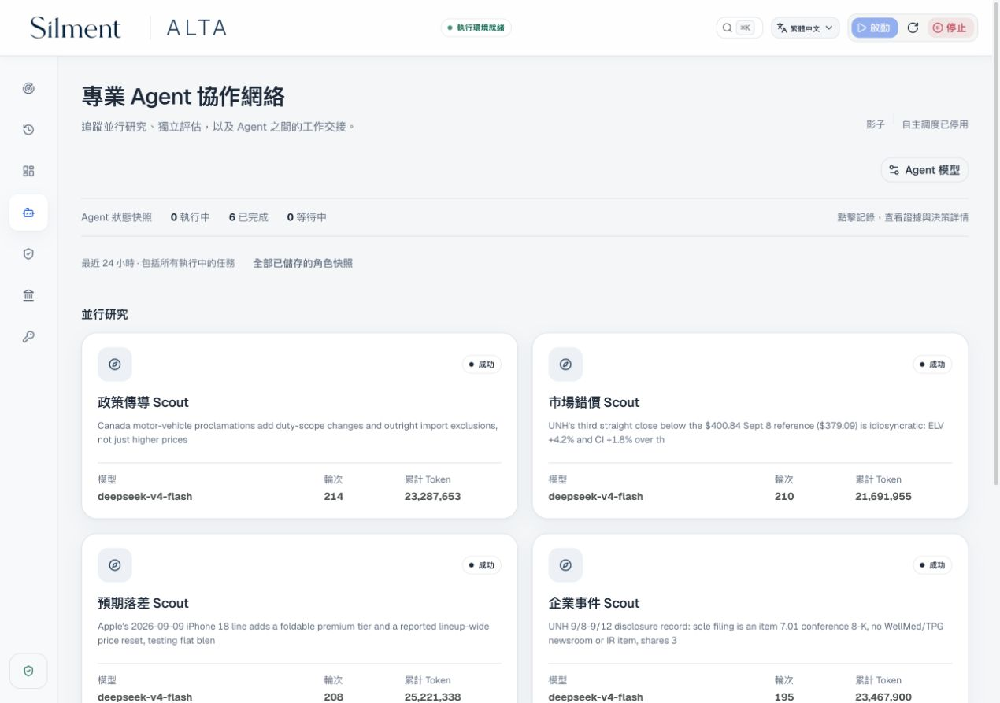
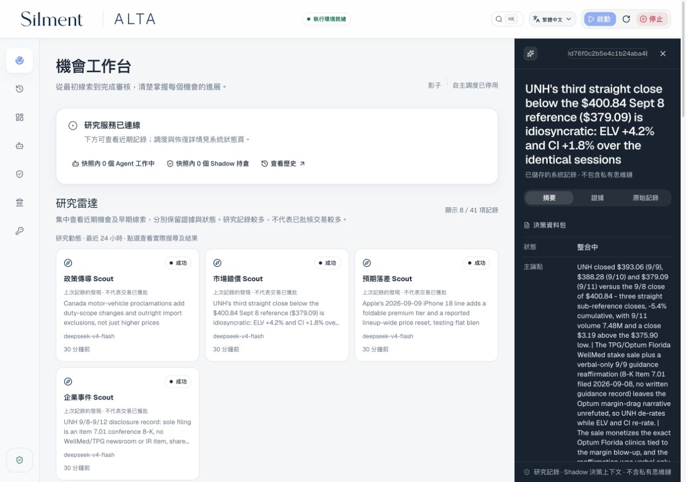
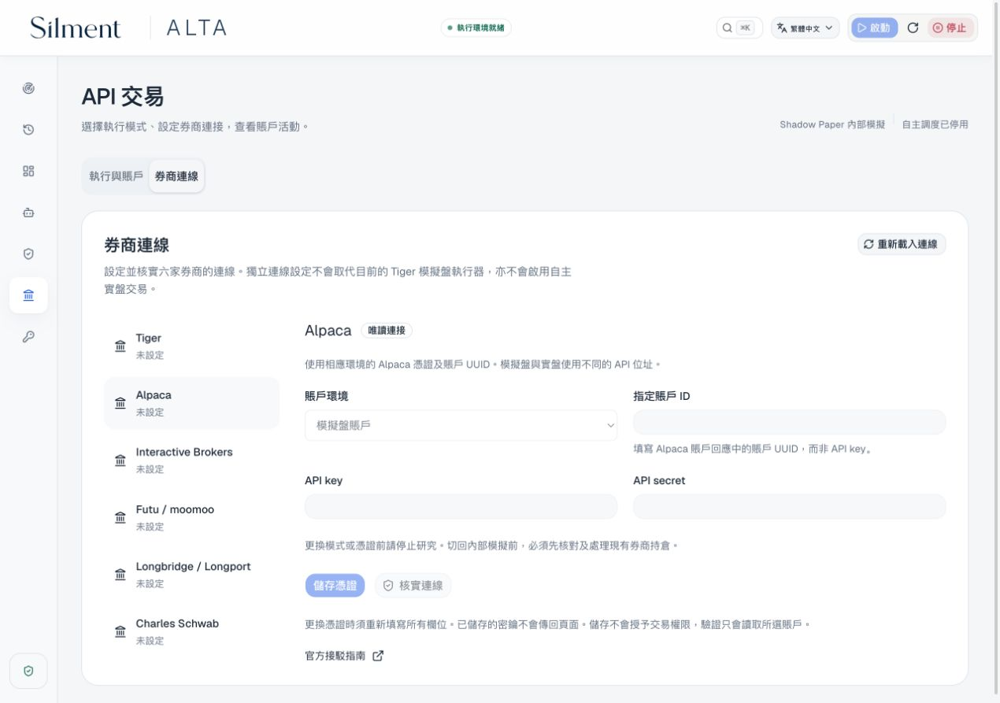
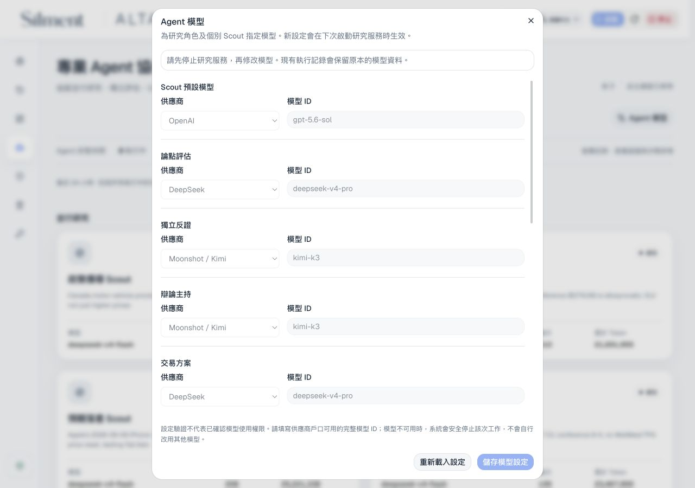
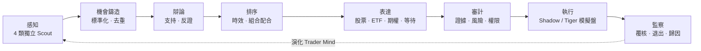

# ALTA

## Autonomous LLM Trading Asterism

_由專業 LLM Agent 協作運作的虛擬交易平台。_

[](https://github.com/kyky2347/ALTA/actions/workflows/ci.yml)
[](LICENSE)
[](docs/research-scope.md)

[English](README.md) · [简体中文](README.zh-CN.md) · [快速開始](#本機運行) ·
[架構](docs/architecture/overview.md) · [驗收紀錄](docs/audits/operator-scout-reliability-2026-09-12.md) ·
[網站](https://alta.silment.com)

**交易的是機會；股票、ETF 或期權，只是把握機會的工具。**

ALTA 把自主市場研究變成持久、可查核的工作流程。四類 Scout 分別尋找變化、
市場錯配、因果關聯及預期差；獨立評審挑戰假設，表達席位比較落實機會的方法，
確定性程式負責風險、權限及執行邊界。

目標是一家虛擬研究機構，而不只是推薦股票的聊天機械人。
一條線索是否有價值，要看它能否經得起證據、反對意見、成本和時間的考驗。

> [!IMPORTANT]
> 本項目屬實驗性研究軟件，不構成投資建議、訂單管理系統或盈利證明。
> 自主執行支援內部 **Shadow Paper** 及明確授權的 **Tiger 模擬盤**。
> 其他券商連接器屬獨立、尚未完成的整合，不是已啟用的自主實盤交易。

## 看見系統如何工作

最新版本看板，聚焦近期已儲存的研究紀錄與專業研究團隊。
按圖片可查看完整尺寸；研究假設不等於已批准交易。

[](docs/assets/alta-operator-console-hk.jpg)

| 研究團隊                                                                                | 機會內部                                                                                              |
| --------------------------------------------------------------------------------------- | ----------------------------------------------------------------------------------------------------- |
| [](docs/assets/alta-agent-desk-hk.jpg) | [](docs/assets/alta-opportunity-detail-hk.jpg) |
| 獨立評審的分工、模型及已儲存工作。                                                      | 假設與決策摘要，可在看板追查完整紀錄。                                                                |

| 券商連接                                                                                              | 模型分工                                                                                            |
| ----------------------------------------------------------------------------------------------------- | --------------------------------------------------------------------------------------------------- |
| [](docs/assets/alta-broker-connections-hk.jpg) | [](docs/assets/alta-model-settings-hk.jpg) |
| 六家券商各自的設定表單，密鑰儲存與執行權限分開處理。                                                  | 按角色選擇模型，保留獨立評審。                                                                      |

2026 年 9 月 12 日 · 繁體中文介面 · Agent 原始產物保留其撰寫語言。
截圖範圍、紀錄 ID 及圖片雜湊見[發佈驗收紀錄](docs/audits/operator-scout-reliability-2026-09-12.md)。
不包含密鑰或賬戶資料。

## 這家虛擬機構如何協作



**LLM 決定甚麼值得研究，程式決定甚麼可以改變持久狀態或資金。**
任何 Agent 都不能包辦證據、風險批准和資金操作。證據不足就等待，不即場編造。

| 層次   | 已有實現                                                                                    |
| ------ | ------------------------------------------------------------------------------------------- |
| 發現   | 4 類 Scout、13 個有邊界的唯讀工具；日期感知搜尋、發行人網站抓取、訂閱源、學術與歷史檔案檢索 |
| 判斷   | 獨立模型路由、可證偽假設、反證、考慮組合的排序及交易工具比較                                |
| 連續性 | 持久化跟進問題、催化事件期限、檢查點恢復及 Trader Mind 演化                                 |
| 評估   | 時點凍結預測、前瞻結果、相對基準表現及只能下調風險的校準                                    |
| 運維   | 三語看板、API/SSE、運行歷史、只寫密鑰、模型設定及啟停控制                                   |

Scout 每次嘗試預設 **11 次工具呼叫、196k 按系統預算口徑計入的 Token、420 秒**，仍設硬上限。
結構化草稿可在原有研究脈絡內修正一次，沿用預算、精確引用並留下審核紀錄。
證據過期或不足仍須等待，不以增加重試次數代替目前有效的訊號。
增加預算用於補足證據，不是增加機會數目的配額。數據源有節流、取消及分層逾時；
不完整的檢索結果仍會標示。[檢索設計與實測限制 →](docs/audits/research-retrieval-review.md)

## 本機運行

**前提：**macOS 或 Linux、Node.js 22+ 與 npm、Python 3.12、`uv`、
Docker/OrbStack 及足夠磁碟空間。首次安裝需要連線；
建置固定版本的自訂 harness 亦需要相應 Rust 工具鏈。

```shell
git clone https://github.com/kyky2347/ALTA.git
cd ALTA
npm run dashboard
```

指令會按需要安裝鎖定的前端依賴、建置最新看板，並開啟已驗證身份的本機頁面。之後：

1. **API 連線**：填寫自己的供應商密鑰；儲存後不會回傳。
2. **Agent 協作 → Agent 模型**：指定可用模型；相互獨立的評審角色必須使用不同模型。
3. **啟動**：準備鎖定的後端環境，啟動受管依賴及研究服務。
4. **停止**：安全結束研究服務，並停止受管資料庫及快取。

券商交易權限預設關閉，需要獨立授權；儲存密鑰不等於准許交易。
harness、供應商要求及排障步驟見[部署指南](docs/operations/getting-started.md)。

如想手動安裝依賴，先執行 `corepack pnpm install --frozen-lockfile`，再執行 `./alta dashboard`。

### 不使用付費 API 的驗證

```shell
./alta env setup --dev
./alta test
./alta env python -m pytest -q alta-runtime/python/tests
uv run --frozen --project alta-runtime/capital-python pytest -q alta-runtime/capital-python/tests
uv run --frozen --all-extras --project alta-runtime/broker-python pytest -q alta-runtime/broker-python/tests
node --test alta-dashboard/tests/*.test.mjs
corepack pnpm check
./alta env down
```

整合測試需要受管 PostgreSQL 環境；沒有 `DATABASE_URL` 時直接執行 `pytest`
不等於完整驗收指令。確定性示範、重播及乾淨源碼安裝見[重現說明](REPRODUCIBILITY.md)。

## 執行能力不等於交易權限

| 模式或邊界   | 真實支援範圍                                                                                                   |
| ------------ | -------------------------------------------------------------------------------------------------------------- |
| Shadow Paper | ALTA 管理內部成交、成本、持倉、觀察及退出，不操作券商                                                          |
| Tiger 模擬盤 | 已有適配執行器；精確賬戶綁定、明確授權、最新審計及重啟對賬                                                     |
| 五家預適配   | Alpaca、IBKR、Futu/moomoo、Longbridge/Longport、Schwab：私有設定、供應商程式及唯讀檢查，端到端賬戶驗收尚待完成 |

新 Tiger 實盤連接器同樣尚未驗收。獨立六券商模組包含執行引擎程式，
但**尚未接入自主研究執行循環**。本機閘道、OAuth、賬戶權限及核驗不能靠
一個通用密鑰輸入框取代。[供應商矩陣與待完成工作 →](docs/broker-expansion.md)

## 為中斷及恢復而設計

PostgreSQL 是事實來源，Redis 提供輔助狀態。工作由帶隔離令牌的單一擁有者認領；
券商意圖先持久化才提交，訂單狀態不確定時先對賬，不盲目重試。
斷線時前端保留最後有效快照，過期控制請求不能覆蓋已確認操作。

9 月 12 日驗收涵蓋 **816 項測試**、前端正式建置、真實無下單研究、
已驗證身份的 API 及乾淨源碼安裝。發佈紀錄保留發現的問題、修復、
最終結果及停止證據，不構成 24×7 可用性認證或盈利保證。

尚未證明：持續樣本外 Alpha、所有斷電情境、所有瀏覽器兼容性，以及其他券商真實賬戶的下單驗收。

## 工程結構

```text
alta-dashboard/                React 看板 · English / 简体中文 / 繁體中文
alta-src/                      Node 閘道 · 有邊界工具 · 啟停控制
alta-runtime/python/           研究生命週期 · PostgreSQL · API/SSE
alta-runtime/capital-python/   隔離的 Tiger 模擬盤執行器
alta-runtime/broker-python/    隔離的實驗性連接器與執行庫
vendor/openai-codex/            固定版本、保留歸屬的 Agent harness
docs/                          架構 · 運維 · 驗收
```

[架構](docs/architecture/overview.md) · [操作指南](docs/operations/operator-console.md) ·
[持續運行手冊](docs/operations/autonomous-shadow.md) · [安全](SECURITY.md) ·
[貢獻指南](CONTRIBUTING.md) · [更新紀錄](CHANGELOG.md)

## 許可與來源

ALTA 自有程式採用 [Apache-2.0](LICENSE)。項目以修改過的固定版本
[OpenAI Codex](https://github.com/openai/codex)（Apache-2.0）作為本機 App Server/harness，
並使用另行授權的依賴及 API。保留上游聲明；修改及依賴見
[ATTRIBUTION.md](ATTRIBUTION.md)、[NOTICE](NOTICE) 及[上游修改紀錄](vendor/openai-codex/CHANGES.md)。

獨立維護，並非由 OpenAI 或任何提及的數據供應商、券商背書。
供應商條款、交易所數據權限及再分發授權仍需使用者自行確認。
