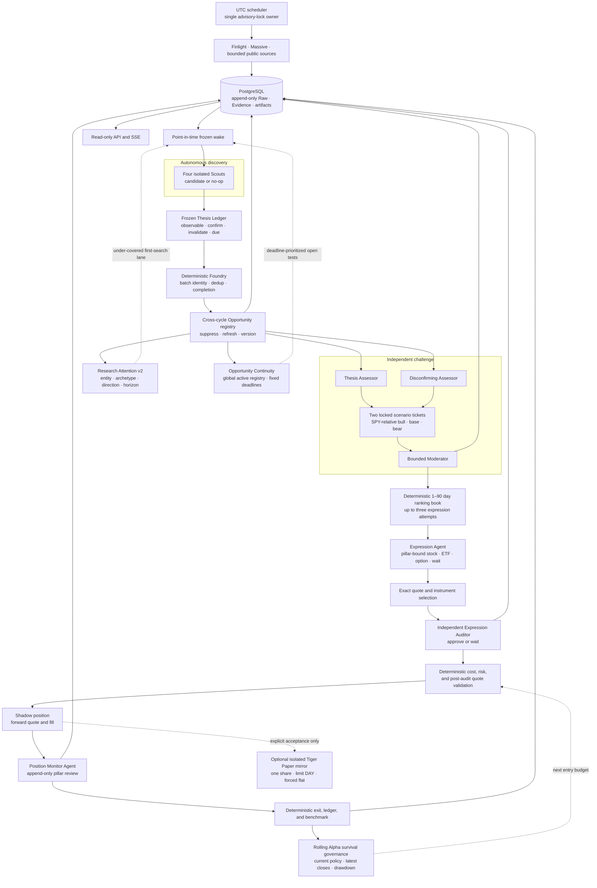

# Opportunity OS design

This document describes the implemented ALTA Opportunity OS and the boundaries
that future work must preserve. It is the detailed companion to the concise
[architecture overview](overview.md).

> [!IMPORTANT]
> ALTA is research software. Replay and internal Shadow are the defaults. An
> explicit acceptance command can mirror one share in one exact Tiger Paper
> account. It is not an investment adviser, live execution system, or claim of
> profitable Alpha. Live brokerage credentials and real capital are outside the
> system.

## Design thesis

ALTA starts from an information change rather than a ticker. Multiple autonomous
Scouts search different information territories, decide whether a falsifiable
opportunity exists, and are allowed to return no candidate. Downstream roles
challenge, rank, express, audit, observe, and measure the surviving ideas.

The central division of responsibility is:

> LLMs own discovery and bounded judgment. Deterministic software owns evidence,
> time, identity, replay, market truth, resource limits, and the capital boundary.

This is deliberately neither a fixed analyst committee nor an unconstrained
agent swarm. Agent autonomy is valuable where interpretation matters; code is
authoritative where an invariant must be reproducible.

## Implemented end-to-end path

Every state-changing arrow above writes a typed, bounded, replayable artifact.
An unavailable dependency narrows the result to `Wait`, `MVP_IDLE`, or a
degraded source posture. It never grants an Agent permission to invent data.

## Decision ownership

| Decision                                                | Owner                               | Why                                                         |
| ------------------------------------------------------- | ----------------------------------- | ----------------------------------------------------------- |
| What changed and why it may matter                      | Scout Agent                         | Requires open-ended search and causal reasoning             |
| Observable thesis pillars and their conditions          | Scout Agent                         | Requires falsifiable causal judgment                        |
| Pillar identity, provenance, and immutability           | Deterministic Foundry               | Must remain point-in-time and replayable                    |
| Candidate identity, merge, and completion rules         | Deterministic Foundry               | Must be stable, reversible, and replayable                  |
| Strongest thesis and strongest disconfirmation          | Two private Assessor Agents         | Benefits from independent judgment without anchoring        |
| Bull/base/bear odds, payoff, and implementation risks   | Two private Assessor Agents         | Forces ex-ante payoff discipline before ranking             |
| Whether discussion adds information                     | Bounded Moderator Agent plus policy | Requires synthesis but must not create Evidence             |
| Ranking gates, score, and bounded fallback              | Deterministic ranker/orchestrator   | Must be explainable, replayable, and resource-bounded       |
| Pillar-bound stock, ETF, option, or Wait recommendation | Expression Agent                    | Requires payoff-shape judgment                              |
| Exact quote and option contract                         | Deterministic market adapter        | Market facts cannot be invented by a model                  |
| Implementation approval                                 | Independent Auditor Agent           | Separates thesis enthusiasm from implementation review      |
| Spread, cost, notional, freshness, and fill checks      | Deterministic validators            | Safety and accounting invariants                            |
| Rolling capital posture from prior forward outcomes     | Deterministic Alpha governance      | Negative evidence must reduce risk without model discretion |
| Pillar state and whether Evidence triggers invalidation | Position Monitor Agent              | Narrow semantic comparison                                  |
| Time exit, quote validity, fill, ledger, and benchmark  | Deterministic position runtime      | Reproducibility and measurement integrity                   |

No Agent receives database credentials, provider credentials, a broker client,
or an order mutation tool. The optional Paper action is performed only by an
isolated deterministic executor after research, audit, market, and risk gates.

Research quality follows the same evidence boundary. A completed search call is
observable, but it earns source-diversity or cross-check credit only when the
Candidate binds the exact validated call and canonical source locator, or cites
frozen Evidence already in its wake. Decision-grade cross-checking requires two
cited non-news calls and three independently frozen source records across three
domains. A repeated source record or one source reused for several roles remains
visible, but does not create independent corroboration. Durable tool Evidence is
source-scoped so each URL retains its own bounded excerpt and origin fingerprint.
At implementation time, deterministic code
projects comparable time-adjusted Alpha dollars, Alpha per stress dollar, and
execution-reserve headroom for each market-valid payoff. The Auditor uses those
figures as decision inputs rather than an automatic score, and the final guarded
buy limit cannot exceed the observed ask.

The rolling capital posture is scoped to the exact current portfolio-policy
version and the latest measurement for each closed Shadow position. It never
uses open PnL, model confidence, reconstructed forecasts, or duplicate events.
Collecting and probation postures cap size at 50%; a 100 bp synthetic-NAV
drawdown or a mature 30-close window whose descriptive 95% upper Alpha bound is
non-positive caps size at 10%. Every distinct Opportunity persisted at the
expression boundary counts as a research trial. A Bonferroni family-wise lower
bound penalizes the many-opportunity search; mature evidence that does not clear
that adjusted floor remains on 50% probation. Only selection-adjusted positive
evidence can restore the ordinary risk budget after old observations roll out,
and it can never grant bonus leverage.

## Agent society

### Active Trader Mind pool

The discovery layer uses four pairwise distinct Trader Mind configurations:

| Mind                    | Primary question                                                                | Active research surface                                        | Explicit non-goals                         |
| ----------------------- | ------------------------------------------------------------------------------- | -------------------------------------------------------------- | ------------------------------------------ |
| Change-event Mind       | What verifiable fact changed recently?                                          | Filings, news, Web research, feeds, archives, public ecosystem | Generic news summaries                     |
| Market-dislocation Mind | What price, volume, or volatility move is inconsistent with available evidence? | Finance, peers, news, Web research, public social sources      | Predicting from price alone                |
| Causal-policy Mind      | What second-order beneficiary or loser follows from a policy or macro change?   | Official, academic, Web, news, social, and finance             | Uncited political narratives               |
| Expectation-gap Mind    | What does the market appear to expect, and what evidence challenges it?         | Filings, news, narrative, social, ecosystem, and finance       | Claiming a gap when posture is unavailable |

Each Trader Mind runs in a separate App Server turn with a role-specific
read-only tool catalog, budget, deadline, frozen input, and durable result. All
four share a core active surface—Web search and research, independent-source
batch fetch, global news, public social search, and public finance data—while specialist tools remain aligned to
their Alpha archetype. The production runtime rejects a turn that never attempts
active research, even when passive Evidence was supplied. Trader Minds use
`deepseek-v4-flash` with high reasoning; judgment roles are routed separately.
ChatGPT/Codex desktop plugins are not injected into these isolated turns:
autonomous tool use comes from ALTA's bounded internal MCP research surface. A
run may return a Candidate or an explicit no-op. One invalid or failed Scout is
retried once against the same frozen identity; failure after that remains
isolated from successful siblings.

The Scout v5 research contract binds every cited retrieval to one institutional
research role: changed primary fact, causal mechanism, market/expectations
context, or counterevidence. Cross-checked posture requires all four roles, a
distinct counter-source, at least three cited active calls, multiple domains,
and non-news depth. Deep research carries optional domain, recency, and language
scopes through every federated query, composes multiple domain scopes with OR
semantics, and ranks retrievable primary records ahead of topically unrelated
generic results. Returned hosts are revalidated locally even when an upstream
engine ignores the scope. The gateway returns the remaining call budget with every
result, and evidence collection round-robins across calls before admitting more
URLs from an early broad search. This preserves late market-context and
counterevidence work without increasing the five-call base budget.

After a completed turn, deterministic code evolves one bounded experience
state. It keeps capped Candidate/no-op, explore/follow-up, and tool-use counts
plus the two most recent findings, first rejections, tool routes, and source counts. On a later
wake only that Mind receives its prior state. This is research-process memory,
not Evidence: it may vary a search route, discourage a failed path, or prevent a
semantic repeat, but every Candidate still needs current frozen or newly
collected auditable Evidence. The snapshot is validated against PostgreSQL and
recovery merges the four isolated memories without polling newer sources.

Recent active Opportunities add a separate open-research agenda. Deterministic
code derives at most two questions from the prior Scout's `next_test` and
`first_rejection` plus `missing_evidence` locked by the Thesis and Disconfirming
Assessors. Each Mind decides whether to explore a new anomaly or follow one
question for which its differentiated toolkit can produce high-information
work. Follow-up output must copy the exact frozen parent ID and question; an
invented lineage fails validation. Candidate and no-op both retain the mode, so
failed follow-up work remains visible instead of being rewritten as exploration.
The question itself is never Evidence, priority, rank, or a capital instruction.

Long-horizon research uses a separate Opportunity Continuity projection. Before
constructing a bounded Scout prompt, deterministic code scans the global active
registry and ranks open questions against fixed Thesis Ledger deadlines. The
highest-value unresolved tests are retained first, then the remaining prompt
slots are filled from recent active Opportunities. Stale work remains visible
for audit but cannot re-enter a fresh capital decision merely because the parent
Opportunity was refreshed. The frozen snapshot is identical across the four
role runs and is reconstructed from durable run artifacts after interruption.

Breadth is also multidimensional. Research Attention v2 measures the recent
production mix by entity, Alpha archetype, direction, and short/medium/long
horizon. It assigns each Mind an under-covered first-search lane that remains
inside that Mind's immutable archetype mandate. The model may abandon the lane
when contradictory evidence is stronger and may always return no-op. The target
does not validate facts, raise confidence, alter rank, or require a Candidate.

For filing-led clues, `alta_finance_data` accepts either an SEC CIK or a listed
ticker. The ticker path uses the official SEC company/exchange mapping before
retrieving the bounded submissions record with a declared User-Agent. Relevant
Form 4, SC 13D/13G, 8-K, 10-Q/10-K, S-3, and 424B records can locate ownership,
incentive, financing, dilution, covenant, and operating-state changes, but a
filing becomes thesis Evidence only when the current turn retrieves and binds
the exact record to a causal claim.

Outcome learning is a separate, slower loop. A production Candidate must select
one Alpha archetype from the originating Mind's frozen mandate. At Shadow entry,
the Position Thesis freezes Candidate, Mind, archetype, explore/follow-up mode,
and completed bounded research-tool route. A later Opportunity merge therefore cannot rewrite
historical credit. Closed cost-adjusted and SPY-relative outcomes return only to
that Mind on a strict later point-in-time wake. Mind metrics remain hidden until
30 benchmarked closes; archetype, route, and research-mode slices also require
10 observations. At Mind maturity, deterministic code computes a one-sided
conservative Alpha bound. A positive bound earns one additional read-only
research call and 8,000 tokens for the next frozen wake; the bonus is removed as
soon as the bound is no longer positive. Candidate count, confidence, raw
profit, and turnover earn nothing. This feedback is non-Evidence and cannot
mutate models, ranking, expression, risk, capital, or broker policy.

The gateway, not the model, is authoritative for the frozen per-run admission
cap: six calls normally and seven only with a maturity-gated earned incentive.
The schema retains an absolute 12-call ceiling, so configuration or malformed
state cannot create unbounded research.
Post-turn validation charges completed research calls and still records failed
attempts. Read-only MCP resource discovery is treated as control-plane metadata,
not as an out-of-territory research call. Unsafe tool locators are discarded
individually; a Candidate still fails if no frozen or collected auditable
Evidence remains.

### Private assessment and discussion

For every materialized Opportunity, ALTA creates two locked assessments:

- the Thesis Assessor builds the strongest evidence-grounded causal case while
  naming its best disconfirmation;
- the Disconfirming Assessor tries to falsify the thesis, identify expectation
  errors, and reject attractive but unsupported stories.

Neither Assessor sees the other output before both are locked. The Moderator
then receives the frozen Opportunity and both private artifacts. It may produce
at most two short, evidence-bound rounds. Discussion is never promoted to
Evidence, and material probability changes must cite existing Evidence IDs.

Each private artifact also includes a direction-normalized bull/base/bear
distribution versus SPY over the Opportunity horizon. Scenario probabilities
must sum to one, returns must be ordered, and every scenario cites frozen
Evidence. The ticket records catalyst clarity, crowding risk, liquidity risk,
and the next fact expected to move price. These numbers are ex-ante research
judgments—not prices, observed returns, or a capital instruction.

The default judgment routes are intentionally heterogeneous:

| Role                   | Default model     | Workload                                            |
| ---------------------- | ----------------- | --------------------------------------------------- |
| Thesis Assessor        | DeepSeek V4 Pro   | Causal underwriting and strongest investable case   |
| Disconfirming Assessor | Grok 4.6          | Independent falsification and expectation stress    |
| Discussion Moderator   | Kimi K3           | Evidence-bound synthesis of two locked views        |
| Expression Agent       | DeepSeek V4 Pro   | Payoff shape and listed-instrument intent           |
| Independent Auditor    | Grok 4.6          | Thesis-purity, implementation, and portfolio review |
| Position Monitor       | DeepSeek V4 Flash | Repeated frozen-falsifier comparison                |

Configuration rejects identical routes for the two private Assessors and for
the Expression/Auditor pair. Provider and model are stored on every run, and
the model route is part of deterministic run identity so a route change cannot
silently recover an artifact produced by another model.

### Expression and independent audit

The orchestrator considers at most the first three ranked Opportunities in
order. Each is given to the Expression Agent without broker capability; the
first independently audited, deterministically valid non-`Wait` expression is
selected. If all three resolve to `Wait`, the first durable `Wait` remains the
cycle outcome. The Agent recommends one of:

- long stock;
- long ETF or inverse ETF for a bounded negative thesis;
- long call or long put;
- `Wait`.

For an option recommendation, the model selects the underlying and payoff
intent. Deterministic code selects the exact listed contract using direction,
horizon, strike range, delta, spread, open interest, quote freshness, and budget.

The Expression Agent receives the frozen Opportunity and compact summaries of
both locked tickets. The independent Expression Auditor receives those same
summaries, the recommended expression, the verified instrument or unavailable
state, and a bounded view of open Shadow exposure. Neither receives the ranking
score. The Auditor can only approve or require `Wait` and cannot redesign the
research thesis.
An approval does not freeze an old price indefinitely: deterministic code
refreshes the same exact instrument after audit and rejects a symbol change,
underlying change, stale quote, or excessive midpoint drift.

### Position Monitor

Open Shadow positions persist across autonomous cycles. The Position Monitor
receives only newer frozen Evidence, the original position invalidation
condition, and the exact Thesis Ledger pillars selected by the expression. It
must append one `confirming`, `weakening`, `invalidated`, or `unresolved` review
per pillar and cite the new Evidence used. It cannot reinterpret ordinary
volatility, edit the thesis, propose another trade, or override deterministic
exit rules. Missing or inconsistent reviews degrade safely instead of exiting.

## Evidence and time model

ALTA follows a raw-first, point-in-time contract:

1. a source response is stored as versioned `Raw` with provenance and a content
   hash;
2. a bounded readable claim becomes `Evidence` linked to that Raw record;
3. a cycle freezes only records known at or before its wake time;
4. Agent outputs may cite only Evidence visible in that frozen input;
5. recovery reuses the interrupted cycle's original frozen wake.

Tool-discovered evidence follows the same path. A model cites the HTTPS locator
it actually saw; the runtime normalizes public query and fragment components and
binds the locator to the successful internal tool call. Non-HTTPS, credentialed,
ambiguous, or unmatched references are rejected.

## Opportunity identity and ranking

The Foundry separates three relationships:

- `duplicate`: exact normalized identity;
- `merge`: high-precision structural identity with reversible membership;
- `competing` or `related`: shared context without destructive merging.

Completion may fill only missing fields and must cite Candidate Evidence. It
cannot overwrite frozen claims. Merge and reversal events are append-only.

Foundry first resolves one batch. The durable registry then compares each
materialized Opportunity with active canonical Opportunities from earlier
cycles. Identity v2 deliberately excludes free-form mechanism prose and uses
normalized entity, event or catalyst, direction, and one of five holding-period
buckets. This absorbs small wording and nearby-horizon drift without merging an
opposite-direction thesis.

Novelty is based on Raw content hashes across the canonical Opportunity and all
of its merged children, not on newly generated Evidence IDs. A semantic repeat
is marked as a merged, rejected child and does not consume assessment, debate,
ranking, or expression work. New source content refreshes the canonical record,
increments its version, keeps bounded current Evidence and Candidate membership,
and proceeds downstream. If the canonical Opportunity already owns an open
Shadow position, the evidence and version are updated but the idea does not
re-enter the expression/open path; position monitoring remains the owner of the
existing exposure.

Each later Scout wake receives at most four recent active Opportunity snapshots.
They are explicitly labeled as registry memory rather than Evidence: they may
prevent a repeat or anchor stable identity keys, but they cannot support a claim
unless the current turn cites auditable Evidence. Registry state, identity
version, merge parent, and merge revision are exposed through the read API and
event stream.

Each snapshot carries at most two open questions. A Mind may ignore all of them
and continue broad exploration. If it chooses `follow_up`, the exact frozen
question and parent Opportunity are validated before persistence, while the
ordinary new-Evidence and semantic-dedup contracts still apply. Multiple Minds
may independently attack the same question; Foundry merges market identity but
retains each Candidate's contribution and later attribution.

The wake also carries at most one prior experience snapshot for each Trader
Mind. Opportunity memory answers “have we seen this thesis?”; Mind memory answers
“which research route just worked or failed?” Neither can prove a market claim.

The current book is `opportunity_1_90d`. Absolute gates require a 1–90 day
horizon, Evidence, falsifier, expectation posture, valid private assessments,
coherent scenario underwriting, and complete decision intelligence. Each private
view must distinguish what is priced in from its variant, state a reference
class and base rate, identify must-be-true conditions, separate company-thesis
status from security-thesis readiness, and freeze an edge half-life plus action
trigger. Historical records without this contract remain readable but are not
rankable.
Ranked items retain probability, evidence and wedge quality, consensus expected
Alpha, downside resilience, payoff asymmetry, catalyst clarity, crowding,
liquidity, decision-relative freshness, investability, expectation posture,
security readiness, reference-class base rate, inside view, edge half-life, and
both probability and scenario disagreement. A missing decision record, a broken
company thesis, a required re-underwrite, a not-decision-grade view, or the
absence of at least one independent `ready` view rejects the item. Self-reported
confidence remains auditable but has no positive ranking weight. Stable IDs
break ties.

## Market and Shadow boundary

Massive is the authoritative market adapter when explicitly enabled. Broad
Massive discovery is disabled by default; Scouts use frozen Evidence and their
role-bounded public research tools. Massive is reserved for a selected
instrument, exact quotes, forward fills, monitoring, and exit. Each cycle has a
hard request budget (8 in the verified configuration). SDK retries and automatic
pagination are disabled so ALTA owns concurrency, pacing, cooldown, and
observability.

A non-Wait expression must pass all of the following:

- the exact instrument exists and has a quote known at decision time;
- bid and ask are valid, fresh, and within spread and cost limits;
- option direction, horizon, strike, delta, open interest, and budget qualify;
- the payoff challenges the locked priced-in expectation, preserves the variant
  and must-be-true conditions, and fits the shorter independent edge half-life;
- position notional and the eight-position portfolio cap qualify;
- the underlying is not already duplicated in the Shadow portfolio;
- the simulated fill uses a new quote observed after intent and frozen latency.

Old prices are never backfilled as Shadow fills. Missing forward quotes produce
an explainable no-fill. Shadow accounting uses append-only double-entry ledger
events and conservative side-of-spread pricing.

Tiger is disabled in Replay and by default in Shadow, service, and
`autonomous --once` operation. An authenticated operator may authorize the
exact Paper account only while the runtime is stopped; the next service start
can then mirror one share only after every research and deterministic gate
passes. The explicit acceptance command remains available for bounded lifecycle
testing. The isolated capital process:

- resolves an owner-only, non-symlink config inside an approved root;
- requires a 17-digit Paper account and an exact SHA-256 account binding;
- rejects live and sandbox-debug configurations and never enumerates accounts;
- permits only long stock/ETF, one-share, DAY limit orders outside extended
  hours, with broker preview and fill/position reconciliation;
- starts with zero positions and zero open orders and re-verifies both in a
  `finally` block;
- refuses shorts, options, more than one share, or more than USD 2,000 limit
  notional.

Research Agents cannot call this executor. There is no HTTP order endpoint and
no live-account type or fallback.

## Persistence and recovery

PostgreSQL is the system of record. It owns versioned domain records, runs,
artifacts, source cursors, events, Shadow positions, and measurement. Redis is
disposable support state and is never authoritative.

Every model run records its role, provider, model, prompt version, frozen-input
hash, deadline, budgets, thread and turn provenance, evidence references, and
bounded output artifact. A succeeded run is recovered rather than called again.

Scout snapshots are role-scoped and may be trimmed differently to fit the
complete PostgreSQL audit row. Recovery therefore compares only the immutable
wake identity, verifies that duplicate objects agree, and deterministically
merges Evidence, prior Opportunities, Mind memory, and maturity-gated feedback.
A frozen Mind version remains valid after the current Mind evolves only when
that exact version already exists in the interrupted cycle's durable run
history. This preserves point-in-time recovery without trusting current state.

Structured judgment contracts enforce cross-field scenario coherence before a
run succeeds. If bounded retries or a deadline are exhausted, the missing
private assessment or moderated debate makes the Opportunity unrankable. The
cycle degrades to normal Idle/Wait while database and programming invariant
failures remain visible rather than being broadly swallowed.

Cycles use PostgreSQL advisory locking for a single scheduler owner. An
interrupted cycle keeps the same cycle identity and resumes from durable
checkpoints after backoff. Once a new scheduler owns the advisory lock, it
closes expired orphan Scout runs and jobs through the durable failure state
before starting work. Repeated failure is exposed
through health state, discards the failed Agent runtime, and retries with capped
exponential backoff. The inner supervisor separates liveness from dependency and
heartbeat readiness, and terminates the full child process group before it
rebuilds a stuck Agent runtime. A macOS launchd or Linux systemd-user service
owns the outer lifecycle, restores managed dependencies after login/boot, and
restarts the inner supervisor after a host-process crash. Recovery is continuous
by default, but it is never an unbounded hot loop.

## Observability contract

The bundled operator console consumes the read-only loopback `/api/v1` JSON and
event surface through its authenticated local proxy. It does not need database
access or log scraping.

| Surface                         | Information                                                               |
| ------------------------------- | ------------------------------------------------------------------------- |
| `/health/live`, `/health/ready` | Process, dependencies, heartbeat, and readiness                           |
| `/api/v1/system/summary`        | Durable object counts                                                     |
| `/api/v1/system/runtime`        | Sources, Agents, cursors, safety posture, and Alpha state                 |
| `/api/v1/mvp/status`            | Current cycle, stages, and recent events                                  |
| `/api/v1/events`                | Forward `cursor` or backward `before` durable history for timeline replay |
| `/api/v1/runs/{id}`             | Frozen input, role, status, budgets, and artifact metadata                |
| `/api/v1/opportunities/{id}`    | Evidence, Thesis Ledger, scenarios, rank, and audit                       |
| `/api/v1/expressions/{id}`      | Recommendation, instrument, validation, and Shadow state                  |
| `/api/v1/alpha/summary`         | Forward Alpha, observed lifecycle quality, uncertainty, and calibration   |
| `/api/v1/alpha/feedback`        | PIT Mind, archetype, route maturity and outcome feedback                  |
| `/api/v1/evaluation/summary`    | Frozen cohort drift, coverage, missingness, and readiness                 |
| `/api/v1/stream`                | Cursor-based server-sent events                                           |

The API is read-only, loopback-bound, bounded, and optionally bearer-protected.
It exposes rationales and structured artifacts, not hidden chain-of-thought.

## Measuring whether the system adds value

Completing the pipeline is an engineering result, not Alpha evidence. ALTA keeps
the measurement surface explicit so future claims can be falsified.

The forward Shadow evaluation should include:

- cost-adjusted net return and SPY-relative realized Alpha;
- sample size, dispersion, positive rate, and a clearly labeled descriptive
  interval using one latest measurement per closed position;
- Top-K lift over the unranked Opportunity population;
- forecast calibration and Brier score;
- unique Candidate contribution by Scout, source, model, and prompt version;
- discovery lead time, turnover, exposure overlap, and maximum drawdown;
- observed maximum favorable/adverse excursion and exit capture, without
  interpolating missing intraday prices or treating them as an optimized exit;
- ablations that remove individual roles or sources.

Until a sufficiently large independent forward sample exists, the API and
documentation must report `Alpha is unproven`.

## Deliberate non-goals

The current system does not provide:

- live trading or real-capital management;
- unattended portfolio trading outside the explicit bounded acceptance command;
- an OMS, portfolio optimizer, leverage, naked shorting, or multi-leg options;
- an unbounded Web crawler or credential-sharing Agent environment;
- self-modifying production weights based on a small sample;
- a guarantee of profitability.

Any future capital phase requires a separate design review, isolated service,
explicit authorization, and evidence from sustained forward Shadow operation.

## Code ownership map

| Path                                                | Responsibility                                                          |
| --------------------------------------------------- | ----------------------------------------------------------------------- |
| `alta-src/`                                         | Project launcher, provider gateway, bounded tools, and resource control |
| `alta-runtime/python/src/alta_asterism/`            | Opportunity domain, Agents, orchestration, API, and Shadow runtime      |
| `alta-runtime/python/tests/`                        | Domain, integration, replay, recovery, and lifecycle evidence           |
| `alta-runtime/capital-python/`                      | Isolated Tiger Paper-only acceptance executor                           |
| `alta-runtime/python/src/alta_asterism/migrations/` | Versioned PostgreSQL schema                                             |
| `vendor/openai-codex/`                              | Pinned and attributed Codex App Server substrate                        |

See [Getting started](../operations/getting-started.md),
[Autonomous Shadow operations](../operations/autonomous-shadow.md), and the
[implementation roadmap](../implementation/roadmap.md) for the executable path
from a clean source clone to sustained forward research.
