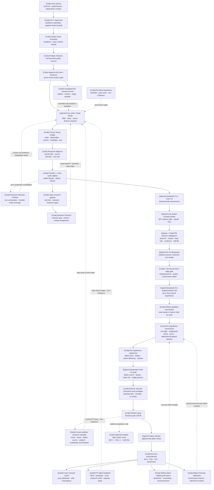

# Architecture overview

ALTA is opportunity-centric: agents wake because information changed, not
because a fixed analyst roster must produce a trade. Deterministic software
protects time, evidence, budgets, auditability, and the capital boundary; LLMs
retain freedom over research interpretation and expression choice.



`[Agent]` nodes own hypotheses and bounded judgment. `[Code]` nodes own source
provenance, immutable identity, scoring mechanics, quotes, safety gates, and
measurement. The App Server harness starts and supervises the Agent turns but
does not collapse their independent contexts into a shared chat.

## Decision hand-offs

```mermaid
sequenceDiagram
  participant O as Cycle orchestrator (code)
  participant D as Research Director (code)
  participant S as Active Trader Minds (4 Agents)
  participant F as Foundry and registry (code)
  participant A as Private Assessors (2 Agents)
  participant M as Moderator (Agent)
  participant R as Ranker (code)
  participant E as Expression Agent
  participant K as Portfolio Constructor (code)
  participant L as Capital Allocator (code)
  participant U as Independent Auditor
  participant G as Market and Shadow gate (code)
  participant V as Alpha capital governance (code)
  participant Q as Forecast calibration (code)
  participant P as Position Monitor Agent
  participant C as Isolated Paper executor (code)

  O->>D: Frozen open questions, state, horizon, and idle streak
  D-->>S: Unique exact follow-ups plus at least two independent exploration seats
  O->>S: Frozen wake, attention seat, completed-bar seed, portfolio mandate, prior experience, mature feedback, revocable incentive, and per-role tools
  S->>S: Explore independently or test only the exact assigned question
  S-->>F: Candidate or no-op plus research record and falsifiable pillars
  F->>F: Compare durable identity and Raw content history
  F-->>O: Persist bounded registry memory and open questions for the next frozen wake
  S-->>O: Persist per-Mind experience separately from Evidence
  F->>A: Versioned Opportunity and cited Evidence
  A-->>F: Two locked scenarios plus priced-in, variant, base-rate, readiness, and half-life records
  F->>M: Opportunity plus both locked views
  M-->>R: Bounded discussion artifact plus deterministic research-quality record
  R->>E: Opportunity plus both scenario and decision tickets; rank score remains hidden
  E-->>G: Up to three pillar-bound payoffs with Alpha source, systematic exposures, hedge posture, and basis risk
  loop Each distinct hypothesis within the cycle request budget
    G->>G: Obtain exact quote or filtered option chain
  G->>K: Instrument, locked tickets, and current Shadow book
    V-->>K: Current-policy rolling capital multiplier
    Q-->>K: Comparable mature forecast-error reserve and size multiplier
    K-->>G: Tightest single/book stress, gross, liquidity, purity, Alpha-source, shared-factor, shared-catalyst, and cross-carrier underlying capacity, or Wait
    G->>L: Time-adjusted edge and incumbent frozen tickets
    L-->>G: Admit, Wait, or replace after bps, Alpha-dollar, and stress-efficiency hurdles
  end
  G->>U: Admissible slate, implementation tickets, and bounded open book
  U-->>G: Independently reclassify exposures and select exactly one hypothesis or Wait
  G->>G: Refresh selected quote, rerun construction/allocation, and freeze execution
  G-->>O: Durable Wait or Shadow-open event
  opt Explicit Tiger Paper acceptance
    G->>C: One-share limit intent after every gate passes
    C-->>G: Paper fill and exact-position reconciliation
  end
  G->>P: Frozen selected pillars plus newer frozen Evidence
  P-->>G: Append-only pillar states and a bound invalidation flag
  G-->>O: Deterministic hold or exit plus measurement
  O->>V: Latest cost-adjusted, benchmarked close per position
  O->>Q: Entry-frozen forecast paired with comparable forward outcome
  O->>O: Attribute result to entry-frozen Mind, archetype, route, and research mode
  O-->>S: Same-Mind feedback on a later PIT wake after maturity gates
```

Only structured artifacts cross a hand-off. One shared canonical JSON budget
registry constrains every durable Agent input and complete prompt. A transient
deadline, App Server failure, missed active-research requirement, or malformed
Scout result gets at most two fresh retries with the same frozen input and
durable Run identity; every prior failure stays append-only. A failed or
unavailable dependency does not grant the next role more discretion; it narrows
the outcome to a durable `Wait` or an idle cycle.

## Trust boundaries

| Boundary     | Guarantee                                                                                                                                                                                                                                                                                            |
| ------------ | ---------------------------------------------------------------------------------------------------------------------------------------------------------------------------------------------------------------------------------------------------------------------------------------------------- |
| Evidence     | Raw-first, versioned, timestamped, source-bound, bounded                                                                                                                                                                                                                                             |
| Trader Minds | Active read-only research is required; attention seats, completed-bar seeds, prior state, and portfolio context are non-Evidence; lineage and actual diligence are recorded; repository-host APIs are absent                                                                                         |
| Thesis       | Original pillars are immutable, observable, time-bounded, source-linked, and reviewed only through append-only events                                                                                                                                                                                |
| Decision     | Company thesis, security readiness, reference class, base rate, must-be-true conditions, and edge half-life remain separate and independently locked                                                                                                                                                 |
| Ranking      | Both independent inside views must beat their own base rates, diligence must be decision-grade, and the lower expected-Alpha forecast must remain positive after a fixed dispersion reserve                                                                                                          |
| Agents       | Separate App Server turns, structured contracts, full-prompt byte fitting, no broker tools                                                                                                                                                                                                           |
| Recovery     | Host restart, process-group cleanup, same-frozen-wake rebuild, at most two auditable fresh Scout retries, and bounded optional-connector backoff                                                                                                                                                     |
| Market data  | Exact quote plus explicitly labeled liquidity proxy; absence resolves to Wait                                                                                                                                                                                                                        |
| Expression   | Up to three pillar-bound payoffs receive actual market and portfolio tickets; independent Auditor sees no rank and selects one or Wait                                                                                                                                                               |
| Portfolio    | Synthetic Shadow NAV; research-quality gate, loss, gross, liquidity, Alpha purity, shared factor/catalyst buckets, decay, incumbent competition, rolling Alpha survival, forecast calibration, carrier-specific execution-cost reserve, fail-closed legacy risk, and pre-intent recheck              |
| Execution    | Frozen arrival benchmark, absolute limit, shortfall budget, participation cap, timeout cancellation, one attempt, no automatic repricing, and append-only round-trip TCA                                                                                                                             |
| Underwriting | Evidence-bound ex-ante estimates, disagreement reserve, and the entry-frozen cost-adjusted forecast stay distinct from realized Alpha; only 30+ comparable closes may create a downside-only forecast reserve                                                                                        |
| Feedback     | Entry-frozen Mind/archetype/route/mode credit; strict PIT cutoff; 30-Mind/10-slice maturity; no auto-policy                                                                                                                                                                                          |
| Capital      | Shadow by default; optional exact-account, one-share Paper acceptance; no live mode                                                                                                                                                                                                                  |
| Operations   | Boot-managed host, loopback API, one owner, split Scout/judgment deadlines, two watchdogs, capped backoff, clean stop                                                                                                                                                                                |
| Evaluation   | Immutable configuration, Run attribution, cohort projection, latest-measurement deduplication, explicitly small-sample Alpha statistics, observed MFE/MAE/drawdown/exit capture, per-carrier execution-cost calibration, negative-evidence-only capital throttling, and visible calibration maturity |

## Runtime components

| Path                           | Responsibility                                                |
| ------------------------------ | ------------------------------------------------------------- |
| `alta-src/`                    | project-local Codex launcher, provider gateway, bounded tools |
| `alta-dashboard/`              | responsive React operator console and production static build |
| `alta-runtime/python/`         | Opportunity OS domain, agents, orchestration, API             |
| `alta-runtime/capital-python/` | isolated Tiger Paper-only acceptance executor                 |
| `alta-runtime/compose.yaml`    | loopback PostgreSQL and Redis                                 |
| `vendor/openai-codex/`         | pinned and attributed Codex Rust substrate                    |

PostgreSQL is the system of record. Redis is disposable support state. The
dashboard contract remains the read-only `/api/v1` JSON/event surface. The
bundled frontend is served by a separate loopback operator-console process,
which keeps the bearer token server-side and owns only lifecycle controls. It
does not run inside the autonomous research process. Its own user-level service
manager provides login startup and crash recovery without coupling console
availability to autonomous research. An owner-only atomic hand-off exposes an
unlogged one-time browser URL, while the persistent HttpOnly session survives a
console restart and per-process CSRF state rotates.
