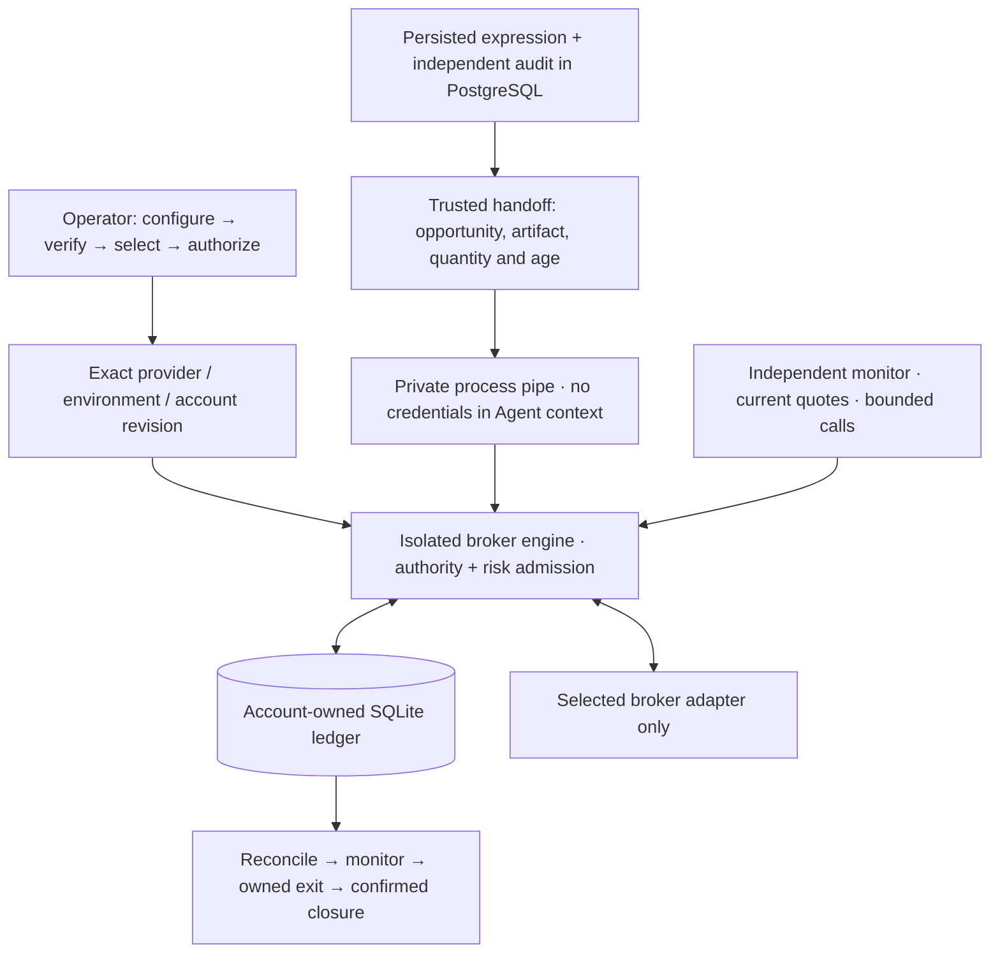

# Broker execution: explicit destination, separate authority

ALTA exposes **two modes: Shadow and Broker API**. Paper or Live is an explicit
attribute of the chosen broker account, not a third mode. A failed connection
never changes the destination to Tiger or fabricates a Shadow fill.

This integration is experimental. No live order was sent during development.
Six adapter implementations are not six accepted live accounts. The historical
Tiger Paper acceptance applies to its older isolated executor, not these new
live connectors.

## Provider matrix

| Provider              | Required setup                                                                   | Current execution boundary                                                                                                                                                    |
| --------------------- | -------------------------------------------------------------------------------- | ----------------------------------------------------------------------------------------------------------------------------------------------------------------------------- |
| Tiger                 | Tiger ID, registered RSA private key, exact account and Paper/Live choice        | Conditional on SDK account, environment and permission proof; live account not accepted                                                                                       |
| Alpaca                | Environment-specific key pair and exact account UUID                             | Conditional v2 execution path; live account not accepted                                                                                                                      |
| Interactive Brokers   | Locally signed-in TWS/IB Gateway, dedicated client ID, exact U/DU account        | Conditional path with mandatory non-executing `whatIfOrder` before each order; live account not accepted                                                                      |
| Futu / moomoo         | Signed-in OpenD, firm, port, account and environment; live trade-unlock password | Conditional SDK execution path; live account not accepted                                                                                                                     |
| Longbridge / Longport | App key, secret and access token                                                 | Connection/order methods exist, but consumed SDK responses do not prove account and environment identity. **Authorization blocked.**                                          |
| Charles Schwab        | Valid OAuth access token, exact account number and account hash                  | Account/order methods exist; automatic OAuth renewal, complete open-order history and trade-permission proof remain incomplete. **Authorization blocked.** No Paper endpoint. |

"Conditional" means the code can reach the real adapter only after its account
checks and operator authorization pass. It is not an account acceptance record.
Neither a key field nor an operator assertion replaces a broker login, permission
or account-identity response. Do not bypass an incomplete check to obtain a trade.

## Operator flow

1. Open **API Trading → Broker connections**. Select the provider and explicitly
   choose Paper or Live. Enter the exact account and provider-specific credentials.
   The local control service works while research is stopped.
2. **Save connection**, then **Verify connection**. Saving is write-only and never
   authorizes an order. Verification reads the broker; local state views reuse
   redacted, revision-bound evidence rather than opening repeated SDK sessions.
3. **Continue to execution → Broker API → Save destination**. The displayed saved
   destination is distinct from the draft selector. Account switching is locked
   while research runs or any lane still has authority or unsettled ALTA exposure.
4. Refresh the selected account, review prerequisites and limits, then enter the
   account-bound confirmation phrase. Initial authorization requires a dedicated
   account with no holdings or open orders. Live means real money.
5. Start the backend. Independently audited eligible plans can enter the selected
   account's durable ledger. The monitor checks order/position evidence without
   waiting for slow LLM turns. The console shows authority, evidence age, balances,
   holdings and the local owned-order ledger.
6. **Revoke & exit** blocks new entries and invalidates queued plans. Keep the
   backend running while it cancels pending entries and exits ALTA-owned exposure.
   Inspect reconciliation; only a broker-confirmed flat account permits switching.
   Stopping the service does **not** liquidate holdings at the broker.

Changing credentials or the account environment requires disarming, settling
exposure and deselecting the lane first. Atomic owner-only files invalidate old
authorization/evidence. Previous account ledgers are preserved, not reassigned.
An unavailable status is unknown, not proof that trading has stopped.

The old Tiger Paper lane has drain-only compatibility controls in the new UI. It
must be drained before selecting the new route; it is not a third mode and cannot
silently receive another provider's order.

## From research to the broker



The trusted handoff reads the exact persisted `expression.validated` event and
successful independent auditor artifact. The audit binds provider, account
revision, opportunity version and snapshot. A stale or mismatched audit blocks
dispatch; an artifact from Shadow cannot authorize a broker plan. Quantities
come from the audited research plan, without an artificial one-share clamp or
size inflation. The broker engine applies its own cash and notional admission.

The separate `research_rpc` accepts staged plans and monitor ticks only from the
trusted local application pipe. The browser RPC accepts account controls, not
arbitrary order, quote or approval payloads. Research Agents receive no broker
credentials or repository capabilities.

Mutations hold both the autonomous owner's database fence and the account's
execution locks. Shutdown drains bounded operations before releasing ownership.
Dispatch also checks parent-process identity and quote-derived expiry. Account
intents precede submission; broker-issued IDs are recorded before fallible detail
reads. Unknown submission results are reconciled by identity, never blindly
retried. These defenses reduce race and duplication risk; they do not make a
network request atomic with a database commit.

## Supported scope and operational limits

- One active plan per account; long, whole-share USD stocks/ETFs, DAY limit orders.
  No shorting, options, leveraged multi-leg plans or portfolio rotation.
- Fresh provider-timestamped quotes are checked again at execution, independently
  of LLM latency. Missing/stale quotes block submission, not safe reconciliation
  and cancellation. The monitor has its own four-reads/minute market-data budget.
- Stop, target, time expiry and close-only authority can trigger an owned exit.
  These are **software-managed exits**, not native protective broker orders.
- Monitoring depends on a running backend, valid broker session and usable data.
  Restart can recover durable work; downtime is not continuous protection.
- Interrupted or partial exits and unresolved order identities can require manual
  review. Revocation can return busy during an in-flight operation; inspect its
  confirmed result rather than assuming a button click completed it.
- Schwab OAuth login/refresh and Longbridge identity proof are unresolved. Token
  expiry does not permit fallback or automatic reauthorization.
- Full real-account acceptance, prolonged live soak, outage/failover coverage and
  profitability are **not verified** by this release.

## Reproduce without broker access

```shell
uv sync --frozen --all-extras --project alta-runtime/broker-python
uv run --frozen --all-extras --project alta-runtime/broker-python \
  pytest -q alta-runtime/broker-python/tests
./alta env python -m pytest -q alta-runtime/python/tests
node --test alta-dashboard/tests/*.test.mjs
```

Broker tests inject transports and account books; they send no real orders. They
cover exact routing for all six provider IDs, wrong-account/revision rejection,
read-only order endpoints, durable entry/exit, revocation, quote expiry and restart
recovery. See the [release evidence](audits/broker-routing-2026-09-13.md) for the
tested scope. Account testing must be a separate authorized procedure.

Primary references: [Tiger](https://docs-en.itigerup.com/docs/prepare),
[Alpaca](https://docs.alpaca.markets/us/docs/getting-started-with-trading-api),
[IBKR](https://www.interactivebrokers.com/docs/tws-api/doc/introduction),
[Longbridge](https://open.longbridge.com/docs/getting-started),
[Futu](https://openapi.futunn.com/futu-api-doc/en/trade/place-order.html),
[Schwab developer portal](https://developer.schwab.com/).
