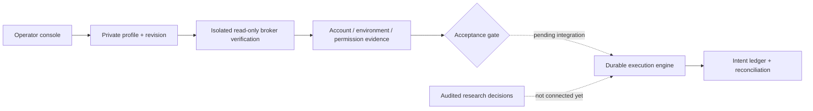

# Broker execution expansion

Status: **1 verified adaptation (Tiger Paper) + 5 pre-adapted connectors**.

"Pre-adapted" means provider-specific connection and order-method code exists;
it does not mean that an account has passed end-to-end acceptance. Tiger's
existing Paper executor is the verified adaptation. Its new live connector is
also pending acceptance; none of these counts implies verified live trading.

The local account-review flow now retains revision-bound broker evidence across
page reloads and exposes balances, holdings, orders, and individual authorization
prerequisites. It performs no SDK request when reading cached state. A failed
connection check clears its previous success; a 30-second age limit prevents old
evidence from appearing current. Reviewing prerequisites does not grant authority.

All six execution adapters support durable broker-ID acknowledgments before
fallible detail reads. Futu and Longport also support bounded prior-session order
lookup. These recovery contracts are tested offline; they are not evidence of
real-account order acceptance, automatic OAuth renewal, or runner integration.

The current runnable execution routes are internal Shadow and the existing
Tiger Paper boundary. The dashboard mode selector controls that real authority;
it is not a switch that converts Paper into live trading. No live order was
submitted in this review. The new `alta-runtime/broker-python/` package is a
separate boundary. Its operator RPC exposes configuration and read-only account
verification, not order mutation or an autonomous live mode.

## Current provider matrix

| Provider              | Required connection model                                                                     | ALTA implementation status                                                                                                                                  |
| --------------------- | --------------------------------------------------------------------------------------------- | ----------------------------------------------------------------------------------------------------------------------------------------------------------- |
| Tiger                 | Tiger ID, registered RSA key and exact account                                                | Existing Paper executor remains operational; new separate Prime/Paper SDK adapter, not live-account accepted                                                |
| Alpaca                | Environment-specific key pair and account UUID                                                | v2 account, positions, orders, limit submission, client-ID lookup and cancellation code; contract-tested, not account accepted                              |
| Interactive Brokers   | Operator-owned TWS/IB Gateway on loopback, dedicated nonzero client ID, explicit U/DU account | `ib_async` adapter, account summary, qualified stock limits, permanent-order-ID recovery; connection alone does not prove permission; authorization blocked |
| Longbridge / Longport | App key, secret and token through `longport` SDK                                              | Balance/positions/order SDK code; account and environment proof unavailable in consumed responses; authorization blocked                                    |
| Futu / moomoo         | Operator-owned OpenD, explicit security firm, port, account and environment                   | SDK account/position/order queries, limit submission, cancellation; not account accepted                                                                    |
| Charles Schwab        | OAuth access token plus exact account number and account hash                                 | HTTP account/order adapter; no Paper endpoint; refresh flow and complete-order/permission proof pending; authorization blocked                              |

No new provider has a real-account order acceptance record in this change. The
execution library is not connected to ALTA's automatic proposal/monitor/exit
loop. Adapter methods alone must not be advertised as that complete lifecycle.

## Configure and verify

Install the isolated optional dependencies from the project directory:

```shell
uv sync --frozen --all-extras --project alta-runtime/broker-python
```

Open **API Trading → Broker connections**, select a provider and explicitly
choose its supported account environment. Stop research before saving. Enter
the exact account and its provider-specific credentials, save, then verify.
The account UUID is required for Alpaca; the account number and separately
issued account hash are required for Schwab. Local gateway ports are not API keys.

These profiles are separate from the existing Tiger Paper configuration. Saving
a new Tiger profile never replaces or enables the current Paper executor.
Schwab access-token expiry requires renewed operator credentials; automatic
OAuth login/refresh is not implemented. Futu Paper does not use a live trade
unlock; unsupported permissions never silently fall back to another environment.



The common engine has tested admission, quote expiry, notional/cash limits,
kernel ownership locks, durable pre-submit intents, partial-fill accounting,
close-only revocation and restart reconciliation. It never retries an unknown
submission merely because a history query returns no matching order. The new
operator process cannot call these mutation methods.

The maintainer has authorized publication of default-off live execution code,
conditional on account verification and explicit operator authority. That policy
change does not itself enable an account. The new lifecycle kernel persists an
audited plan and its exit intent, survives restart without duplicate submission,
and requires broker reconciliation before reporting closure. Production audit and
quote ports, the supervised worker and dashboard enablement are still pending;
the read-only operator RPC has not been replaced with an unverified trading route.

An API-key form cannot replace OpenD, an IBKR login session, an OAuth callback,
exchange permission or a broker's account eligibility checks. A missing Paper
product must not be emulated by sending an order to a live endpoint.

Primary integration references: [Tiger](https://docs-en.itigerup.com/docs/prepare),
[Alpaca](https://docs.alpaca.markets/us/docs/getting-started-with-trading-api),
[IBKR](https://www.interactivebrokers.com/docs/tws-api/doc/introduction),
[Longport SDK](https://longportapp.github.io/openapi/python/reference_all/),
[Futu](https://openapi.futunn.com/futu-api-doc/en/trade/place-order.html),
[Schwab developer portal](https://developer.schwab.com/).

## Required vertical slice before enabling any additional broker

1. A typed adapter reports instrument, environment, order and recovery capabilities.
   Provider-specific code lives outside the research orchestrator and outside the
   existing Paper-only package.
2. A write-only external credential profile has an immutable provider/environment/
   account binding and a revision. Saving it never grants order authority.
3. A read-only verification proves the expected account, currency, balances,
   positions, pending orders and permission state. Unknown data blocks enablement.
4. The operator explicitly selects the profile and approves its trading authority.
   Live authorization is separate from Paper authorization. Existing exposure
   prevents changing accounts until it is reconciled and explicitly transferred
   or closed; it is never abandoned by a mode switch.
5. Audited expressions become durable broker intents in a separate capital ledger.
   Decimal quantities, limits, currency and instrument identifiers are validated.
   Fresh quotes and available buying power are checked again immediately before
   dispatch; the price seen before an LLM turn is not sufficient.
6. One fenced owner controls mutations per account. Intent IDs precede submission.
   Timeouts become unresolved intents, not permission to resubmit. Recovery reads
   broker order and fill state before continuing; an ambiguous response blocks new
   risk. Partial fills, cancellation, expiry and session loss have explicit states.
7. Monitoring and exit ownership survives restarts. Shadow cash and fills never
   substitute for broker account evidence. Turning off new entry authority must
   preserve the ability to reconcile existing exposure and outstanding orders.
8. The dashboard shows requested versus effective mode, proof age, permissions,
   currency, balances, positions, orders and reconciliation exceptions. Account
   identifiers, credentials and raw provider errors stay outside public artifacts.
9. Offline adapter tests cover malformed responses, stale prices, quantity and
   currency precision, rejected orders, uncertain submission, duplicate IDs,
   partial fills, lost authorization, disconnect and restart recovery. A real
   authorized test account is then required for an end-to-end acceptance record.

An adapter becomes available for autonomous trading only after this slice is implemented. Contract-test
coverage and actual account verification are separate statuses. This document is
the implementation boundary, not a claim of profitability or production certification.
