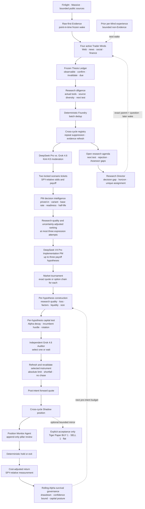

# Autonomous Shadow operations

> **Release:** `0.26.0` — `FORWARD_EVIDENCE_VERIFIED`
>
> **Capital boundary:** internal Shadow by default. Only the explicit
> `acceptance` command can call an isolated one-share Tiger Paper mirror. Live
> accounts and real capital are unsupported and rejected.
>
> **Alpha status:** unproven. ALTA records cost-adjusted forward Shadow outcomes
> and an SPY benchmark; that measurement capability is not evidence of future
> profitability.

This runbook covers the production-shaped research loop with autonomous Agents,
Massive market data, optional Finlight news, cross-cycle Shadow positions, and
read-only observability.

## Operating flow



Every production Trader Mind must actively search its allowed public research
surface; passive Evidence alone is not a completed discovery turn. The four
Minds share Web, news, public social, and public finance discovery, with
specialist feeds, archives, academic, or crawl tools assigned by Alpha
archetype. Repository-host APIs are excluded from the Opportunity OS catalog. Downstream
Assessors, Moderator, Expression, Auditor, and
Position Monitor remain bound to frozen evidence appropriate to their role.

Every production Candidate also carries one to three frozen thesis pillars.
Each names a causal claim, a concrete observable, independent confirmation and
invalidation conditions, and a due date no later than the Opportunity horizon.
The Foundry merges semantic duplicates without dropping Candidate or Evidence
provenance. A later Mind may investigate the resulting exact open question, but
the original claim is never rewritten.

On each later wake, the Research Director considers at most two recent active
Opportunities and two open questions per Opportunity. Questions come from the
prior next test, first rejection, immutable thesis pillars, and missing Evidence
named by both locked Assessors. Expired questions and Opportunities already
owned by the Shadow monitor are excluded. The remaining queue is ordered by
Opportunity state, question origin, and horizon urgency; at most two exact,
different questions are assigned to different Minds, leaving at least two Minds
for independent exploration. Follow-up must bind the assigned parent and
question, and a Candidate still requires new auditable Evidence. The queue and
its score are process memory, not Evidence, conviction, rank, or capital input.

The runtime derives a research-diligence record from what each Trader Mind
actually completed, but source families, independent domains, non-news depth,
and cross-check credit come only from frozen Evidence or exact tool results the
Candidate cites. Unbound browsing remains observable as process cost and cannot
inflate research quality. Causal beneficiary path, counterevidence, and next
test remain explicit. This is durable process metadata, not Evidence and not a
fixed approval score. The downstream team can challenge shallow or
single-source work without preventing an Agent from presenting an unusual,
well-supported route to Alpha.

After ranking, the implementation PM proposes at most three distinct payoff
hypotheses. Each receives actual market, construction, Alpha-clock, and capital
checks before the independent Auditor selects one or chooses `Wait`. For every
admissible entry the audit snapshot exposes time-adjusted expected Alpha
dollars, expected Alpha per stress-loss dollar, estimated costs, and remaining
execution-reserve headroom without collapsing them into an automatic score.
The selected instrument is quoted and constructed again before a frozen
absolute limit is admitted. A buy limit may equal the observed ask but cannot
be placed above it, and automatic repricing remains forbidden. This is a
bounded implementation tournament, not permission for an Agent to place or
reprice an order.

Every non-Wait hypothesis must bind the exact Thesis Ledger pillar IDs its
payoff monetizes. Later Position Monitor runs append one status per selected
pillar—`confirming`, `weakening`, `invalidated`, or `unresolved`—using only
newer frozen Evidence. Any incomplete or invented binding degrades safely and
cannot force an exit. A valid invalidation flag enters the existing
deterministic monitor policy; the Agent never owns the order or exit mutation.

Agent roles remain free to search, reason, challenge, and choose a payoff shape.
Deterministic code protects point-in-time evidence, source provenance, quote
truth, cost, exposure, fills, accounting, and measurement.

## Data-source posture

### Massive

The runtime uses the official `massive` Python client for:

- bounded per-symbol stock snapshots in the configured universe;
- adjusted daily bars with a durable once-per-day cursor;
- bounded option-chain and exact-contract requests only for expression
  hypotheses that actually require them;
- exact stock, ETF, or option quotes for expression, fill, monitoring, and exit.

Broad Massive discovery is disabled by default. The verified acceptance budget
is eight requests for the entire cycle. The expression slate is capped at three
and the same global budget also covers selected-instrument refresh, forward
fill, monitoring, and exit. Exhaustion produces `Wait`; it never substitutes a
stale or invented quote. The client is configured without SDK retry
bursts, automatic pagination, or a large connection pool. ALTA owns single-slot
admission, concurrency, deadlines, 429 cooldown, and observability.

Raw market payloads are normalized into bounded readable Evidence. Quote-only
execution facts are not automatically fed back into the next research cycle,
which limits self-reinforcing narrative contamination.

### Finlight

Finlight is optional. Its REST adapter uses a single owner, durable cursor,
bounded requests, and 429 cooldown. When it is unavailable, the source posture
is explicit and independent Scouts may continue with existing Evidence and
other bounded public tools.

### Tiger

Tiger is not part of the standard autonomous execution path. The main service
and `autonomous --once` report `capitalMode=disabled`. The explicit acceptance
path invokes a separate capital package that requires an exact 17-digit Paper
account SHA-256 binding, an owner-only non-symlink configuration file, zero
positions, zero open orders, and a single-owner lease. It permits only one-share
stock/ETF DAY limit orders, reconciles every fill to the exact account, and
verifies the account remains flat and order-free in a `finally` block. Account discovery, live fallback, shorts, options,
extended-hours orders, and an HTTP order API are absent or rejected.

## Preflight

Start with a credential-free verification:

```shell
corepack pnpm install --frozen-lockfile
./alta env setup --dev
./alta test
./alta env up
./alta env python -m alta_asterism migrate upgrade
./alta env python -m alta_asterism demo
./alta env python -m alta_asterism replay
```

Do not proceed if tests fail, replay hashes differ, migrations are not current,
or an unexpected managed process is already active.

## Inject credentials externally

Use an operating-system secret manager or external helper. Do not write real
values into the repository, examples, logs, fixtures, or Agent prompts.

```shell
export ALTA_ENVIRONMENT=shadow
export ALTA_AUTONOMOUS_ENABLED=true
export ALTA_AGENT_PROVIDER=deepseek
export ALTA_AGENT_MODEL=deepseek-v4-flash
export ALTA_AGENT_REASONING_EFFORT=high
export ALTA_THESIS_PROVIDER=deepseek
export ALTA_THESIS_MODEL=deepseek-v4-pro
export ALTA_DISCONFIRMING_PROVIDER=grok
export ALTA_DISCONFIRMING_MODEL=grok-4.6
export ALTA_MODERATOR_PROVIDER=kimi
export ALTA_MODERATOR_MODEL=kimi-k3
export ALTA_EXPRESSION_PROVIDER=deepseek
export ALTA_EXPRESSION_MODEL=deepseek-v4-pro
export ALTA_AUDIT_PROVIDER=grok
export ALTA_AUDIT_MODEL=grok-4.6
export ALTA_AGENT_DEADLINE_SECONDS=180
export ALTA_REASONING_AGENT_DEADLINE_SECONDS=300
export ALTA_SCOUT_CONCURRENCY=4
export ALTA_AUTONOMOUS_INTERVAL_SECONDS=1800
export ALTA_AUTONOMOUS_FOLLOW_UP_INTERVAL_SECONDS=900
export ALTA_AUTONOMOUS_POSITION_INTERVAL_SECONDS=300
export ALTA_AUTONOMOUS_HEARTBEAT_SECONDS=30
export ALTA_AUTONOMOUS_FAILURE_BACKOFF_SECONDS=60
export ALTA_AUTONOMOUS_FAILURE_BACKOFF_MAX_SECONDS=1800
export ALTA_AUTONOMOUS_CYCLE_TIMEOUT_SECONDS=3600

export ALTA_SUPERVISOR_RESTART_MAX_SECONDS=300
export ALTA_SUPERVISOR_STABLE_UPTIME_SECONDS=600
export ALTA_SUPERVISOR_PROBE_SECONDS=5
export ALTA_SUPERVISOR_UNHEALTHY_GRACE_SECONDS=120
export ALTA_SUPERVISOR_UNRESPONSIVE_GRACE_SECONDS=15
export ALTA_SUPERVISOR_SHUTDOWN_GRACE_SECONDS=30
export ALTA_SERVICE_PORT=8876
export ALTA_SERVICE_LOG_MAX_MB=16

export ALTA_MASSIVE_ENABLED=true
export ALTA_MASSIVE_DISCOVERY_ENABLED=false
export ALTA_MASSIVE_MAX_REQUESTS_PER_CYCLE=8
export ALTA_MASSIVE_BASE_URL='https://api.massive.com'
export ALTA_MASSIVE_AUTH_MODE='bearer'
# Inject MASSIVE_API_KEY from an external secret helper.
# Optionally inject FINLIGHT_API_KEY the same way.

export ALTA_SHADOW_MAX_POSITION_NOTIONAL=10000
```

The scheduler uses `ALTA_AUTONOMOUS_INTERVAL_SECONDS` as its base research
cadence. While an unresolved active Opportunity exists it uses the smaller of
that value and `ALTA_AUTONOMOUS_FOLLOW_UP_INTERVAL_SECONDS`; while a Shadow
position is open it instead uses the smaller base/position value from
`ALTA_AUTONOMOUS_POSITION_INTERVAL_SECONDS`. Open-position monitoring has
priority over backlog follow-up. Runtime state exposes `cadenceReason` and
`nextIntervalSeconds`. These deterministic states alter effort only: no model
confidence, rank, or proposed trade can shorten the cadence or bypass a gate.

The Agent child environment strips market-data, news, database, cache, and
broker credentials. `doctor` validates configuration without printing secrets.

### Inspect and rotate API keys

ALTA manages external slots without accepting a secret as a command-line
argument:

```shell
./alta credentials status
./alta credentials check
./alta credentials set deepseek
./alta credentials reload
```

`set` reads hidden terminal input (or bounded standard input for a secret-manager
pipe), validates the slot format, reuses the one matching external file, and
performs an owner-only fsync-backed atomic rename. Duplicate matching files,
symlinks, oversized files, relative credential roots, and environment-variable
shadowing fail closed. If the host service is active it is restarted and must
become ready; a failed reload restores the previous file before recovery is
retried. A stopped service remains stopped and reads the new revision next time.

The supported slots are `deepseek`, `xai`/`grok`, `kimi`, `massive`,
`finlight`, `brave`, `jina`, and `openalex`. LLM files belong under
`llm/`, Massive and Finlight under `resources/`, and optional research-tool
keys under `tools/`. OpenAI authentication stays on the official Codex login
path. Tiger Paper remains a separate, explicit acceptance configuration.

The first `./alta service install` snapshots these non-secret controls into
ignored mode-0600 `.alta/opportunity-service.env`. Set endpoint, model-route, or
approved Massive proxy controls before that first install; later changes should
be made in that local file followed by `./alta service restart`. Never put API
keys in the service settings—the service reloads Massive and Finlight values
from the external `resources/` credential directory on every start.

Massive-compatible proxies require an explicit credential-free base URL. Use
`ALTA_MASSIVE_AUTH_MODE=x_api_key` or `x_proxy_key` only when the approved proxy
requires the corresponding header. Insecure HTTP is disabled and should not be
enabled outside a separately reviewed loopback proxy.

## Run one controlled cycle

```shell
./alta env up
./alta env python -m alta_asterism migrate upgrade
./alta env python -m alta_asterism doctor
./alta env python -m alta_asterism autonomous --once
```

Acceptable terminal outcomes include:

- `MVP_IDLE`: no Opportunity survived the evidence and horizon gates;
- structured `Wait`: the Agent or Auditor declined implementation;
- no-fill: no valid quote arrived after intent;
- Shadow open: every Agent and deterministic gate approved and a qualifying
  post-intent quote was observed.

None of these standard autonomous outcomes submits an order.

Review the API state before starting continuous operation. Confirm the source
posture, all role statuses, Evidence bindings, ranking components, Expression,
Auditor result, market validation, position state, and Alpha label.

## Run the optional Paper acceptance

This command mutates a Tiger **Paper** account. It is never part of normal
service startup, must never receive live credentials, and should run only in a
dedicated empty Paper account after the test suites and Shadow path pass.

```shell
export ALTA_ENVIRONMENT=shadow
export ALTA_TIGER_PAPER_ENABLED=true
export ALTA_TIGER_CONFIG_PATH='/absolute/path/to/owner-only-paper.properties'
export ALTA_TIGER_PAPER_ACCOUNT_SHA256='<sha256-of-the-exact-paper-account-id>'
export ALTA_TIGER_ORDER_TIMEOUT_SECONDS=20
export ALTA_ACCEPTANCE_HOLD_SECONDS=5

./alta env python -m alta_asterism acceptance \
  --cycle-id paper-acceptance-YYYYMMDD-NN
```

The command refuses to start unless the config is an owner-only regular file,
the account is a 17-digit Paper account matching the supplied hash, and the
account has zero positions and zero open orders. A successful lifecycle reports
`paperFillCount=2`, `positionStatus=closed`, `paperFlatSafety=true`, and
`lifecycleComplete=true`. A `Wait` or no-op is a safe research result but does
not satisfy the Paper lifecycle acceptance. The `finally` path attempts to
flatten any one-share position created by that cycle and then runs another
zero-position/zero-open-order preflight.

## Install the unattended 24×7 service

After a successful controlled cycle:

```shell
./alta service install
./alta service status
```

Installation is a one-time operator action. It validates the loopback endpoint,
refuses an occupied port, creates owner-only local state, restores dependencies,
runs migrations and preflight, and installs a macOS LaunchAgent or Linux
systemd-user unit. No API key is written to the unit or service configuration;
an API bearer token is generated under ignored mode-0600 `.alta/secrets/` state.
The service then survives terminal closure and resumes when the host service
manager starts at login or boot.

LaunchAgents start at macOS login. Linux systemd-user units start with the user
manager; boot-before-login operation requires the operator to enable the
standard systemd linger policy separately. ALTA does not change that host policy.

The scheduler uses a PostgreSQL advisory lock so only one owner runs. A failed
cycle is recorded without its exception detail, its Agent runtime is discarded,
and the next attempt starts from a clean runtime after bounded exponential
backoff. Waiting and degraded states emit periodic heartbeats.

The supervisor has no restart limit unless `--max-restarts` is passed
explicitly. It restarts a crashed child and continuously probes readiness. A
process that remains live but unready beyond
`ALTA_SUPERVISOR_UNHEALTHY_GRACE_SECONDS` is terminated gracefully and replaced.
Loss of `/health/live` uses the shorter
`ALTA_SUPERVISOR_UNRESPONSIVE_GRACE_SECONDS`; the supervisor then terminates the
entire opportunityd process group so a stuck App Server cannot be orphaned.
Backoff is capped by `ALTA_SUPERVISOR_RESTART_MAX_SECONDS`; a stable uptime window
resets the consecutive-failure exponent. `SIGINT` and `SIGTERM` stop the
scheduler, release the advisory lock, terminate the child, and write a final
mode-0600 supervisor state.

`ALTA_AUTONOMOUS_CYCLE_TIMEOUT_SECONDS` is the maximum running-heartbeat age. It
must cover at least four times the longer of the Scout and judgment-role
deadlines. Scouts default to 180 seconds; slower heterogeneous PM, debate,
expression, and audit roles default to 300 seconds. A Scout deadline, transient
App Server failure, malformed structured result, or missed active-research
requirement may receive one fresh attempt against the same frozen input and
durable Run identity. The first failure remains append-only. Token/tool budget,
evidence-provenance, territory, and investment-policy failures are not retried.
A cycle that stops making progress eventually makes `/health/ready` fail, which
activates the supervisor watchdog. The built-in scheduler remains responsible
for research cadence; no external cron job or Agent should invoke individual
cycles.

Operational commands are:

```shell
./alta service start
./alta service stop
./alta service restart
./alta service status
./alta service logs
./alta service uninstall
```

`stop` waits for the owner and child tree to exit. `uninstall` stops the service
and removes only the host definition; ignored runtime configuration and durable
PostgreSQL data remain. `./alta service run` is the portable foreground fallback
and the Windows option; this release does not install a Windows boot service.

Recovery always uses the interrupted cycle's durable Scout snapshots and frozen
wake. It does not fetch later source data into an earlier decision point or call
a succeeded model role again.

## Expression and market semantics

For each cycle the orchestrator considers at most three ranked Opportunities,
in order, and stops at the first audited actionable expression. The Expression
Agent acts as a bounded implementation PM: it compares direct Stock, ETF/proxy,
long Call, long Put, and Wait; names the intended Alpha, unwanted exposures,
retained exposure, and rejected alternatives; and then recommends one shape.
It cannot place an order. If the Opportunity genuinely requires a short, pair,
spread, basket, uncovered option, or dynamic hedge, the supported result is
Wait rather than an approximate single-leg bet.

For an option, deterministic selection checks:

- thesis direction and target horizon;
- supported strike range;
- delta;
- bid/ask spread;
- open interest;
- maximum position budget.

The deterministic Portfolio Constructor then sizes the verified instrument to
the tightest available constraint:

- per-trade scenario stress-loss budget;
- single-position and aggregate-gross fractions of a synthetic Shadow NAV;
- per-Alpha-source, shared-systematic-factor, and shared-catalyst capacity;
- configured market-data notional ceiling;
- Massive snapshot day-volume participation over the configured exit window
  for Stock/ETF, explicitly labeled as a proxy rather than institutional ADV;
- option premium at risk and bounded open-interest participation.

Direct Stock and ETF plans must also retain a minimum expected relative Alpha
after estimated spread, slippage, and commission. Long options use the locked
underlying Alpha only as a research proxy and are admitted by full-premium loss
budget; the system does not pretend that underlying basis points are option
returns.

The independent Expression Auditor receives the frozen Opportunity, proposed
implementation, both locked underwriting summaries, verified instrument or
unavailable state, and a bounded Shadow portfolio view. It cannot see the
ranking score. It evaluates thesis purity, scenario/payoff fit, implementation
quality, tail risk, cost, horizon, and duplicate exposure, and can only approve
or require Wait. Model failure fails closed.

The final deterministic gates check:

- the quote existed and was knowable at decision time;
- bid, ask, freshness, spread, and cost are valid;
- the instrument matches the recommendation and policy;
- a refreshed post-audit quote is for the same instrument and remains within
  the bounded midpoint-drift threshold;
- target size is the tightest credible constraint and its estimated stress
  loss remains within budget;
- current aggregate gross, portfolio stress, Alpha-source, systematic-factor,
  shared-catalyst, and duplicate-underlying rules still pass immediately before
  intent;
- a forward quote was observed after intent and frozen latency.

The fill engine polls a bounded number of times for a new exact quote. It does
not use an earlier quote to simulate execution. Options are stored in
share-equivalent units so a standard contract represents 100 units; rationale
retains the contract count and multiplier.

## Cross-cycle monitoring

At each new frozen wake, the runtime checks existing open Shadow positions:

1. select only Evidence newer than the position thesis;
2. give the bounded Position Monitor Agent at most eight open positions;
3. ask only whether new Evidence explicitly satisfies each frozen invalidation
   condition;
4. require cited Evidence IDs for a triggered falsifier;
5. apply deterministic falsifier, time, opportunity, quote, and hold policy;
6. require another exact forward quote before a close fill;
7. write the close and balanced ledger transaction atomically.

If the Monitor Agent is unavailable or returns an invalid binding, the runtime
records a redacted degraded event. Price and time observation continues, but the
system does not assume that the falsifier was triggered.

## Alpha measurement

Every completed Shadow close writes an append-only performance event containing:

- gross and net PnL;
- gross and cost-adjusted return in basis points;
- SPY midpoint return over the same observed interval;
- realized Alpha in basis points: net return minus SPY return.
- the Candidate, Trader Mind, Alpha archetype, explore/follow-up mode, and
  bounded research route frozen
  when the position opened.
- an observed lifecycle diagnostic derived only from executable bid observations
  captured while the position was open and the actual close: MFE, MAE, maximum
  observed drawdown, exit capture, time to best observation, and holding time.

Sparse quotes are not interpolated. Malformed lifecycle samples are omitted
rather than blocking the close ledger or final return measurement. The lifecycle
aggregate remains descriptive even after its 30-position reporting threshold;
it cannot tune an exit, change capital, or authorize a broker action.

For direct-stock expressions, the API also compares the two locked ex-ante
underwriting tickets with realized forward Alpha. Options and proxy ETFs are
excluded because their payoff basis is not comparable to pre-expression
security underwriting. Calibration reports bias, absolute error, direction hit
rate, sample scope, and an exploratory warning until the minimum sample exists.

When no benchmarked closed sample exists, the API must report `Alpha is
unproven`. Model confidence, backtests, open-position PnL, and a working pipeline
are not substitutes for forward evidence.

The same latest-measurement-only outcomes also drive a deterministic rolling
capital posture for the next Shadow entry. The posture is scoped to the current
portfolio-policy version and a 30-position window. Collecting and negative-mean
probation cap target size at 50%; a 100 bp synthetic-NAV drawdown or a mature
window whose descriptive 95% upper Alpha bound is non-positive caps it at 10%.
The Expression Agent may explain the posture but cannot override it. The
portfolio constructor reloads it immediately before intent, rejects stale or
tightened plans, and never grants a multiplier above 1.0. Rolling recovery is
allowed only through later small Shadow observations replacing older results.

A second, separate controller closes the forecast-calibration loop only for
comparable direct-stock positions under the same portfolio-policy version. It
does nothing before 30 closed, cost-adjusted, benchmarked observations. After
that maturity gate, historical overforecast bias plus 25% of rolling mean
absolute error becomes a downside-only reserve, capped at 500 bp and deducted
from new expected Alpha before costs and decay. Directional hit rate below 45%
also caps new size at 50%. Favorable bias cannot create a negative reserve or a
multiplier above 1.0. The frozen reserve and policy are reloaded immediately
before intent; any tighter result requires a fresh implementation plan.

The `/api/v1/alpha/feedback` projection returns only prior, closed outcomes at a
strict point-in-time cutoff. A Mind sees performance values only after 30
benchmarked closed positions. Archetype, research-route, and research-mode
slices also require 10 observations. Before those gates, the projection exposes
coverage and maturity only. After maturity, a one-sided conservative Alpha bound
drives a revocable research-only incentive: positive earns one additional tool
call and 8,000 tokens for the next wake; immature, negative, or uncertain earns
no bonus. The API exposes the contract and state. Feedback is non-Evidence and
has no code path to models, ranking, expression, limits, capital, or brokers.

## Read-only observability

| Endpoint                     | Operational use                                                     |
| ---------------------------- | ------------------------------------------------------------------- |
| `/health/live`               | Process liveness                                                    |
| `/health/ready`              | Database, scheduler owner, and heartbeat readiness                  |
| `/api/v1/system/summary`     | Durable state counts                                                |
| `/api/v1/mvp/status`         | Current cycle, stages, outcomes, positions, and costs               |
| `/api/v1/runs/{id}`          | Role input binding, budgets, status, and artifact                   |
| `/api/v1/opportunities/{id}` | Evidence, Thesis Ledger, agenda/lineage, challenge, rank, and audit |
| `/api/v1/expressions/{id}`   | Recommendation, risk/implementation plan, and Shadow state          |
| `/api/v1/alpha/summary`      | Closed sample, lifecycle quality, reserve, and capital postures     |
| `/api/v1/alpha/feedback`     | PIT Mind/archetype/route/mode maturity and feedback                 |
| `/api/v1/evaluation/summary` | Cohort drift, coverage, missingness, and sample readiness           |
| `/api/v1/stream`             | Cursor-based lifecycle events                                       |

Bind the service to `127.0.0.1`. Protect `/api/v1` with `ALTA_API_TOKEN` when it
is accessed by another local process. The service has no order API.

## Current acceptance record

The verified release has demonstrated:

- durable cross-cycle suppression of same-content Opportunities, one-time
  canonical refresh for genuinely new source content, and bounded
  same-environment registry memory on the next Scout wake;
- immutable non-secret configuration binding for every autonomous cycle,
  indexed cycle attribution for Agent runs, and a bounded read-only cohort
  projection that detects configuration drift and missing measurements;
- deterministic fixture demo, replay equality, recovery, and market-session soak;
- a `0.18.0` deterministic lifecycle with three Candidates, three Opportunities,
  one Shadow position, exact replay equality, plus a 6.5 event-hour / 14-cycle
  soak with zero failures and zero manual repairs;
- research-diligence tests proving actual-tool/source derivation and explicit
  non-Evidence semantics, deterministic quality scoring, screen-grade caps, and
  non-news route credit, plus stock, ETF, and option expression-tournament tests
  proving real per-candidate market validation and independent selection;
- explore/follow-up tests proving exact frozen parent/question validation,
  deterministic open-question priority and deduplication, merged-contributor
  lineage, API visibility, and maturity-gated mode attribution;
- Thesis Ledger tests proving stable pillar merge/provenance, exact follow-up
  projection, claim-to-payoff binding, append-only evidence reviews, and
  fail-closed invalidation consistency;
- decision-intelligence tests proving reference-class/base-rate preservation,
  company/security separation, independent-readiness rejection, legacy `Wait`,
  conservative half-life decay, lower-of-two expected-Alpha admission, and
  forecast-dispersion persistence;
- Alpha-isolation tests proving dual-agent exposure agreement, conservative
  minimum-score sizing, starter caps, unsupported multi-leg `Wait`, shared
  factor-bucket capacity, malformed legacy normalization, and pre-intent
  exposure revalidation;
- portfolio-construction tests proving tightest-constraint sizing, fail-closed
  missing liquidity, independent-audit Wait, and read-only implementation-ticket
  projection;
- unit and PostgreSQL integration tests proving Alpha expiry, full-book
  replacement hurdles, an idempotent `better_opportunity` exit, post-rotation
  revalidation, and a non-chasing execution ticket;
- a foreground host-service smoke with ready heartbeat, running scheduler,
  Tiger disabled, and a clean owner/supervisor/scheduler process-tree stop;
- a resumed real Shadow cycle fitting both the durable per-Mind snapshot and
  complete prompt, recovering historical Mind memory after current-state
  evolution, producing one Candidate and one Opportunity, and safely completing
  `MVP_IDLE` when the thesis role exhausted its old deadline (zero expressions,
  positions, and orders); a second cycle recorded three honest no-ops and one
  bounded transient Scout deadline;
- separate Scout and higher-judgment deadline windows plus one same-input,
  same-identity fresh Scout retry, covered through invalid-output, real App
  Server interrupt, stuck-process reset, and PostgreSQL attempt-ledger tests;
- an installed 24×7 service recovery test that exposed and corrected an
  application/database frozen-input bound mismatch, then completed with one
  healthy owner, bounded role unavailability, capital disabled, zero orders,
  clean stop, and clean uninstall;
- a fresh `0.22.0` host-managed deployment that autonomously completed four of
  four active research turns, admitted no unsupported Candidate, persisted
  `MVP_IDLE`, produced no expression, position, capital process, or order, and
  left no service, datastore, or loopback listener after uninstall;
- `0.23.0` rolling-governance tests covering collecting, probation,
  preservation, unique-position enforcement, drawdown response, rolling
  recovery, no bonus leverage, and pre-intent tightening;
- complete Node (141), Opportunity OS Python (240), and isolated capital (25)
  test suites for the current tree;
- a fresh `0.23.0` host-managed deployment in which four DeepSeek V4 Flash
  Scouts completed without an external Agent, the Foundry admitted no
  unsupported Opportunity, the cycle persisted `MVP_IDLE`, and service,
  scheduler, datastores, and loopback listener were safely removed;
- `0.24.0` decision-edge tests proving each independent view must beat its own
  base rate, non-positive uncertainty-adjusted Alpha is rejected before
  expression, and screen-grade research cannot enter the ranking book;
- a `0.24.0` host-managed run that autonomously produced one Candidate and
  exposed two bounded production issues: MCP catalog discovery consuming the
  research budget, and a 8,345-byte private input exceeding the 8,000-byte
  bound. After correction, catalog control calls remain separately bounded and
  the exact Candidate fits at 7,900 bytes with an ordered 2/3 Evidence subset;
- uncertainty-reserve tests proving the lower independent forecast is reduced
  by a visible dispersion reserve before rank and capital admission;
- research-quality capital tests proving weak work must `Wait`, marginal work is
  starter-sized, and stronger process quality cannot create bonus leverage;
- unit and PostgreSQL integration tests proving calibration uses the exact
  entry-frozen cost-adjusted forecast, deduplicates repeated position
  measurements, and keeps small-sample Alpha explicitly unproven;
- bounded Massive snapshots, bars, option selection, exact quotes, 429 posture,
  and source balancing under controlled tests;
- Finlight REST ingestion with explicit degraded behavior when streaming is not
  available;
- four isolated DeepSeek V4 Flash Scouts completing a controlled real-data
  cycle, with one invalid structured Scout response recovered against the same
  frozen identity;
- real structured calls through DeepSeek V4 Pro, Grok 4.6, and Kimi K3, followed
  by a one-Opportunity acceptance in which all five heterogeneous judgment roles
  succeeded and persisted their configured model identities;
- a safe heterogeneous-role terminal state of validated `Wait`, zero Shadow
  positions, and zero Paper order events when market and broker adapters were
  deliberately absent;
- a current-evidence AMZN retail-advertising Candidate becoming a 90-day
  Opportunity;
- two private assessments, bounded discussion, deterministic 1–90 day ranking,
  stock expression, independent audit, and post-audit exact quote refresh;
- a one-share Tiger Paper `BUY` followed by one-share `SELL`, exact-position
  reconciliation, two durable Paper-fill events, and a final
  zero-position/zero-open-order preflight;
- exactly 8 of 8 allowed Massive requests, with broad discovery disabled;
- read API and SSE coverage across the lifecycle;
- accelerated continuous-recovery coverage across more than three consecutive
  cycle failures, runtime reconstruction, heartbeat/backoff state, and eventual
  recovery;
- an accelerated 24-hour event-time soak completing 49 half-hour cycles with
  zero failures and zero manual database repairs;
- supervisor coverage for crashes, graceful signals, and live-but-unready
  watchdog replacement;
- a real macOS LaunchAgent install that became ready without an external Agent,
  completed a heterogeneous live-source cycle to audited `Wait`, replaced an
  unresponsive opportunityd process group, recovered after the host Node process
  was killed, and returned to exactly one host/supervisor/child tree;
- clean signal shutdown with no remaining owner, App Server, Agent workspace, or
  advisory lock.

This is evidence that one bounded discovery-to-exit engineering path works. It
is not evidence that the strategy will produce Alpha or that execution is
reliable over a statistically meaningful sample.

## What must happen next

Before any performance claim:

1. run at least one complete US market-session wall-clock soak;
2. operate the frozen research configuration for 6–12 weeks;
3. accumulate a meaningful set of independent, closed, cost-adjusted, benchmarked
   Shadow observations;
4. report source and Agent missingness alongside performance;
5. evaluate calibration, Top-K lift, unique Candidate contribution, discovery
   lead time, turnover, exposure, and drawdown;
6. run role and source ablations;
7. avoid adapting weights from a small favorable sample.

## Safe shutdown checklist

Stop the host service—not an individual cycle—and wait for the command to report
the child tree stopped:

```shell
./alta service stop
./alta service status
./alta env status
./alta env down
```

Confirm:

- every supervisor reports `stopped`;
- PostgreSQL and Redis are stopped when the run is over;
- no scheduler, API, App Server, or Agent child remains;
- the advisory lock is released;
- temporary Agent workspaces are gone;
- when acceptance was enabled, the isolated Paper preflight reports zero
  positions and the owner lease is released;
- no credential value was printed, persisted in the project tree, or exposed to an Agent.

See the [detailed architecture](../architecture/opportunity-os.md) for role and
trust boundaries and [Reproducibility](../../REPRODUCIBILITY.md) for release
verification.
